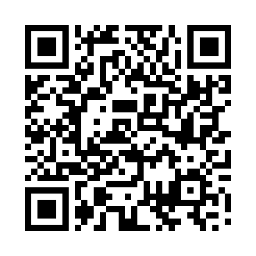
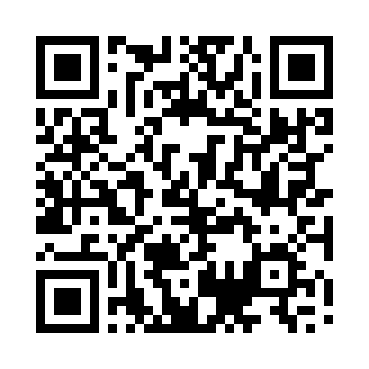
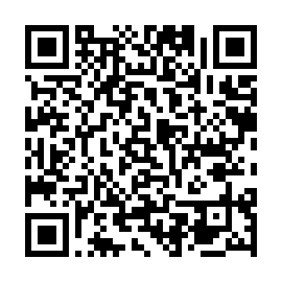
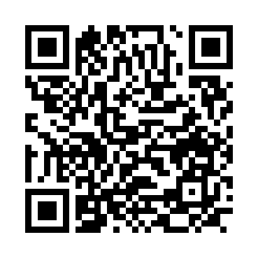
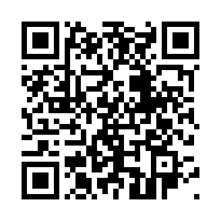
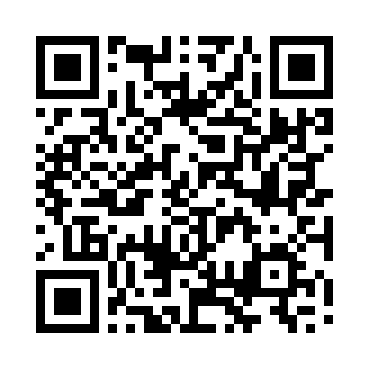
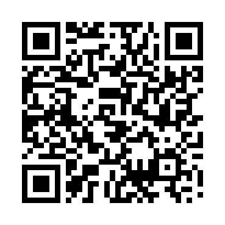
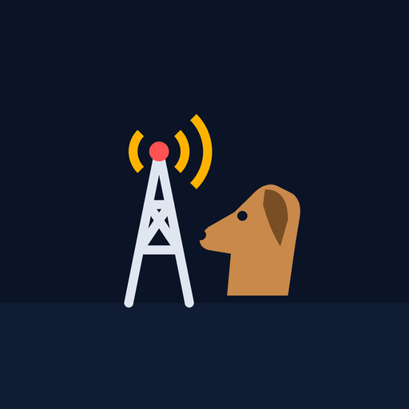
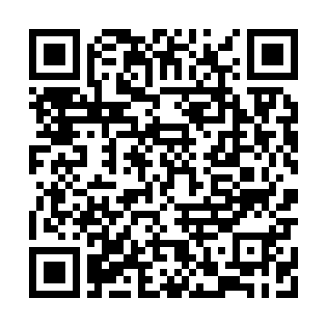
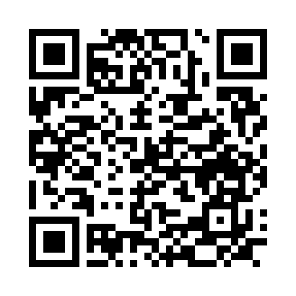

# kijitora-no-hito の Android アプリ

個人で作っている Android アプリの配布ページです。
APK を直接ダウンロードしてインストールする形で配っています（Google Play でも公開予定）。

- **ソースコードは公開していません。** このリポジトリにあるのは説明ページ・画像・プライバシーポリシーだけです。
- APK は [Releases](https://github.com/kijitora-no-hito/android-apps/releases) に置いています。各アプリのページの「ダウンロード」から入手できます。
- どのアプリも無料・広告なし・アプリ内課金なし・アカウント登録なしです。

## アプリ一覧

スマホで開くときは QR コードを読み取ってください（アプリのページが開きます）。

<table>
<tr>
<td width="110" align="center"></td>
<td><b><a href="trip_planner/">旅行プランナー</a></b>（v1.6） 予定カードを日ごとのボードに並べ、地図と予算で旅程を俯瞰。JSON で仲間に丸ごと渡せます。</td>
<td width="150" align="center"></td>
</tr>
<tr>
<td align="center"></td>
<td><b><a href="career_log/">キャリアログ</a></b>（v1.2.0） 学歴・職歴・資格・実績を登録すると、RPG のステータス画面・統計・Wikipedia 風・履歴書の 4 通りで見せてくれる経歴アプリ。</td>
<td align="center"></td>
</tr>
<tr>
<td align="center"></td>
<td><b><a href="whistle_trainer/">ホイッスルトレーナー</a></b>（v1.1） ティン・ホイッスル（D 管）の練習アプリ。譜面と運指を見ながら吹き、マイクで正誤を判定します。</td>
<td align="center"></td>
</tr>
<tr>
<td align="center"></td>
<td><b><a href="link_conne2/">りんくこねこね</a></b>（v1.3.1） 機器を置き、ケーブルを引き、設定を直す。目標スループットを達成するネットワーク構築パズルゲーム。</td>
<td align="center"></td>
</tr>
<tr>
<td align="center"></td>
<td><b><a href="mask_camera/">MaskCamera</a></b>（v1.1） 好きな画像を重ねてマスクを作り、そのまま覗いて撮るカメラ。透過 PNG もそのまま使えます。</td>
<td align="center"></td>
</tr>
<tr>
<td align="center"></td>
<td><b><a href="TPS_CAMERA/">TPS Camera</a></b>（v1.2） カメラ映像にゲーム風の HUD を重ね、地図で立てたピンを AR の光柱で現地に案内します。</td>
<td align="center"></td>
</tr>
<tr>
<td align="center"></td>
<td><b><a href="radio_survey/">電測記録</a></b>（v1.1.1） 電波の測定をプランと実測で記録。地図・写真・携帯網の RSRP をまとめ、PDF / CSV / KML で出力します。</td>
<td align="center"></td>
</tr>
<tr>
<td align="center"></td>
<td><b><a href="phonetic_hound/">Phonetic Hound</a></b>（<b>開発中</b> v0.5.1-dev） 電波で操られたゾンビの街で、スマホの信号強度と到来方向を頼りに携帯基地局を探して制圧する TPS アクション。</td>
<td align="center"></td>
</tr>
</table>

## インストール方法（共通）

1. アプリのページを**スマホのブラウザで**開き、「APK をダウンロード」を押します。
2. ダウンロードした APK を開きます。初回は「提供元不明のアプリ」のインストールを許可するよう求められるので、
   使っているブラウザ（またはファイルアプリ）に許可してください（設定 → アプリ → 特別なアプリアクセス → 不明なアプリのインストール）。
3. Google Play プロテクトが「不明なアプリ」「アプリをスキャンしますか」などの警告を出すことがあります。
   ストアを通さない APK では一般的に出る表示です。心配なときは、各ページに載せた **SHA-256** とダウンロードしたファイルが一致するか確かめてください。
4. インストールが済んだら、ブラウザへの「提供元不明のアプリ」の許可は戻しておいてかまいません。

### 更新・アンインストールについて

- **自動更新はありません。** 新しい版は、各アプリのページから同じ手順で入れ直してください（上書きインストールになり、データは残ります）。
- **アンインストールすると、端末の中に保存したデータは消えます。** データを書き出す機能があるアプリは、先に書き出しておいてください。
- ここで配っている APK は、tsukutta.app で配っている版、および今後 Google Play で公開する予定の版と**同じ署名鍵**で署名しています。
  そのため、どの配布元から入れた版にも（同じか新しい版なら）アンインストールせずに上書きできます。
  （電測記録と Phonetic Hound はここ GitHub でのみ配布しています。）

## 利用条件

- 無料で使えます。個人での利用は自由です。
- 無保証です。アプリの利用によって生じた損害について、開発者は責任を負いません。
- APK の再配布、改変しての配布はしないでください（紹介するときはこのページへのリンクでお願いします）。

詳しくは [LICENSE](https://github.com/kijitora-no-hito/android-apps/blob/main/LICENSE) を参照してください。各アプリが使っている第三者のデータ・ライブラリの表記は各アプリのページにあります。

## 連絡先

開発者: **kijitora-no-hito**

不具合の報告・ご要望は [Issues](https://github.com/kijitora-no-hito/android-apps/issues) へどうぞ。
各アプリのプライバシーポリシーに関するお問い合わせ先は、それぞれのポリシーに記載しています。

 このページの QR コード

