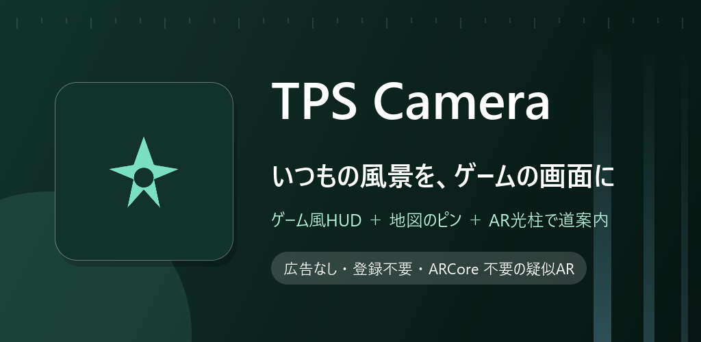

# TPS Camera

カメラ映像にゲーム風の HUD を重ね、地図で立てたピンを AR の光柱で現地に案内します。

## ダウンロード

### [APK をダウンロード（v1.1・2.4 MB）](https://github.com/kijitora-no-hito/android-apps/releases/download/tpscamera-v1.1/tpscamera-1.1-release.apk)

| 項目 | 内容 |
| --- | --- |
| バージョン | 1.1（2026-09-24） |
| ファイル | `tpscamera-1.1-release.apk`（2,489,885 バイト） |
| SHA-256 | `F0B181C9CDB24673C720FBCC0D37B5F844423457A41C0CE52D23E00ADE2063B3` |
| 対応 Android | 7.0 以上 |
| 権限 | 下の「権限の使いみち」を参照 |
| 価格 | 無料・広告なし・アプリ内課金なし・アカウント登録なし |

 PC で見ている方へ: スマホでこの QR を読み取ると、このページが開きます。

## どんなアプリ？

いつもの風景を、三人称視点ゲームの画面みたいに見るカメラアプリです。

### ゲーム風の HUD

- カメラ映像の上に、HP バーのようなゲージが 3 本、所持金、アイテム枠が 3 つ、そして画面上部に方位コンパスが重なります。
- ゲージの値も色も、所持金も、アイテムの画像も自分で決められるので、好きな世界観に仕立てられます。
- コンパスは端末を回すとリアルタイムに追従します。

### 地図でピンを立てる

- 地図をタップするとピンが立ちます（立てた瞬間に「ピシッ」と鳴ります）。もう一度タップすれば消えます。
- 地図には現在地と、カメラが向いている方向のコーンが出ます。

### AR の光柱で現地へ

- ピンを立てると、カメラ画面に戻ったときに、その方向に光の柱が立ちます。距離のラベルも付くので、「あと 320m、あっちの方向」が映像の中で分かります。
- コンパスにもピンの方向がノッチで出ます。
- GPS と方位センサーだけで計算する疑似 AR なので、ARCore 対応端末でなくても動きます。

### 場所に連動する BGM

- 地図上に円を描いて「このエリアではこの曲」を設定できます。端末に入れてある音楽ファイルを選ぶだけ。
- エリアに入ると曲が切り替わり、どのエリアにもいないときは既定の曲が流れます。散歩やランニングを自分のサウンドトラック付きにできます。

### みんなで同じ地図を見る（任意・上級者向け）

- 中継サーバを用意すれば、合言葉で部屋に入った人どうしで、お互いの位置・向き・ピン・ひとことメッセージを共有できます。相手の位置も地図と AR に出ます。
- **この機能は既定では無効で、接続先サーバを自分で入力したときだけ動きます。** サーバはアプリに付属しないので、使うには自分でサーバを立てて公開する必要があります。
- 接続中は位置情報などがそのサーバへ送られ、同じ部屋の人に見えます。信頼できる相手のサーバにだけ接続してください（詳しくはプライバシーポリシー）。

### データについて

- ピン・設定・BGM の設定は端末内にのみ保存されます。
- 写真や動画の撮影・保存はしません（カメラはライブ映像の表示だけに使います）。

## 権限の使いみち

| 権限 | 使いみち |
| --- | --- |
| カメラ | HUD と AR の光柱を重ねるライブ映像の表示 |
| 位置情報 | 地図の現在地、ピンまでの方向・距離の計算、BGM エリアの判定 |
| 通知 / フォアグラウンドサービス | 「場所に連動する BGM」をオンにしている間の再生と、その停止ボタン |
| インターネット | 地図タイルの取得（と、マルチプレイを自分で有効にしたときのサーバ接続） |
| 外部ストレージへの書き込み | Android 9 以下のみ。地図タイルのキャッシュ |

## 注意

- 疑似 AR なので、機種ごとの実際の画角、GPS と電子コンパスの誤差のぶん、光柱の位置は数度ずれます。屋内や磁気の強い場所では方位が乱れます（8 の字を描くキャリブレーションをすると改善します）。
- 地図タイルの初回取得にはインターネット接続が必要です（一度読めばキャッシュされます）。
- 地図（地理院タイル）は日本国内のみをカバーしています。

## インストール方法

1. このページをスマホのブラウザで開き、上の「APK をダウンロード」を押します。
2. ダウンロードした APK を開きます。初回は「提供元不明のアプリ」のインストールを許可するよう求められるので、使っているブラウザ（またはファイルアプリ）に許可してください。
3. Google Play プロテクトが警告を出すことがあります。ストアを通さない APK では一般的に出る表示です。心配なときは上の SHA-256 と一致するか確かめてください。
4. **アンインストールすると、立てたピンと設定は消えます。**

### 更新について

- 自動更新はありません。新しい版が出たら、このページから同じ手順で入れ直してください（上書きインストールになり、ピンと設定は残ります）。
- Google Play でも公開する予定です。ここで配っている APK は tsukutta.app 版・Google Play 版と同じ署名鍵で署名しているので、どちらから入れた版にも上書きで入れ替えられます。

## 出典

- 地図: [地理院タイル](https://maps.gsi.go.jp/development/ichiran.html)（国土地理院）/ 地図表示ライブラリ [osmdroid](https://github.com/osmdroid/osmdroid)

## プライバシーポリシー

[TPS Camera プライバシーポリシー](https://kijitora-no-hito.github.io/android-apps/TPS_CAMERA/privacy-policy.html)

---

[← アプリ一覧に戻る](../)
