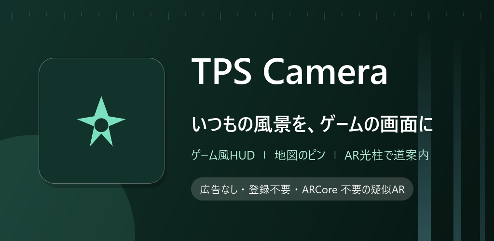

# TPS Camera

カメラ映像にゲーム風の HUD を重ね、地図で立てたピンを AR の光柱で現地に案内します。

## 紹介動画

<video src="images/demo.mp4" poster="images/demo-poster.jpg" controls playsinline preload="metadata" width="720" style="max-width:100%;height:auto;"></video>

動画が表示されないときは [こちら（MP4・38 秒・7.6 MB）](https://kijitora-no-hito.github.io/android-apps/TPS_CAMERA/images/demo.mp4) から再生できます。

<small>BGM：<a href="https://maou.audio/">魔王魂</a></small>

## ダウンロード

### [APK をダウンロード（v1.3・24.6 MB）](https://github.com/kijitora-no-hito/android-apps/releases/download/tpscamera-v1.3/tpscamera-1.3-release.apk)

| 項目 | 内容 |
| --- | --- |
| バージョン | 1.3（2026-09-28） |
| ファイル | `tpscamera-1.3-release.apk`（25,834,177 バイト） |
| SHA-256 | `DE48DC745799AA6E5A887BD7664949F9616FCBC8624FF0959F15D6CF50E2D525` |
| 対応 Android | 7.0 以上・**64bit（arm64-v8a）の端末のみ**（1.3 から。ここ数年の端末はほぼ該当します） |
| 権限 | 下の「権限の使いみち」を参照 |
| 価格 | 無料・広告なし・アプリ内課金なし・アカウント登録なし |

 PC で見ている方へ: スマホでこの QR を読み取ると、このページが開きます。

## どんなアプリ？

いつもの風景を、三人称視点ゲームの画面みたいに見るカメラアプリです。

### ゲーム風の HUD

- カメラ映像の上に、HP バーのようなゲージが 3 本、所持金、アイテム枠が 3 つ、そして画面上部に方位コンパスが重なります。
- ゲージの値も色も、所持金も、アイテムの画像も自分で決められるので、好きな世界観に仕立てられます。
- コンパスは端末を回すとリアルタイムに追従します。

### 地図でピンを立てる

- 地図をタップするとピンが立ちます（立てた瞬間に「ピシッ」と鳴ります）。もう一度タップすれば消えます。
- 地図には現在地と、カメラが向いている方向のコーンが出ます。

### AR の光柱で現地へ

- ピンを立てると、カメラ画面に戻ったときに、その方向に光の柱が立ちます。距離のラベルも付くので、「あと 320m、あっちの方向」が映像の中で分かります。
- コンパスにもピンの方向がノッチで出ます。
- GPS と方位センサーだけで計算する疑似 AR なので、ARCore 対応端末でなくても動きます。

### レーダー

- 右下のレーダーボタンを押すと、足元に格子が、まわりにワイヤーフレームの球が広がっていきます。
- ボタンを押したときに映っていた人には、頭上に HP バー（値はランダム）、胴に青い光が付き、動いても追いかけます。見失うと消えます。
- 人物の検出は端末の中だけで行い、映像を保存したり送信したりはしません。遊びのための機能です。人を映すときは相手の同意を得てください。

### 中央のキャラクター

- 設定で、画面の中央にゲームの主人公のようなキャラクターを後ろ姿で表示できます。3D キャラクターは 3 体から選べ、歩く速さに合わせて待機・歩き・走りが切り替わります。
- 3D の代わりに、好きな画像を表示することもできます（画像は端末内にだけ保存されます）。

### 場所に連動する BGM

- 地図上に円を描いて「このエリアではこの曲」を設定できます。端末に入れてある音楽ファイルを選ぶだけ。
- エリアに入ると曲が切り替わり、どのエリアにもいないときは既定の曲が流れます。散歩やランニングを自分のサウンドトラック付きにできます。

### みんなで同じ地図を見る（任意・上級者向け）

- 中継サーバを用意すれば、合言葉で部屋に入った人どうしで、お互いの位置・向き・ピン・ひとことメッセージを共有できます。相手の位置も地図と AR に出ます。
- **この機能は既定では無効で、接続先サーバを自分で入力したときだけ動きます。** サーバはアプリに付属しないので、使うには自分でサーバを立てて公開する必要があります。
- 接続中は位置情報などがそのサーバへ送られ、同じ部屋の人に見えます。信頼できる相手のサーバにだけ接続してください（詳しくはプライバシーポリシー）。
- **サーバの立て方とアプリの設定方法: [マルチプレイ用サーバの立て方](multiplayer.md)**（自宅の PC で無料で試す方法と、VPS で常時動かす方法）。

### データについて

- ピン・設定・BGM の設定・中央に表示する画像は端末内にのみ保存されます。
- 写真や動画の撮影・保存はしません（カメラはライブ映像の表示と、レーダーの人物検出（端末内）だけに使います）。

## 権限の使いみち

| 権限 | 使いみち |
| --- | --- |
| カメラ | HUD と AR の光柱を重ねるライブ映像の表示、レーダーの人物検出（端末内のみ） |
| 位置情報 | 地図の現在地、ピンまでの方向・距離の計算、BGM エリアの判定 |
| 通知 / フォアグラウンドサービス | 「場所に連動する BGM」をオンにしている間の再生と、その停止ボタン |
| インターネット | 地図タイルの取得（と、マルチプレイを自分で有効にしたときのサーバ接続） |
| 外部ストレージへの書き込み | Android 9 以下のみ。地図タイルのキャッシュ |

## 注意

- 疑似 AR なので、機種ごとの実際の画角、GPS と電子コンパスの誤差のぶん、光柱の位置は数度ずれます。屋内や磁気の強い場所では方位が乱れます（8 の字を描くキャリブレーションをすると改善します）。
- 地図タイルの初回取得にはインターネット接続が必要です（一度読めばキャッシュされます）。
- 地図（地理院タイル）は日本国内のみをカバーしています。

## インストール方法

1. このページをスマホのブラウザで開き、上の「APK をダウンロード」を押します。
2. ダウンロードした APK を開きます。初回は「提供元不明のアプリ」のインストールを許可するよう求められるので、使っているブラウザ（またはファイルアプリ）に許可してください。
3. Google Play プロテクトが警告を出すことがあります。ストアを通さない APK では一般的に出る表示です。心配なときは上の SHA-256 と一致するか確かめてください。
4. **アンインストールすると、立てたピンと設定は消えます。**

### 更新について

- 自動更新はありません。新しい版が出たら、このページから同じ手順で入れ直してください（上書きインストールになり、ピンと設定は残ります）。
- ここで配っている APK は tsukutta.app 版と同じ署名鍵で署名しているので、どちらから入れた版にも上書きで入れ替えられます。

## 出典

- 地図: [地理院タイル](https://maps.gsi.go.jp/development/ichiran.html)（国土地理院）/ 地図表示ライブラリ [osmdroid](https://github.com/osmdroid/osmdroid)
- 人物検出: [MediaPipe](https://ai.google.dev/edge/mediapipe) / EfficientDet-Lite0（Apache License 2.0）
- 3D 表示: [Filament](https://github.com/google/filament)（Apache License 2.0）/ 3D キャラクター: [Quaternius](https://quaternius.com/)（CC0）
- 紹介動画の BGM：[魔王魂](https://maou.audio/)（アプリには同梱していません）

## プライバシーポリシー

[TPS Camera プライバシーポリシー](https://kijitora-no-hito.github.io/android-apps/TPS_CAMERA/privacy-policy.html)

---

[← アプリ一覧に戻る](../)
