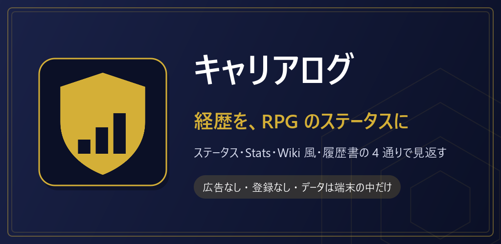
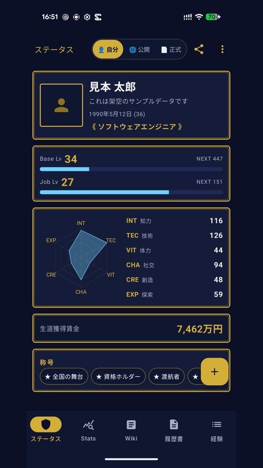
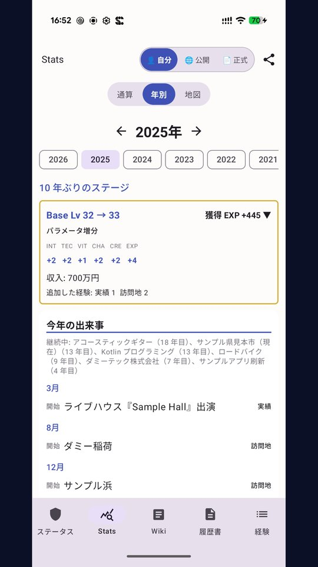
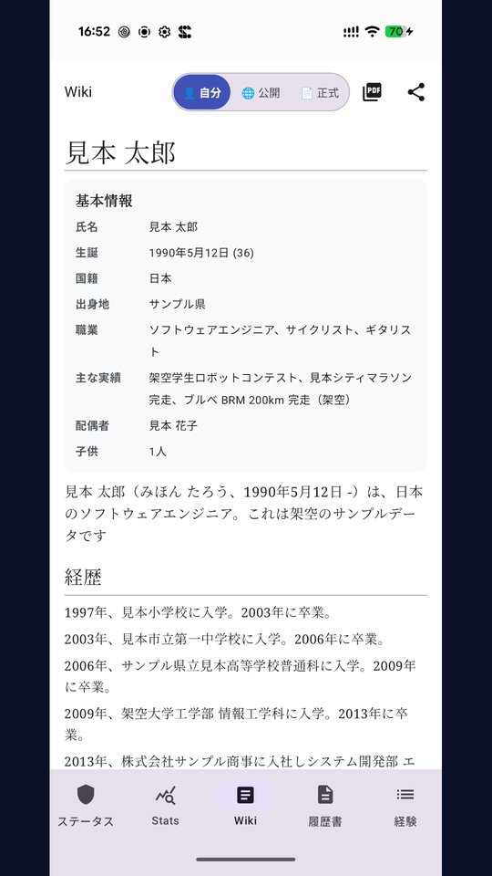
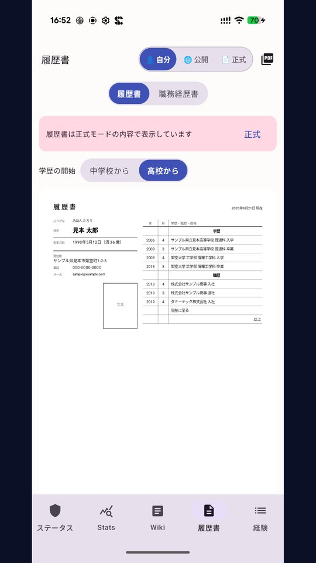
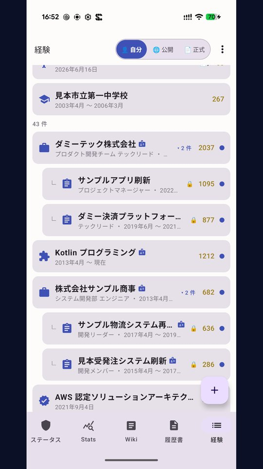
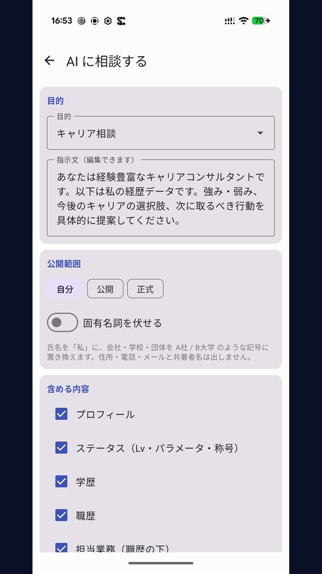

# キャリアログ

学歴・職歴・資格・実績を登録すると、RPG のステータス画面・統計・Wikipedia 風・履歴書の 4 通りで見せてくれる経歴アプリ。通信は地図検索のときだけ。

## ダウンロード

### [APK をダウンロード（v1.2.0・53.7 MB）](https://github.com/kijitora-no-hito/android-apps/releases/download/careerlog-v1.2.0/careerlog-1.2.0-release.apk)

| 項目 | 内容 |
| --- | --- |
| バージョン | 1.2.0（2026-09-24） |
| ファイル | `careerlog-1.2.0-release.apk`（56,338,072 バイト） |
| SHA-256 | `FE43A4D20A5189734479535549BEBAB0AC22705C008CCAC4EA4C7BEFBDBA3DA9` |
| 対応 Android | 7.0 以上 |
| 権限 | インターネット / 通信状態の確認（「地図から選ぶ」で地図と場所検索を使うときだけ。許可ダイアログは出ません）。**位置情報の権限はありません** |
| 価格 | 無料・広告なし・アプリ内課金なし・アカウント登録なし |

ファイルが大きめ（約 54MB）なので、モバイル回線でのダウンロードにはご注意ください。

 PC で見ている方へ: スマホでこの QR を読み取ると、このページが開きます。

## どんなアプリ？

自分がこれまでにやってきたことを 1 か所に集めて、いろいろな見え方で眺めるためのアプリです。
学歴・職歴・担当業務・資格・実績・論文や発表・活動や委員・特技・訪問地・居住地・ライフイベントを登録すると、同じデータが次の画面に変わります。

- **ステータス** — RPG のステータス画面。Base Lv と Job Lv、6 つのパラメータ（知力・技術・体力・社交・創造・探索）のレーダーチャート、生涯獲得賃金、条件を満たすと付く称号。経験を追加すると「+360 EXP（Base Lv 32 → 33）」と増分が出ます。
- **Stats** — スポーツ選手の成績ページ風。得意分野の横棒、上位の実績、所属の年表、年ごとの EXP と収入の推移。「年別」に切り替えると、その年の Lv の伸び・出来事の月別タイムライン・行った場所・振り返りメモを 1 年分まとめて見返せます。
- **Wiki** — 自分の経歴から Wikipedia 風の記事を自動生成します。導入文・経歴・主な実績・業績・活動・資格・特技・私生活・年表。
- **履歴書 / 職務経歴書** — JIS 風の履歴書と職務経歴書を A4 で組んで、PDF に書き出せます。
- **経験一覧** — 追加・編集の入口。職歴の下に担当業務をぶら下げて管理できます。職種・資格・趣味・学部学科・担当業務・役割・ゲームタイトル・大会の種目は同梱の一覧から検索して選べ、一覧に無いものは自分で足せます。

はじめて開いたときは、使い方を 9 ページで案内するチュートリアルが出ます（設定からいつでも開き直せます）。

### 3 つの表示モード

- 「自分 / 公開 / 正式」を画面上部で切り替えられます。経験ごと・プロフィール項目ごとに「どのモードで見せるか」を決められるので、SNS に載せるスクリーンショットでは本名や収入を伏せ、履歴書として渡すときは趣味の実績を外す、といった出し分けが 1 タップでできます。
- 経験ごとに正式名称とは別の**一般名称**（例: 「○○株式会社」→「SaaS 系スタートアップ」）を登録しておくと、公開モードではその言い換えで表示されます。

### AI に相談する

- 登録した経歴を、生成 AI にそのまま貼り付けられる Markdown に整えます。「キャリア相談」「履歴書の添削」「年間の振り返り」など 8 つの目的から選べます。
- **固有名詞を伏せる**スイッチで、氏名は「私」、会社名や学校名は「A社」「B大学」のような記号に置き換わります。
- アプリが AI へ送信することはありません。コピー・共有するかどうかは利用者が決めます。

### SNS に呟く

- ステータス・Stats・Wiki の共有ボタンから、SNS 用のサマリ画像（1080×1350）をその場で作れます。
- 画像は必ず「公開」モードの内容で作るので、本名や収入がうっかり写り込むことはありません。

### 大会・イベント・配信もそのまま

- e-sports の大会、自転車のヒルクライム、マラソン大会などは「大会・イベント」テンプレートで登録できます。役割（出場 / 主催 / 運営 / 実況）・結果・参加人数・タイム・距離の欄がまとめて出ます。
- 配信・実況はプラットフォームと頻度、配信回数・登録者数を記録できます。

### 取り込みと書き出し

- **CSV でまとめて登録** — PC の表計算ソフトで作った CSV から経験をまとめて登録できます。書式のヘルプとテンプレート CSV を同梱しています。
- **researchmap からの取り込み** — researchmap からエクスポートした業績 JSON を読み込めます（通信はせず、選んだファイルを読むだけです）。
- **バックアップ** — ZIP に書き出して、必要なときに復元できます。機種変更のときはこれを持って行ってください。

### 地図で訪問地・居住地を見る

- Stats タブの「地図」で、訪問した都道府県・国を塗り分けて表示します（居住は濃い色、訪問は中間色）。この塗り分け地図は通信せず、同梱の地図データで描いています。
- 訪問地・観光地・居住地の場所は「地図から選ぶ」で登録できます。地図をタップするか場所名で検索すると、国・都道府県・市区町村と緯度経度がまとめて入ります。

### データについて

- **通信するのは「地図から選ぶ」を開いたときの地図タイルと場所検索だけ**です。登録した経歴が外に出ることはありません。
- データはすべて端末の中だけに保存されます。現在地の取得（位置情報の権限）もありません。

## スクリーンショット

画面に出ている人物・会社・学校はすべて架空のサンプルデータです。

<table>
<tr>
<td align="center"> ステータス</td>
<td align="center"> Stats（年別）</td>
<td align="center"> Wiki</td>
</tr>
<tr>
<td align="center"> 履歴書</td>
<td align="center"> 経験一覧</td>
<td align="center"> AI に相談する</td>
</tr>
</table>

## 注意

- 「地図から選ぶ」の地図は日本国内のみ表示されます（海外の場所は検索から選べます）。地図と場所検索にはインターネット接続が必要です。

## インストール方法

1. このページをスマホのブラウザで開き、上の「APK をダウンロード」を押します。
2. ダウンロードした APK を開きます。初回は「提供元不明のアプリ」のインストールを許可するよう求められるので、使っているブラウザ（またはファイルアプリ）に許可してください。
3. Google Play プロテクトが警告を出すことがあります。ストアを通さない APK では一般的に出る表示です。心配なときは上の SHA-256 と一致するか確かめてください。
4. **アンインストールすると、端末内の経歴データは消えます。** 先に「設定 → バックアップ（ZIP 書き出し）」で書き出しておいてください。

### 更新について

- 自動更新はありません。新しい版が出たら、このページから同じ手順で入れ直してください（上書きインストールになり、データは残ります）。
- Google Play でも公開する予定です。ここで配っている APK は tsukutta.app 版・Google Play 版と同じ署名鍵で署名しているので、どちらから入れた版にも上書きで入れ替えられます。

## 出典

- 「地図から選ぶ」の地図: [地理院タイル](https://maps.gsi.go.jp/development/ichiran.html)（国土地理院）
- 場所検索: [Nominatim](https://nominatim.org/) / © [OpenStreetMap](https://www.openstreetmap.org/copyright) contributors（ODbL）
- 塗り分け地図のデータ: [Natural Earth](https://www.naturalearthdata.com/)（パブリックドメイン）を簡略化して同梱 — Made with Natural Earth

## プライバシーポリシー

[キャリアログ プライバシーポリシー](https://kijitora-no-hito.github.io/android-apps/career_log/privacy-policy.html)

---

[← アプリ一覧に戻る](../)
