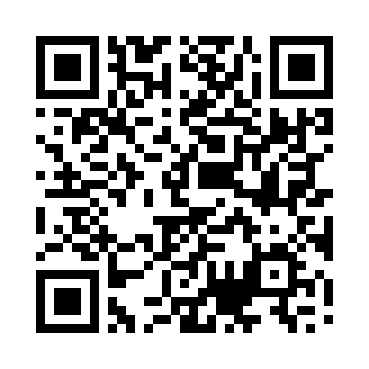
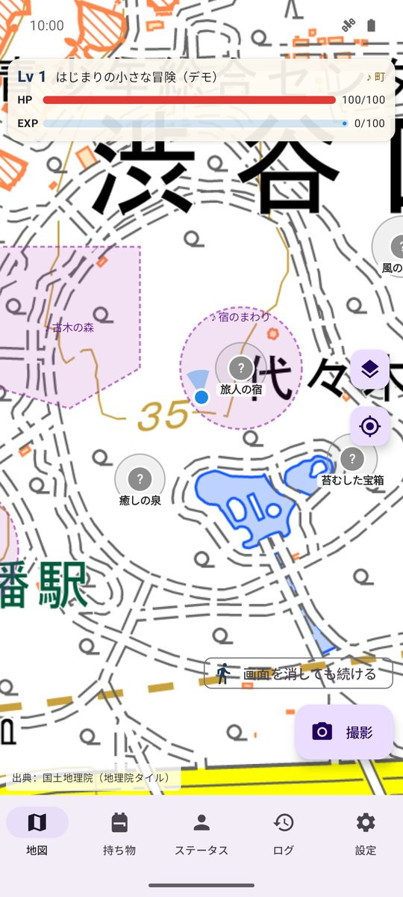
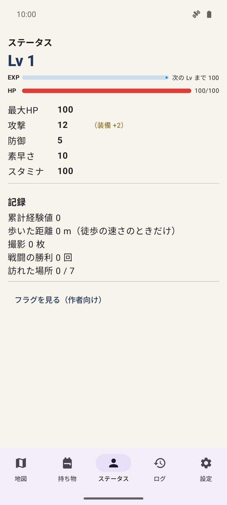
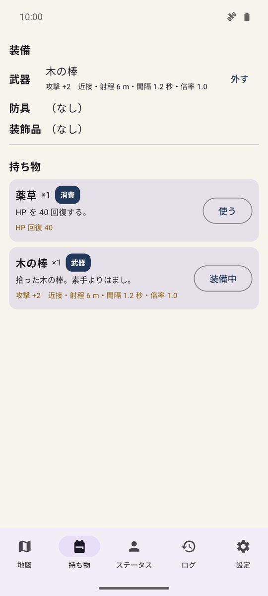
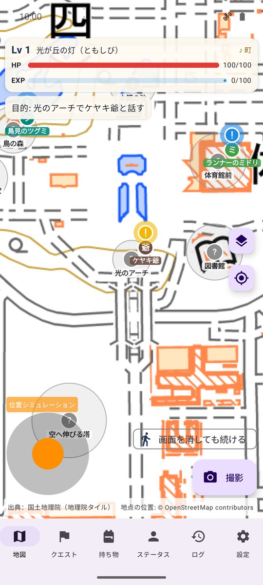
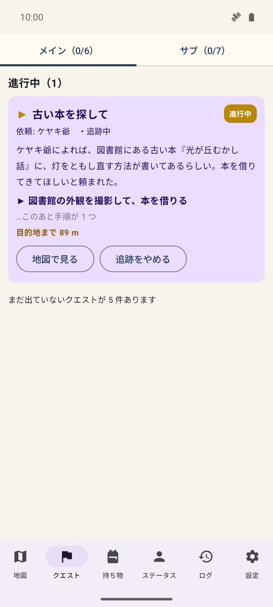
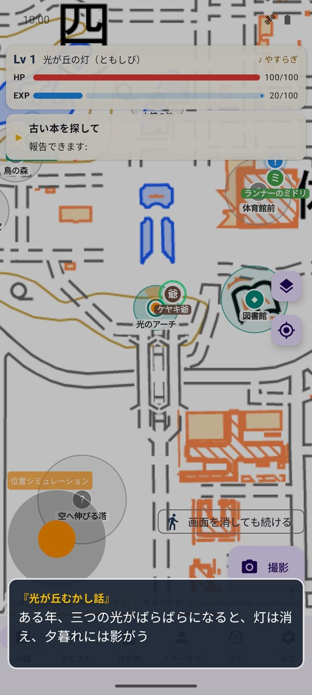

# ジオクエスト（開発中・仮名）

> **⚠ 開発中の版です。** いまはゲームの土台と、光が丘公園のシナリオ・短いデモだけです。名前・内容・バランス・画面は今後大きく変わります。
> セーブデータは今後の版で引き継げなくなることがあります。

現実の街を歩いて冒険する、GPS の位置ゲームです。

## ダウンロード

### [APK をダウンロード（v0.2.0-dev・13.5 MB）](https://github.com/kijitora-no-hito/android-apps/releases/download/geoquest-v0.2.0-dev/geoquest-0.2.0-dev-release.apk)

| 項目 | 内容 |
| --- | --- |
| バージョン | 0.2.0-dev（2026-10-11・開発中） |
| ファイル | `geoquest-0.2.0-dev-release.apk`（14,150,481 バイト） |
| SHA-256 | `60983271E5A6118187F9B8567A5BE5C92B2549A2DA03E49655E65E8D4D49978E` |
| 対応 Android | 7.0 以上 |
| 権限 | 位置情報、身体活動（歩数）、カメラ、通知、インターネット（地図の画像） |
| 価格 | 無料・広告なし・アプリ内課金なし・アカウント登録なし |

 PC で見ている方へ: スマホでこの QR を読み取ると、このページが開きます。

## どんなゲーム？

- **実際の場所へ行く**と、会話やイベントが起こります。場所で**写真を撮る**と、アイテムが手に入ったり、隠れた場所が見つかったりします。
- **歩いたり写真を撮ったりすると経験値**が入り、Lv が上がります（歩いた距離は徒歩の速さのときだけ数えます）。
- **戦闘は地図の上**。あなたが実際に歩くと、地図の上のキャラクターが動きます。攻撃は自動。あなたは**位置取り**を担当し、敵の攻撃の予告範囲から歩いて出て、［ローリング］で身をかわします。
- **場所に応じた BGM** が流れ、戦闘やイベントでは曲が切り替わります（曲と効果音はアプリの中で合成したもの）。
- 冒険は「シナリオパック」で作られていて、**作成モード**で地図に場所を置き、イベント・アイテム・敵・BGM を組み立てて自分の冒険を作れます（書き出し / 読み込み）。

### シナリオ「光が丘の灯（ともしび）」— 練馬区・光が丘公園

むかし「光の丘」と呼ばれた丘には、灯がともっていたという。夕暮れの公園に影の獣が出るようになったいま、公園の入口で出会ったケヤキ爺は、図書館にある古い本に灯をともし直す方法が書いてあるはずだと言う——。

- 公園の入口・図書館・観賞池・くすのき広場・ピラミッド・大芝生など、**実際の場所を巡る**メインクエスト 6 つと、公園の人たちのサブクエスト 7 つ。
- 依頼を受けられる人の頭上には**「！」**（メインは金、サブは青）、報告できるときは**「？」**。目的地には旗が立ち、画面の外なら端に方向と距離が出ます。
- 例: 入口のケヤキ爺に頼まれて図書館へ。**外観の写真を撮ると本を借りたことになり**、本を手に入れてケヤキ爺に渡す。
- **建物の中には入りません**（外観の写真で済みます）。戦闘は公園の広い芝生だけで起こります。写真に人が写らないようにしてください。バードサンクチュアリでは静かに。
- 出発は光が丘駅前。遠くにいても選べます（地図で場所を見られます）。

### いま遊べるデモ「はじまりの小さな冒険」

冒険を始めた場所のまわり 50〜350 m に、宿・泉・古木・宝箱・野原・塔・祠の 7 か所が現れます。宿で話を聞き、古木で写真を撮り、敵を倒して祠のボスへ。どこでも遊べますが、場所が道路や私有地にかかることがあります（その場所へは行かないでください）。

<table>
<tr>
<td align="center"> 地図（場所・BGM のゾーン）</td>
<td align="center"> ステータス</td>
<td align="center"> 持ち物・装備</td>
</tr>
<tr>
<td align="center"> 光が丘公園: 依頼主の「！」</td>
<td align="center"> クエスト一覧</td>
<td align="center"> 本の中身（物語）</td>
</tr>
</table>

## 安全のために

- **歩きながら画面を見ないでください。** 戦闘中も、立ち止まって周りを確かめてから画面を見てください。
- **道路に飛び出さない・私有地や立ち入り禁止の場所に入らない。** 地図上の場所がそういう所にかかっていたら、行かないでください。
- 車・自転車など、徒歩より速い移動中は戦闘が一時停止し、歩いた距離の経験値も入りません。
- 夜間や人通りの少ない場所、天候の悪いときは無理をしないでください。

## データについて

- 位置・写真・ゲームの進行は端末の中だけに保存し、送信しません。通信は地図の画像の取得だけです。
- 出典：国土地理院（地理院タイル）。光が丘公園のシナリオの地点の位置: © OpenStreetMap contributors（ODbL）。このアプリは国土地理院・東京都・練馬区が作成・承認したものではありません。

## インストール方法

1. このページをスマホのブラウザで開き、上の「APK をダウンロード」を押します。
2. ダウンロードした APK を開きます。初回は「提供元不明のアプリ」のインストールを許可するよう求められるので、使っているブラウザ（またはファイルアプリ）に許可してください。
3. Google Play プロテクトが警告を出すことがあります。ストアを通さない APK では一般的に出る表示です。心配なときは上の SHA-256 と一致するか確かめてください。
4. **アンインストールすると、端末内の記録・写真・作成したパックは消えます。**

詳しい手順は[トップページ](../)の「インストール方法（共通）」にもあります。

## プライバシーポリシー

[ジオクエスト プライバシーポリシー](https://kijitora-no-hito.github.io/android-apps/geo_quest/privacy-policy.html)

---

[← アプリ一覧に戻る](../)
