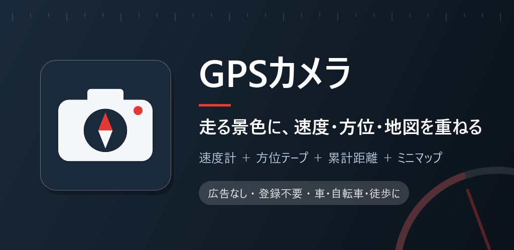
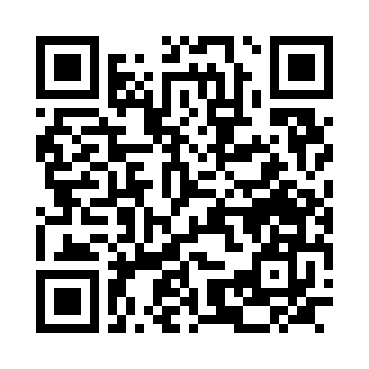

# GPSカメラ

カメラ映像に速度・方位・累計距離・ミニマップを重ねて表示。車・自転車・徒歩のお供に。

## ダウンロード

### [APK をダウンロード（v1.2・8.5 MB）](https://github.com/kijitora-no-hito/android-apps/releases/download/gpscamera-v1.2/gpscamera-1.2-release.apk)

| 項目 | 内容 |
| --- | --- |
| バージョン | 1.2（2026-10-10） |
| ファイル | `gpscamera-1.2-release.apk`（8,872,422 バイト） |
| SHA-256 | `2D0716A861ECA2D2999FBA55B0342AE65C203FA0F03BA804D3F23DA50138B28B` |
| 対応 Android | 7.0 以上 |
| 権限 | カメラ / 位置情報 / インターネット（下の「権限の使いみち」を参照） |
| 価格 | 無料・広告なし・アプリ内課金なし・アカウント登録なし |

 PC で見ている方へ: スマホでこの QR を読み取ると、このページが開きます。

## どんなアプリ？

背面カメラの映像を画面いっぱいに映し、その上に速度計や方位、地図を重ねて表示するアプリです。
車載ホルダーに付けて、ゲームの HUD のような画面で走れます。画面は横向きです。

### 画面に出るもの

- **速度**（km/h）と、直近 1km の平均速度（左上）
- **スピードメーター**（0〜180 km/h のアナログ風。現在時刻つき、左下）
- **方位テープ**（背面カメラが向いている方角と角度、上中央）
- **累計走行距離**（右上）
- **前面カメラの小窓**（前後のカメラを同時に使える端末のみ）
- **ミニマップ**（Google マップ。現在地を中心に、カメラの向きが上になるよう回転。走った道を赤線で表示、右下）

### 画角と写す位置

- **背面カメラ**: 下中央の −/＋、またはカメラ映像の上でピンチで画角を変えられます。**ズームしているときは 1 本指のドラッグで写す位置をずらせます。** ダブルタップか倍率（例 2.0×）のタップで 1.0×・中央に戻ります。広角側（1.0× 未満）は超広角カメラのある端末だけです。
- **前面カメラの小窓**: 小窓の中でピンチすると画角、ドラッグすると写す位置が変わります。左下に倍率、右上の［↺］かダブルタップで元に戻ります。小窓の中の操作は背面カメラには伝わりません。
- 前面カメラの小窓を出している間は、背面カメラの使える範囲が狭くなることがあります。
- **地図**: ミニマップ左上の −/＋ でズームレベルを 1 段ずつ変えられます（10〜20）。
- カメラの画角と位置、地図のズームは、次に起動したときも同じ値で始まります。

### 速度と距離の計算

- GPS の測位から端末の中で計算します。精度の悪い測位や、ありえない跳び（時速 300km 超）は距離に足さないようにしています。
- 累計距離のパネルを長押しすると、累計距離と地図の赤線をリセットできます。

### データについて

- 累計距離と走行ルートは端末内にのみ保存されます。
- **撮影・録画はしません**（表示だけです）。録画したいときは Android 標準の画面録画を使ってください。

## 権限の使いみち

| 権限 | 使いみち |
| --- | --- |
| カメラ | 背面カメラの全画面表示と前面カメラの小窓（ライブ表示のみ。保存・送信はしません） |
| 位置情報（詳細・おおよそ） | 速度・平均速度・累計距離・走行ルートの計算（端末内）と、ミニマップの中心。アプリの画面を表示している間だけ使い、バックグラウンドでは使いません |
| インターネット / ネットワーク状態の確認 | ミニマップの地図の取得（許可ダイアログは出ません） |

## 注意

- **運転中はアプリを操作したり、画面を注視したりしないでください。** 操作は停車中に。端末は視界や操作の妨げにならない場所にしっかり固定してください。
- 速度と距離は GPS による目安です。車の速度計の代わりにはなりません。トンネルや高架下、ビル街では測れなかったりずれたりします。
- 方位は端末の向きから求めています。背面カメラを進行方向に向けて使ってください。車内などの磁気の乱れる場所では誤差が出ます。
- 前後のカメラの同時表示（前面カメラの小窓）は、対応した端末だけで表示されます。非対応の端末では背面カメラだけになります。
- 地図の表示にはインターネット接続と Google Play 開発者サービスが必要です。通信できないと地図は灰色のままです（ほかの表示は動きます）。
- 画面を表示し続けるので、電池の減りと端末の発熱に注意してください。

## インストール方法

1. このページをスマホのブラウザで開き、上の「APK をダウンロード」を押します。
2. ダウンロードした APK を開きます。初回は「提供元不明のアプリ」のインストールを許可するよう求められるので、使っているブラウザ（またはファイルアプリ）に許可してください。
3. Google Play プロテクトが警告を出すことがあります。ストアを通さない APK では一般的に出る表示です。心配なときは上の SHA-256 と一致するか確かめてください。
4. **アンインストールすると、累計距離と走行ルートは消えます。**

### 更新について

- 自動更新はありません。新しい版が出たら、このページから同じ手順で入れ直してください（上書きインストールになり、データは残ります）。
- このアプリは GitHub でのみ配布しています。

## 更新履歴

- **1.2**（2026-10-10）: 背面・前面それぞれのカメラの画角調整と、ズーム中のドラッグで写す位置をずらす機能を追加。
- **1.1**（2026-09-29）: カメラのズーム（−/＋・ピンチ）と、ミニマップのズームレベルの調整を追加。
- **1.0**（2026-09-28）: 初公開。

## 出典

- 地図: Google マップ（Google のロゴと出典は地図上に表示されます）

## プライバシーポリシー

[GPSカメラ プライバシーポリシー](https://kijitora-no-hito.github.io/android-apps/gps_camera/privacy-policy.html)

---

[← アプリ一覧に戻る](../)
