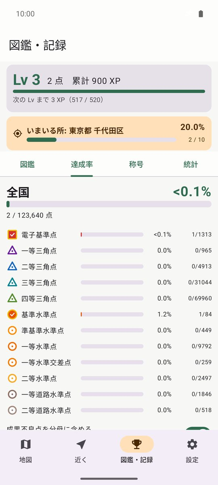

# 基準点めぐり

電子基準点・三角点・水準点を現地で集める位置ゲーム。基準点のそば（10 m 以内）で写真を撮ると獲得でき、経験値がたまって Lv が上がります。

## ダウンロード

### [APK をダウンロード（v0.3.0・15.4 MB）](https://github.com/kijitora-no-hito/android-apps/releases/download/kijuntenmeguri-v0.3.0/kijuntenmeguri-0.3.0-release.apk)

| 項目 | 内容 |
| --- | --- |
| バージョン | 0.3.0（2026-10-07） |
| ファイル | `kijuntenmeguri-0.3.0-release.apk`（16,101,722 バイト） |
| SHA-256 | `9D642107B2B52E0B4A54DF56E4B833F3BBAF5A0FB3BD6F99A936565B003EA8E4` |
| 対応 Android | 7.0 以上 |
| 権限 | 位置情報（獲得の判定・近くの基準点）、カメラ（獲得の写真）、インターネット（地図の画像） |
| 価格 | 無料・広告なし・アプリ内課金なし・アカウント登録なし |

 PC で見ている方へ: スマホでこの QR を読み取ると、このページが開きます。

## どんなアプリ？

街なかや山の上にある測量の目印 ── 電子基準点・三角点・水準点 ── を巡って集めるアプリです。

### 地図

- 国土地理院の地図の上に、基準点を種別ごとの形で表示します（電子基準点 □・三角点 △・水準点 ○）。
- **獲得済みの点はチェックと金の縁**で一目で分かります。種別ごとの表示切り替え・獲得済みを隠す、もできます。
- 点をタップすると、点名・種別・基準点コード・現在地からの距離と方角・獲得の記録と写真が見られます。

### 近くの基準点

- 現在地から近い順に、距離と方角の矢印つきで一覧します（範囲 1 / 3 / 5 / 10 km）。
- 点を選ぶと、コンパスで向きと距離を大きく表示します。**10 m 以内に入ると［獲得する（撮影）］が押せる**ようになります。

### 獲得・経験値・Lv

- 獲得の条件は「点から 10 m 以内」「移動が徒歩程度まで（時速 9 km 以下。車や電車からは獲得できません）」「偽の位置情報でない」こと。アプリのカメラで写真を撮ると獲得です。
- **等級が高い点ほど経験値が多く**入ります（電子基準点 300・一等三角点 250・基準水準点 200・二等三角点 120・一等水準点 100・三等三角点 60・四等三角点 30 など）。初めての種別・初めての都道府県にはボーナスがあります。
- 経験値がたまると Lv アップ。称号は「初めての電子基準点」「一等三角点 10 点」「47 都道府県」「市区町村コンプリート」など 35 種類。

### 達成率

- 全国 約 12 万 4 千点の基準点の一覧をアプリに入れてあり、**全国・都道府県・市区町村ごとに何 % 獲得したか**が分かります。種別ごと（電子基準点・一等〜四等三角点・各種の水準点）の % も出ます。
- 都道府県の一覧は達成率順・獲得数順に並べ替えられ、タップで市区町村ごとの達成率へ。市区町村では、まだ獲得していない点を近い順に一覧できます。
- 記録の画面の上に「いまいる所」（例: 東京都 千代田区 20%）を表示します。
- 都市部は基準点が少なめです（データどおりです）。成果不良点を分母に入れるかは設定で切り替えられます。

### 図鑑・記録

- 獲得した点を写真つきの図鑑で見返せます。種別ごと・都道府県ごとの達成、称号、月ごとの獲得数、Lv アップの履歴も残ります。
- 記録と写真は ZIP ファイルに書き出して、機種変更のときに読み込めます。

### 圏外でも

- 基準点の一覧はアプリに入っているので、山の中など電波が届かない所でも近くの基準点の一覧・案内・獲得ができます（地図の画像は一度表示した範囲だけ残ります）。

## スクリーンショット

<table>
<tr>
<td align="center"> 地図</td>
<td align="center"> 近くの基準点</td>
<td align="center"> 案内（10 m 以内で撮影）</td>
<td align="center"> 図鑑・記録（称号）</td>
</tr>
<tr>
<td align="center"> 達成率</td>
</tr>
</table>

## 安全のために

- **基準点は私有地・山の中・道路の上にあることがあります。** 立ち入りが許されていない場所には入らないでください。
- 歩きながら・道路の上で画面を見ないでください。周りの安全を確かめてから撮影してください。
- **標石には触れたり、動かしたりしないでください。** 基準点は測量法で保護されています。
- 山の上の三角点を目指すときは、装備と計画を整えてください。
- 地図上の点の位置は「おおよそ」です。見つからないこともあります（成果不良点など）。

## データについて

- 地図と基準点のデータは国土地理院の「地理院タイル」を使っています。出典：国土地理院（地理院タイル・基準点）。
- 市区町村の区分は「国土数値情報（行政区域データ）」（国土交通省）を加工して作成しています。
- このアプリは国土地理院・国土交通省が作成・承認したものではありません。
- 通信するのは国土地理院のサーバーだけです（地図の画像の取得と、地図で「表示範囲を最新に更新」を押したときの基準点データの取得）。獲得した場所の座標は送りません。
- 写真と獲得の記録は端末の中だけに保存し、送信しません。広告・アクセス解析はありません。

## インストール方法

1. このページをスマホのブラウザで開き、上の「APK をダウンロード」を押します。
2. ダウンロードした APK を開きます。初回は「提供元不明のアプリ」のインストールを許可するよう求められるので、使っているブラウザ（またはファイルアプリ）に許可してください。
3. Google Play プロテクトが警告を出すことがあります。ストアを通さない APK では一般的に出る表示です。心配なときは上の SHA-256 と一致するか確かめてください。
4. **アンインストールすると、端末内の記録と写真は消えます。** 先に「設定 → 書き出す」で書き出しておいてください。

詳しい手順は[トップページ](../)の「インストール方法（共通）」にもあります。

### 更新について

- 自動更新はありません。新しい版が出たら、このページから同じ手順で入れ直してください（上書きインストールになり、記録は残ります）。
- このアプリは GitHub でのみ配布しています。

## プライバシーポリシー

[基準点めぐり プライバシーポリシー](https://kijitora-no-hito.github.io/android-apps/kijunten_meguri/privacy-policy.html)

---

[← アプリ一覧に戻る](../)
