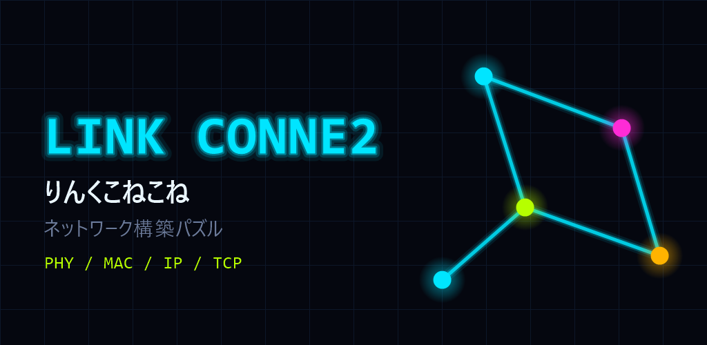
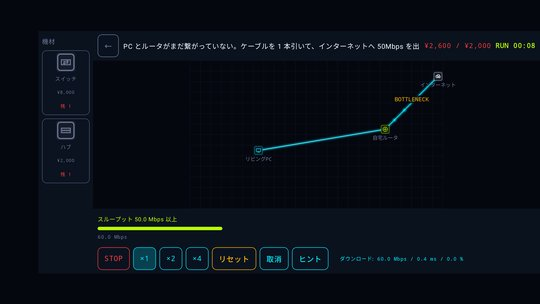
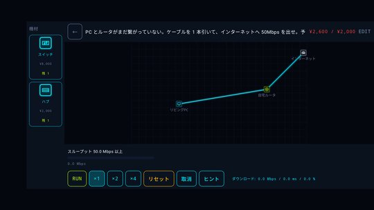
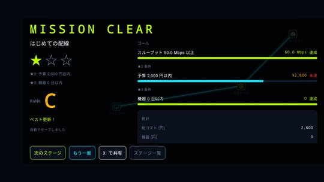
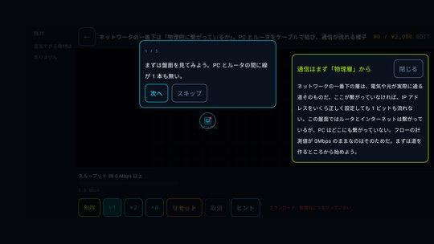
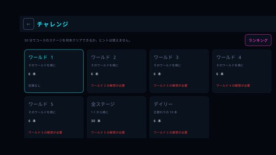
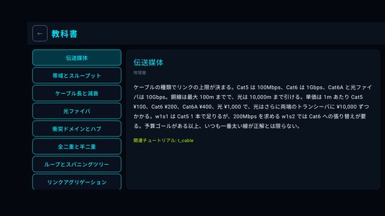
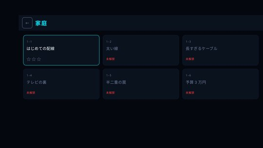
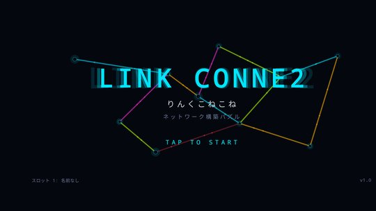

# りんくこねこね（Link Conne2）

機器を置き、ケーブルを引き、設定を直す。目標スループットを達成せよ。

## ダウンロード

### [APK をダウンロード（v1.3.1・2.4 MB）](https://github.com/kijitora-no-hito/android-apps/releases/download/linkconne2-v1.3.1/linkconne2-1.3.1-release.apk)

| 項目 | 内容 |
| --- | --- |
| バージョン | 1.3.1（2026-09-24） |
| ファイル | `linkconne2-1.3.1-release.apk`（2,533,940 バイト） |
| SHA-256 | `F55B4D32AB1002F84FD28BB2AD6C5F4D83269298E76B4500541D1CDE07A89C34` |
| 対応 Android | 8.0 以上 |
| 権限 | インターネット（新しいバージョンの確認のためだけ。設定でオフにできます） |
| 画面 | 横向き専用 |
| 言語 | 日本語 / English |
| 価格 | 無料・広告なし・アプリ内課金なし |

 PC で見ている方へ: スマホでこの QR を読み取ると、このページが開きます。

## どんなアプリ？

「200Mbps を出せ」——そのお題を満たすネットワークを、自分の手で組み上げるパズルゲームです。

機器をドラッグして盤面に置き、ケーブルを引き、設定を直す。RUN を押すとパケットが光の粒になって流れ出します。
詰まっている場所は自動で光り、どこが足を引っ張っているのかがひと目で分かります。

### 「線を引けばつながる」では済まない

このゲームの速度は、実際のネットワークと同じ理屈で決まります。

- **物理層** — ケーブルの規格ごとの上限、長さによる劣化、光ファイバ、リピータ
- **データリンク層** — ハブの衝突、半二重と全二重、ループとスパニングツリー、リンクアグリゲーション
- **無線** — 距離減衰、壁による遮蔽、SNR から決まる変調方式、チャネル干渉、電子レンジ、遅い端末が全員を巻き込む仕組み
- **ネットワーク層** — サブネット、デフォルトゲートウェイ、静的ルートと動的ルーティング、NAT、IP アドレスの重複、QoS
- **トランスポート層** — 帯域遅延積、ウィンドウサイズ、パケットロスと TCP の関係、MTU とジャンボフレーム
- **アプリケーション層** — 動画配信のビットレート、サーバの処理能力、ロードバランサ、ファイアウォール

無線の伝搬は ITU-R P.1411 に基づく計算で、距離・壁・見通しの有無から受信電力と SNR を求め、そこから変調方式（BPSK から 1024-QAM まで）が決まります。
画面には「64-QAM 3/4」のように実際の変調方式が表示されます。

### 4 つのモード

- **ミッション** — 家庭・オフィス・キャンパス・データセンター・都市と災害。5 つのワールドに 30 ステージ。予算や機器数の制限を満たすほど星が増えます。
- **チュートリアル** — 18 本。どれも「完成一手前」の盤面から始まり、解説を読みながら最後の一手を打つだけ。なぜその値になるのかを数字で説明します。説明の文字サイズは設定画面で小・標準・大から選べます。
- **チャレンジ** — 30 分のタイムアタック。何本クリアできるかを競い、見習いエンジニアからトップエンジニアまで 8 段階で認定されます。端末内ランキングつき。
- **フリー** — 予算無制限。全機材を使って好きなだけ試せる実験場です。通信を自分で定義して、どこが限界になるのかを確かめられます。

さらに、31 枚の用語カードを集めた教科書モードを収録。設定項目の「?」からいつでも該当ページを開けます。

### 特徴

- 日本語 / English 対応
- 広告なし・アプリ内課金なし。ゲームはオフラインで遊べます
- セーブデータ 3 スロット。中断してもその場から再開できます

ネットワークの勉強をしている方にも、パズルとして遊びたい方にも。

## スクリーンショット

<table>
<tr>
<td align="center"> RUN でパケットが流れる</td>
<td align="center"> 機器を置いて設定する</td>
</tr>
<tr>
<td align="center"> 結果</td>
<td align="center"> チュートリアル</td>
</tr>
<tr>
<td align="center"> チャレンジ</td>
<td align="center"> 用語カード（教科書モード）</td>
</tr>
<tr>
<td align="center"> ステージ選択</td>
<td align="center"> タイトル</td>
</tr>
</table>

## 新しいバージョンのお知らせについて

この APK には、新しいバージョンが出たことを知らせる機能があります（起動時に 1 日 1 回まで、配布元の tsukutta.app の配布ページを読むだけで、セーブデータなどは送りません。設定でオフにできます）。
お知らせが出たら、このページか tsukutta.app の配布ページから新しい版を入れ直してください。どちらの APK も同じものです。

## インストール方法

1. このページをスマホのブラウザで開き、上の「APK をダウンロード」を押します。
2. ダウンロードした APK を開きます。初回は「提供元不明のアプリ」のインストールを許可するよう求められるので、使っているブラウザ（またはファイルアプリ）に許可してください。
3. Google Play プロテクトが警告を出すことがあります。ストアを通さない APK では一般的に出る表示です。心配なときは上の SHA-256 と一致するか確かめてください。
4. **アンインストールすると、セーブデータ（進行状況・ランキング・フリーモードの盤面）は消えます。**

### 更新について

- 自動更新はありません。新しい版が出たら、このページから同じ手順で入れ直してください（上書きインストールになり、セーブデータは残ります）。
- Google Play でも公開する予定です。ここで配っている APK は tsukutta.app 版・Google Play 版と同じ署名鍵で署名しているので、どちらから入れた版にも上書きで入れ替えられます
  （Google Play 版には新しいバージョンのお知らせ機能とインターネット権限がありません。更新は Google Play が配ります）。

## 音楽について（クレジット）

アイルランド伝統曲および Turlough O'Carolan（1670-1738）の楽曲を使用しています。曲そのものはパブリックドメインです。

譜面データの出典は [The Session](https://thesession.org/)（thesession.org）で、[ODC Open Database License (ODbL) v1.0](https://opendatacommons.org/licenses/odbl/1-0/) に基づいて利用しています。
Contains information from The Session, which is made available under the ODC Open Database License (ODbL).

採譜者名・元 URL・加えた変更の内容はアプリ内の「設定 → クレジット」に記載しており、同じ画面から譜面データを zip で書き出せます。
アプリに同梱している譜面データ（派生データベース）は、ODbL に従ってここでも公開しています: [music-data/](music-data/)（[LICENSE.txt](music-data/LICENSE.txt) / [credits.json](music-data/credits.json)）

## プライバシーポリシー

[りんくこねこね プライバシーポリシー / Privacy Policy](https://kijitora-no-hito.github.io/android-apps/link_conne2/privacy-policy.html)

---

[← アプリ一覧に戻る](../)
