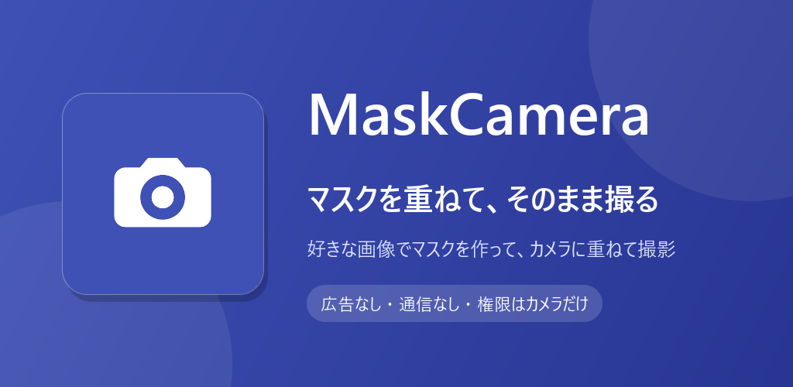

# MaskCamera

好きな画像を重ねてマスクを作り、そのまま覗いて撮る。透過 PNG もそのまま使えます。

## ダウンロード

### [APK をダウンロード（v1.1・2.2 MB）](https://github.com/kijitora-no-hito/android-apps/releases/download/maskcamera-v1.1/maskcamera-1.1-release.apk)

| 項目 | 内容 |
| --- | --- |
| バージョン | 1.1（2026-09-24） |
| ファイル | `maskcamera-1.1-release.apk`（2,300,947 バイト） |
| SHA-256 | `3A56F9A032CA79C51A2F57FA8A6D094CAC34177B0443E89562067FC76004E357` |
| 対応 Android | 7.0 以上 |
| 権限 | カメラ / 外部ストレージへの書き込み（Android 9 以下のみ。写真の保存のため） |
| 通信 | **しません**（インターネット権限を持っていません） |
| 価格 | 無料・広告なし・アプリ内課金なし |

 PC で見ている方へ: スマホでこの QR を読み取ると、このページが開きます。

## どんなアプリ？

手持ちの画像を重ねて「マスク」を作り、それをカメラのプレビューに重ねたまま撮影できるアプリです。

### マスクを作る

- 端末の写真から好きな画像を選び、指で拡大縮小・回転・移動して好きな位置に置きます。
- 画像は何枚でも重ねられるので、パーツを組み合わせて 1 枚のマスクに仕立てられます。
- 透過 PNG は透明部分がそのまま透明として扱われるので、切り抜き済みの素材をそのまま使えます。
- 出来上がったら名前を付けて保存。アプリ内に貯めておいて、いつでも呼び出せます。

### マスクを重ねて撮る

- 保存したマスクを選ぶと、カメラのプレビューにマスクが重なった状態になります。
- 透明度のスライダーで薄くしたり濃くしたりしながら構図を決めて、そのまま撮影。
- 撮った写真にはマスクが焼き込まれた状態で保存されるので、あとから合成する手間はありません。保存先は端末のギャラリー（Pictures/MaskCamera）です。
- 前面カメラにも切り替えられます。

### データについて

- ネットワークにいっさい接続しません。
- 作ったマスクも撮った写真も、端末の中だけに保存されます。

## 今のバージョンでできないこと

- 保存済みマスクの再編集（同じ名前で保存し直すと上書きできます）
- レイヤーの重ね順の入れ替え
- 透明部分のタップ判定（レイヤーの選択は四角い範囲で判定します）

## インストール方法

1. このページをスマホのブラウザで開き、上の「APK をダウンロード」を押します。
2. ダウンロードした APK を開きます。初回は「提供元不明のアプリ」のインストールを許可するよう求められるので、使っているブラウザ（またはファイルアプリ）に許可してください。
3. Google Play プロテクトが警告を出すことがあります。ストアを通さない APK では一般的に出る表示です。心配なときは上の SHA-256 と一致するか確かめてください。
4. **アンインストールすると、作ったマスクは消えます。** 撮った写真はギャラリーに残ります。

### 更新について

- 自動更新はありません。新しい版が出たら、このページから同じ手順で入れ直してください（上書きインストールになり、マスクは残ります）。
- Google Play でも公開する予定です。ここで配っている APK は tsukutta.app 版・Google Play 版と同じ署名鍵で署名しているので、どちらから入れた版にも上書きで入れ替えられます。

## プライバシーポリシー

[MaskCamera プライバシーポリシー](https://kijitora-no-hito.github.io/android-apps/mask_camera/privacy-policy.html)

---

[← アプリ一覧に戻る](../)
