

# Phonetic Hound（開発中）

> **⚠ 開発中の版です。** 全 6 ステージを遊べますが、見た目・バランス・操作は今後大きく変わります。
> セーブデータは今後の版で引き継げなくなることがあります。

電波で操られたゾンビがあふれる街。スマートフォンの**信号強度と電波の到来方向**を頼りに、
隠れた携帯基地局を探し出して制圧していく、横画面の TPS アクションです。

## ダウンロード

### [APK をダウンロード（v0.5.1-dev・10.2 MB）](https://github.com/kijitora-no-hito/android-apps/releases/download/phonetichound-v0.5.1-dev/phonetichound-0.5.1-dev-release.apk)

| 項目 | 内容 |
| --- | --- |
| バージョン | 0.5.1-dev（2026-09-26・開発中） |
| ファイル | `phonetichound-0.5.1-dev-release.apk`（10,649,496 バイト） |
| SHA-256 | `C63159D431A8F15C667D738B96236E78EAF529458469D0EA0C78BF4ED2B27727` |
| 対応 Android | 7.0 以上（横画面） |
| 価格 | 無料・広告なし・アプリ内課金なし・アカウント登録なし |

権限は使いません（インターネット通信もしません）。

 PC で見ている方へ: スマホでこの QR を読み取ると、このページが開きます。

## どんなゲーム？

- 街の携帯基地局（Alpha・Bravo・Charlie…）から出る電波がゾンビを操っています。ゾンビは電波の届く範囲でしか動けません。
- スマホを持った**指示役のゾンビ**を倒すと、スマホが手に入ります。スマホには、その基地局の**信号の強さ**が出ます（強くなった ↑ / 弱くなった ↓）。
  信号が強くなる方へ歩いて基地局を探します。
- 各基地局のエリアには**電波伝搬シミュレータ**が 1 台ずつ置いてあります。使うと、その局の位置と**カバレッジマップ**が地図に出て、
  スマホに電波の**到来方向（AoA）**の矢印が出るようになります。ビルの壁で反射した電波は壁の方から届くので、矢印をうのみにしないこと。
- スマホと同じ基地局に繋がっているゾンビは**指揮**できます（護衛・攻撃・待機）。
- 小さな基地局の設備盤で**停波**すると制圧。制圧した基地局は休憩地点・復活地点になります。
  小基地局をすべて制圧すると、巨大基地局のシールドが消えます。巨大基地局を止めればステージクリアです。
- 攻撃はパンチ、アンテナ振り（**溜めるほどリーチと威力が伸びる**。溜めずに振ると短く弱い）、アンテナからの電波放射（指示役のスマホを一時的に止める）。
- アンテナは 5 種類（ダイポール・八木・バイコニカル・ホーン・パラボラ）。基地局を制圧すると手に入り、
  リーチ・攻撃力・電波放射の形（細く遠くまで／自分の周り全部／鉛筆のようなビーム など）がそれぞれ違います。
- マップは歩いた場所だけが見えます。ピンも置けます。
- 街並みは実在の地形と建物のデータから作っています。電波は建物での反射・回折まで計算しています。

## この版でできること（0.5.1-dev）

- **全 6 ステージ**を、最初から巨大基地局の停波まで遊べます。開発中の版では、どのステージも最初から選べます。

  | # | ステージ | 特徴 | 難易度 |
  | --- | --- | --- | --- |
  | 1 | 練馬 | 住宅地・チュートリアル | ★ |
  | 2 | 多摩ニュータウン | 永山駅と団地・丘 | ★★ |
  | 3 | 博多 | 博多駅・那珂川・中洲（橋を渡る） | ★★ |
  | 4 | 東京駅 | 丸の内の高層ビル・駅舎・濠 | ★★★ |
  | 5 | 神城（白馬村） | 山あい・森林・ゾンビ多め | ★★★ |
  | 6 | 新宿 | 西新宿の超高層街（最終ステージ） | ★★★★ |

- アンテナ 5 種類（メニューの「装備」で持ち替え。手に入れたアンテナは次のステージにも持ち越し）。
- BGM と効果音（ケルト伝統曲をアプリ内のシンセサイザーで演奏）。設定画面で音量とカメラの感度を変えられます。
- 操作: 画面の左半分をドラッグで移動、右半分をドラッグで視点。右下のボタンで攻撃・回避・指揮・停波。
- セーブはステージごとに自動保存（休憩地点・制圧時・60 秒ごと）。0.1.0-dev のセーブは練馬に引き継がれます。
- **デバッグモード**: 設定で ON にすると、タイトルに「フリープレイ（デバッグ）」が出ます。好きなステージを、本編のセーブに影響を与えずに遊べます
  （全アンテナ所持。ゲーム中の DEBUG ボタンで無敵・敵なし・野良ゾンビの量・局へワープ・即時制圧など）。

これから: 難易度・バランスの調整、見た目の改善。

### 0.5.0-dev からの変更

- カバレッジマップを見やすく: その局が一番強く届くエリアだけを局の色で塗り、強さを色の濃淡で表すようにしました（解析済みを全部表示すると、局ごとのエリアの境目が分かります）。

### 0.4.0-dev からの変更

- **電波伝搬シミュレータを作り直し**: 各基地局のエリアに 1 台ずつ置いてあり、使うとその局の位置・カバレッジマップ・到来方向（AoA）が分かります。
  スマホだけでは信号の強さ（↑↓ 付き）しか分かりません。
- **アンテナは溜めないと射程が出ない**ように調整（溜めずに振るとリーチ 1.1m・威力半分）。パンチの 3 段目で敵がよろめきます。
- 練馬のチュートリアルを新しいシミュレータの流れに合わせて直しました。

### 0.3.0-dev からの変更

- **野良ゾンビ**を追加し、ゾンビに出会う回数を約 15 倍にしました（街のあちこちからゾンビが寄ってきます。野良は指揮できません。制圧した基地局のエリアには入ってきません）。
- ドローンが建物越しや建物の中から撃っていた不具合を直しました。撃たれた方向を画面に赤い弧で示し（上からなら ▲）、弾の軌跡も見えるようにしました。
- 巨大基地局は**建物の足元の設備盤**で停波します。設備盤を建物の前の開けた場所に移し、光の柱・距離の表示・地図のアイコンで案内するようにしました。
- デバッグモード（フリープレイ）を追加。

### 0.2.0-dev からの変更

- ステージ「多摩ニュータウン」「博多」「東京駅」「新宿」を追加。川・濠の水面、橋、超高層ビルの街並み。
- ステージごとの探索曲、新宿の決戦曲を追加。
- 狭い路地でカメラがガタつかないようにしました。

### 0.1.0-dev からの変更

- 2 本目のステージ「神城」を追加（田んぼ・森・山すその斜面。尾根の上の巨大局 Oscar を目指します）。
- アンテナ装備（八木・バイコニカル・ホーン・パラボラ）を追加。
- BGM・効果音・設定画面・ステージ選択を追加。

## スクリーンショット

<table>
<tr>
<td align="center">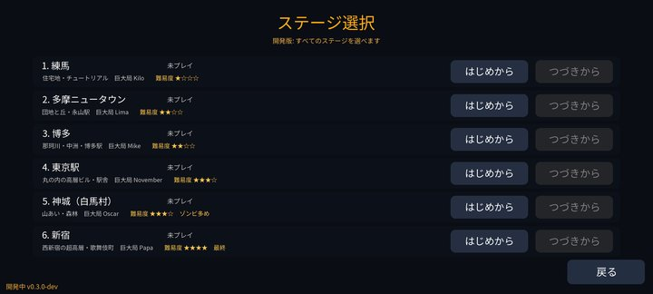 ステージ選択</td>
<td align="center">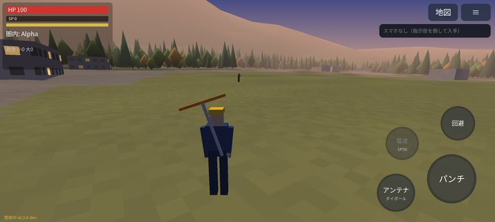 神城（白馬村）の田んぼと森</td>
</tr>
<tr>
<td align="center">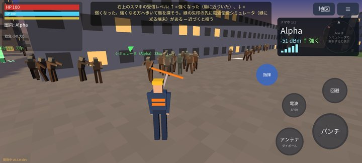 スマホは信号の強さ（↑↓）だけ</td>
<td align="center">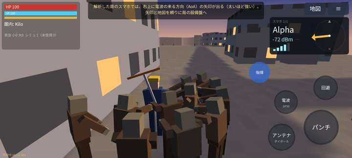 シミュレータで解析した局は到来方向が出る</td>
</tr>
<tr>
<td align="center">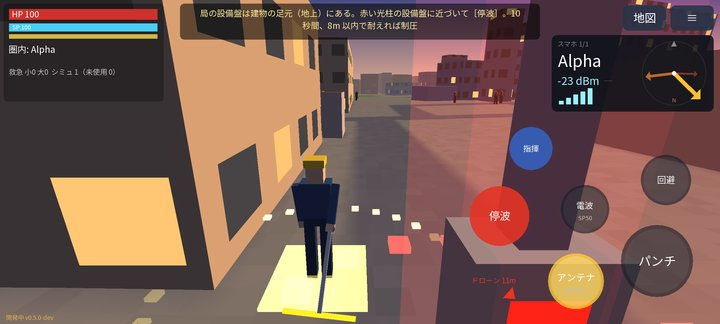 アンテナを溜めて振る</td>
<td align="center">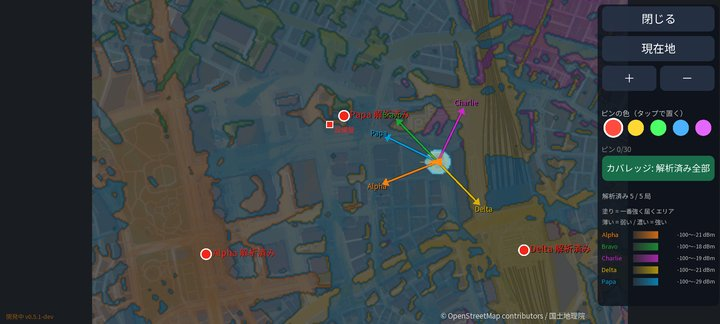 カバレッジマップ（局ごとのエリアを濃淡で表示）</td>
</tr>
<tr>
<td align="center">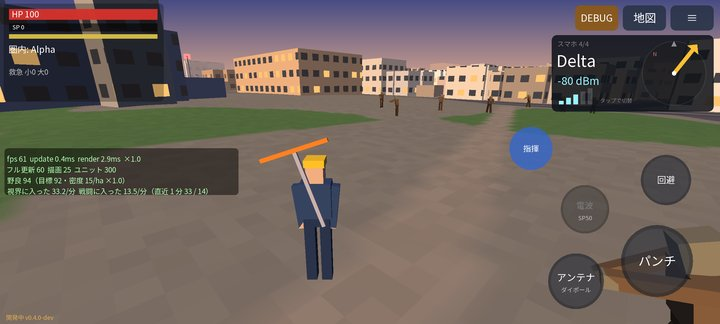 野良ゾンビが街中から寄ってくる</td>
<td align="center">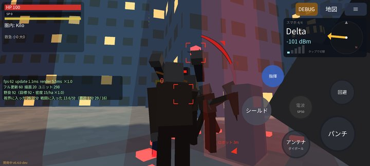 撃たれた方向を赤い弧で表示</td>
</tr>
<tr>
<td align="center">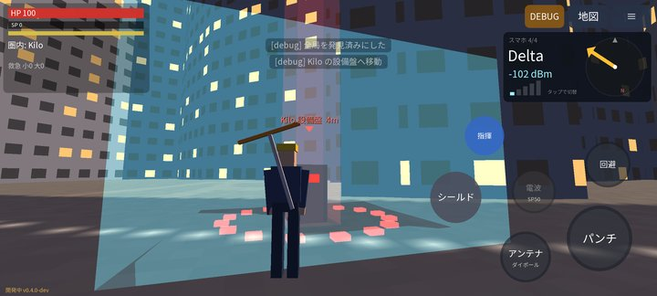 巨大局は足元の設備盤で停波</td>
<td align="center">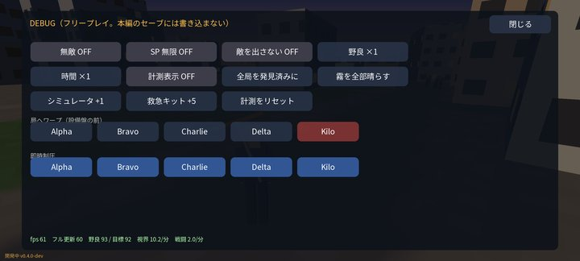 デバッグモードのパネル</td>
</tr>
<tr>
<td align="center">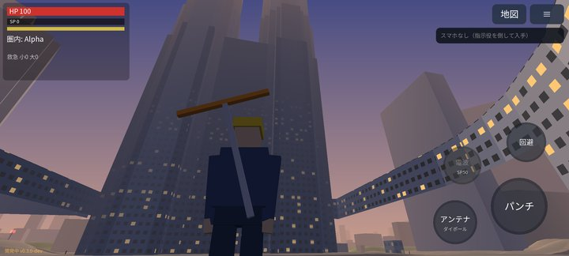 新宿（最終）の超高層街</td>
<td align="center">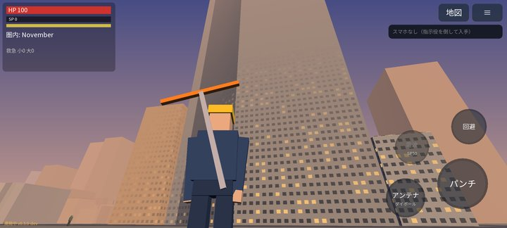 東京駅・丸の内の高層ビル</td>
</tr>
<tr>
<td align="center">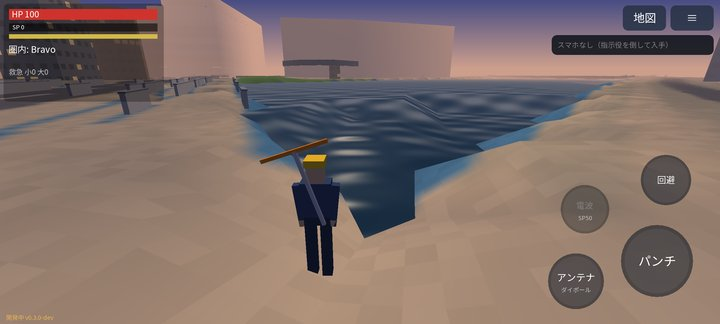 博多・那珂川のほとり</td>
<td align="center">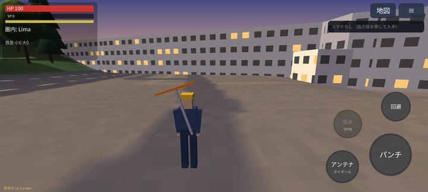 多摩ニュータウンの団地</td>
</tr>
<tr>
<td align="center">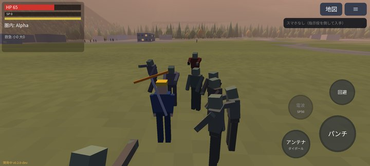 神城はゾンビ多め</td>
<td align="center">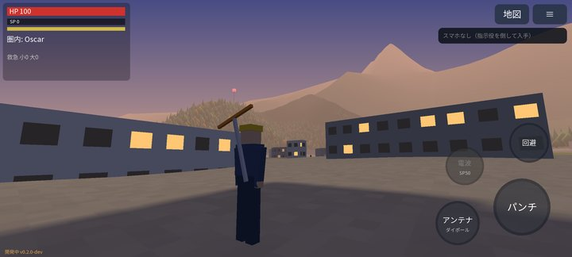 尾根の上に巨大局 Oscar</td>
</tr>
<tr>
<td align="center">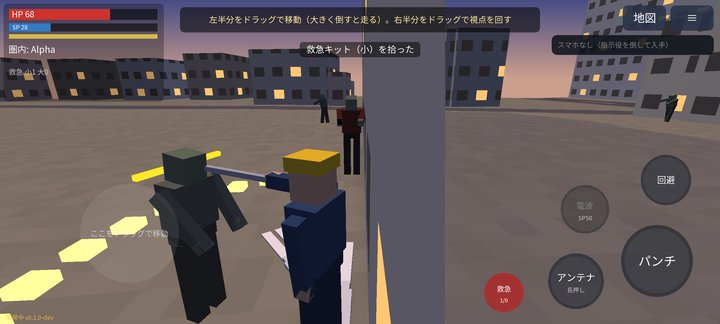 アンテナ 5 種類の性能比較</td>
<td align="center">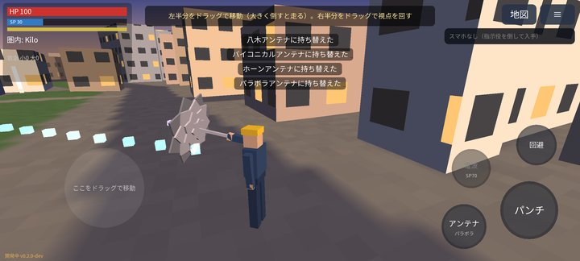 パラボラのビーム</td>
</tr>
<tr>
<td align="center">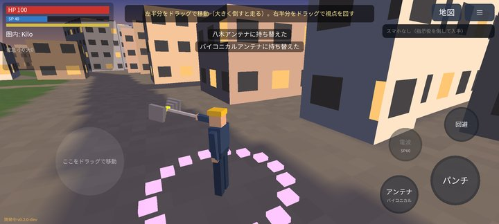 バイコニカルは周り全部に放射</td>
<td align="center">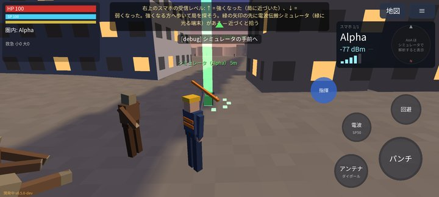 各局のエリアに置いてあるシミュレータ（緑の光）</td>
</tr>
<tr>
<td align="center">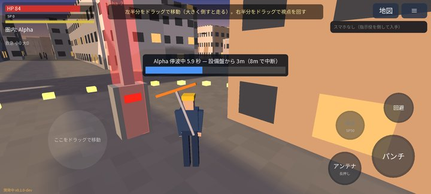 基地局を停波中</td>
<td align="center">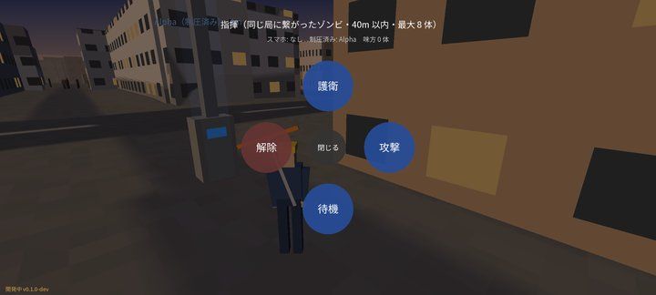 ゾンビを指揮（護衛・攻撃・待機）</td>
</tr>
</table>

## 注意

- 開発中の版です。不具合があれば [Issues](https://github.com/kijitora-no-hito/android-apps/issues) へお知らせください。
- 登場する携帯基地局・事業者は架空のもので、実在の事業者・基地局とは関係ありません。
- ゾンビとの戦闘の表現があります（流血の表現はありません）。

## インストール方法

1. このページをスマホのブラウザで開き、上の「APK をダウンロード」を押します。
2. ダウンロードした APK を開きます。初回は「提供元不明のアプリ」のインストールを許可するよう求められるので、使っているブラウザ（またはファイルアプリ）に許可してください。
3. Google Play プロテクトが警告を出すことがあります。ストアを通さない APK では一般的に出る表示です。心配なときは上の SHA-256 と一致するか確かめてください。

### 更新について

- 自動更新はありません。新しい版が出たら、このページから同じ手順で入れ直してください（上書きインストールになります）。
- このアプリは GitHub でのみ配布しています。

## 出典

- 建物・道路などの地図データ: © [OpenStreetMap](https://www.openstreetmap.org/copyright) contributors（ODbL）
- 地形: [国土地理院（標高タイル）](https://maps.gsi.go.jp/development/ichiran.html)
- BGM の譜面: [The Session](https://thesession.org/)（ODbL 1.0）。アプリに同梱した譜面データ（派生データベース）は
  [music-data](https://github.com/kijitora-no-hito/android-apps/tree/main/phonetic_hound/music-data) で公開しています。
  アプリのクレジット画面からも書き出せます。
- フォント: Noto Sans JP（SIL Open Font License 1.1）
- ゲームエンジン: libGDX（Apache License 2.0）

## プライバシーポリシー

[Phonetic Hound プライバシーポリシー](https://kijitora-no-hito.github.io/android-apps/phonetic_hound/privacy-policy.html)

---

[← アプリ一覧に戻る](../)
