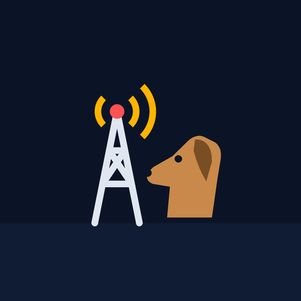
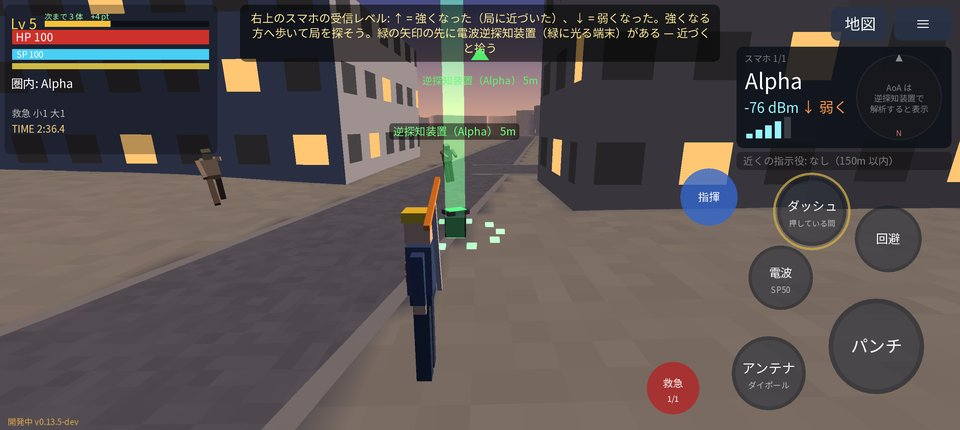
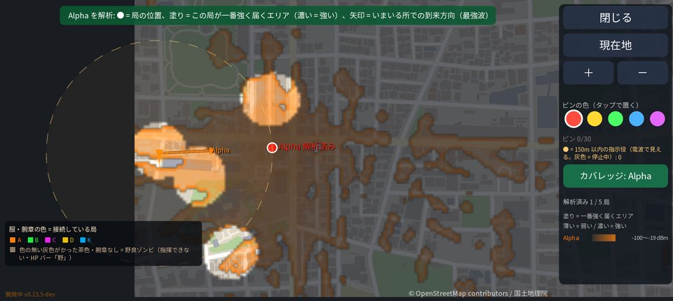
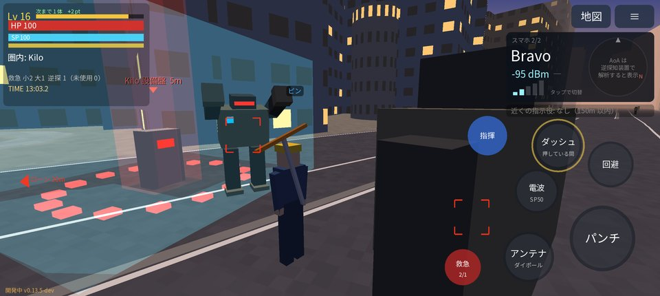
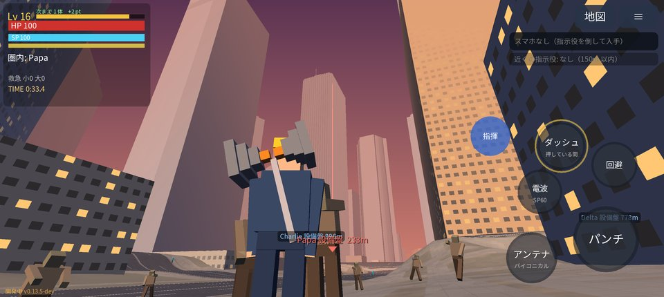

# Phonetic Hound（開発中）

> **⚠ 開発中の版です。** 全 6 ステージを遊べますが、見た目・バランス・操作は今後大きく変わります。
> セーブデータは今後の版で引き継げなくなることがあります。

電波で操られたゾンビがあふれる街。スマートフォンの**信号強度と電波の到来方向**を頼りに、
隠れた携帯基地局を探し出して制圧していく、横画面の TPS アクションです。

## ダウンロード

### [APK をダウンロード（v0.13.5-dev・10.9 MB）](https://github.com/kijitora-no-hito/android-apps/releases/download/phonetichound-v0.13.5-dev/phonetichound-0.13.5-dev-release.apk)

| 項目 | 内容 |
| --- | --- |
| バージョン | 0.13.5-dev（2026-09-28・開発中） |
| ファイル | `phonetichound-0.13.5-dev-release.apk`（11,417,470 バイト） |
| SHA-256 | `9B23A84B735445C92D50DD5F2DCFDFAEEFA3F5B5D8578D208F675AF7C2ED41B3` |
| 対応 Android | 7.0 以上（横画面） |
| 価格 | 無料・広告なし・アプリ内課金なし・アカウント登録なし |

権限は使いません（インターネット通信もしません）。結果の共有は、端末の共有メニューで選んだアプリに画像と文章を渡すだけです。

 PC で見ている方へ: スマホでこの QR を読み取ると、このページが開きます。

## どんなゲーム？

街の携帯基地局から出る電波が、ゾンビを操っています。スマホの**信号の強さ**と、**電波逆探知装置**でつかむ電波の**到来方向**を頼りに、
隠れた基地局を探し出し、足元の設備盤で**停波**して制圧していきます。小基地局をすべて止めたら、最後は巨大基地局へ。

- パンチ・溜めて振るアンテナ・電波放射で戦う。アンテナは 5 種類（ダイポール・八木・バイコニカル・ホーン・パラボラ）
- スマホと同じ基地局につながるゾンビを**指揮**して味方にできる
- 倒した数でレベルが上がり、体力・パンチ・移動速度・スタミナを育てる
- 街並みは実在の地形と建物のデータから作り、電波は建物での反射・回折まで計算

<table>
<tr>
<td align="center"> 群れに囲まれたらアンテナを溜めて振る</td>
<td align="center"> 電波逆探知装置で基地局を探す</td>
</tr>
<tr>
<td align="center"> 基地局の位置とカバレッジを地図に</td>
<td align="center"> シールドに守られた巨大局</td>
</tr>
<tr>
<td align="center"> NAGANO: 山あいのロボットの群れ</td>
<td align="center"> TOKYO AREA IV: 最終ステージ</td>
</tr>
</table>

### [📖 遊び方マニュアル（画面の見方・操作・攻略のヒント）](manual.html)

## この版でできること（0.13.5-dev）

- **全 6 ステージ**を最初から最後まで遊べます（開発中の版では、どのステージも最初から選べます）。

  | # | ステージ | 特徴 | 難易度 |
  | --- | --- | --- | --- |
  | 1 | TOKYO AREA I | 住宅地・チュートリアル | ★ |
  | 2 | TOKYO AREA II | 団地と坂 | ★★ |
  | 3 | KYUSHU | 川と橋 | ★★ |
  | 4 | TOKYO AREA III | 高層ビルの谷 | ★★★ |
  | 5 | NAGANO | 山あい・森林・敵はすべてロボット・回復スポットあり | ★★★ |
  | 6 | TOKYO AREA IV | 超高層街（最終ステージ） | ★★★★ |

- **ノーマルモード**（セーブあり・レベルと成長）と、**チャレンジモード**（Lv 200 固定・セーブ無し・1 回倒れたら終わり。全ステージ通し / ステージ選択）。
- スコアアタック: クリアタイム・撃破数・支配数のランキング、記録画面、スクリーンショット付きの結果共有（#phonetichound）。
- BGM と効果音（ケルト伝統曲をアプリ内のシンセサイザーで演奏）。
- タッチ操作のほか、**ゲームパッド（DualShock 4 など）**でも遊べます。

これから: 難易度・バランスの調整、見た目の改善。

## 更新履歴

版の見出しを押すと開閉します。

<b>0.13.5-dev</b>（2026-09-28）

- ステージの名前を変えました: TOKYO AREA I・TOKYO AREA II・KYUSHU・TOKYO AREA III・NAGANO・TOKYO AREA IV（セーブと記録はそのまま引き継がれます）。
- 遊び方の[マニュアル](manual.html)をスクリーンショット付きで作りました。

<b>0.13.4-dev</b>（2026-09-28）

- アンテナの溜めを直しました: スタミナが足りないときは溜め始めず、溜めは今のスタミナで払える所で止まります（放せば必ず振れます）。
- ゾンビがプレイヤーの目の前で止まってしまう問題を直しました。攻撃の順番待ちのゾンビは周りを回り込むように、担当エリアの境目で止まっていたゾンビは 8m まで追って来るようになりました。それ以上離れると灰色になり、頭上に砂嵐が出て下がっていきます（電波が届かない合図）。

<b>0.13.3-dev</b>（2026-09-28）

- タイトルのボタン名を**チャレンジモード**にしました。
- ノーマルモード・チャレンジモードの画面をゲームらしく作り直しました（大きなカードに名前と要点だけ、ルールは「Lv 200」「1 LIFE」「NO SAVE」の札）。細かい説明は右上の **？** ボタンで読めます（パッドでは △）。

<b>0.13.2-dev</b>（2026-09-28）

- **敵の色分け**: 各局のゾンビ（群れ・指示役）は、つながっている局の色の服と腕章。野良は色の無い灰色がかった茶色（腕章なし）。中立は薄い色＋頭上に「−」、指揮中の味方は頭上に水色のひし形。NAGANO のロボットは目とランプが局の色。敵の HP バーの左に局の頭文字（野良は「野」）。地図に凡例も付けました。
- **タイトルの構成**: タイトルに［ノーマルモード］［チャレンジ］を並べ、［ノーマルモード］の次の画面で「はじめから」「つづきから」を選ぶようにしました。

<b>0.13.1-dev</b>（2026-09-28）

- **ダッシュボタン**: 走るのはダッシュボタンを押している間だけになりました（スティックを大きく倒しても走らず、歩きの速さが変わるだけ）。ボタンの周りの弧がスタミナの残りです。設定で「押している間 / 押すたびに切り替え」を選べます。
- ゲームパッドは **R2 を押している間ダッシュ**。電波放射は R1 だけになりました。
- スティック・ダッシュ・攻撃を別々の指で同時に押しても入力を取りこぼさないようにしました。

<b>0.13.0-dev</b>（2026-09-28）

- **スタミナ**: アンテナを振るとスタミナを使います（溜めずに 25〜溜め切って 50）。足りないと振れません。走っている間もスタミナを使い、使い切ると回復するまで歩きになります。スタミナにポイントを振ると続けて振れる回数が増えます。
- **パンチ**: スタミナは使いません。パンチにポイントを振ると、攻撃力に加えてリーチ（最大 2 倍）と攻撃の範囲も広がります。
- **指示役のオーラ**: 指示役（NAGANO では指揮ロボット）は、スマホの電波で光をまとうようになりました。150m 以内の指示役は地図にも出て、HUD に「近くの指示役: 2（最寄り 64m）」と表示します。
- **光柱のラベル**: 光柱の上に「Alpha 設備盤 120m」「ピン: メモ」「逆探知装置（Alpha）」のように何の光柱かを表示します。

<b>0.12.1-dev</b>（2026-09-28）

- 画面によって説明文の折り返しが次の行に重なる不具合を直しました（チャレンジの入口など）。日本語を文字の途中で自然に折り返し、行の高さを測って並べるようにしました。
- 端末の解像度によって文字の大きさが変わらないようにしました。タブレットなど横幅の狭い画面で表がはみ出すのも直しています。

<b>0.12.0-dev</b>（2026-09-27）

- 通常のモードを**ノーマルモード**と呼ぶようにしました（記録画面・リザルト・共有文も）。
- **チャレンジ（Lv 200）に 2 通りの遊び方**:
  - **全ステージ通し**: 開始ステージから TOKYO AREA IV まで続けて遊びます。開始地点は TOKYO AREA I か、ノーマルモードでクリア済みのステージ。アンテナと割り振りは次のステージへ持ち越し、HP は全回復。1 回倒れたら終わり。合計タイムを開始ステージごとのランキングに記録します。
  - **ステージ選択**: 1 ステージだけ遊びます。選べるのはノーマルモードでクリア済みのステージだけです。
- チャレンジでクリアしても、ノーマルモードのステージは解放されません。
- 記録画面のランキングを「ノーマル / チャレンジ（ステージ）/ チャレンジ（通し）」で切り替えられるようにしました。

<b>0.11.0-dev</b>（2026-09-27）

- **ゲームパッド対応（DualShock 4 など）**: 左スティックで移動・右スティックでカメラ、□ パンチ・△ アンテナ・○ 回避・× アクション・R1/R2 電波放射・L1 指揮・L2 ロックオン・SHARE 地図・OPTIONS メニュー。メニュー・地図・ステージ選択・名前入力などすべての画面をパッドだけで操作できます（× 決定・○ 戻る・L1/R1 タブ）。
- パッドを使うと画面のボタンが隠れ、操作表示が □△○×（Xbox 系は A/B/X/Y）になります。画面に触るとタッチ用の表示に戻ります。
- 設定に「操作・パッド」ページ: カメラの上下反転、スティックの遊び（デッドゾーン）、ボタンの配置・表記、割り当て表、「パッドの入力を確認」画面。
- ロックオン（L2）を追加。
- 実機の DualShock 4 では未確認です。ボタンが合わないときは設定の「パッドの入力を確認」で確かめ、「ボタンの配置」を切り替えてください。

<b>0.10.0-dev</b>（2026-09-27）

- **レベルと成長**: 本編で倒した敵の数でレベルが上がり（最大 Lv 999）、1 レベルごとに 1 ポイント。体力・パンチ・移動速度・スタミナに振れます（1 ポイント = +1%、各 200 ポイントまで）。メニューの「成長」タブで振り、休憩地点では無料で振り直せます。
- **チャレンジモード**: Lv 200 固定・セーブ無し・1 回倒れたら終わり。開始前にポイントを割り振ります。チャレンジ専用のランキングがあります。
- **やり込みの記録**: 振らなかったポイントと振り直した回数をランキング・記録画面・共有に残します（「未使用ポイント最多でのクリア」「振り直し 0 回での最速クリア」）。
- 電波伝搬シミュレータの名前を**電波逆探知装置**に変えました。
- 0.9.0-dev から上書きインストールでき、それまでの討伐数からレベルが決まります。

<b>0.9.0-dev</b>（2026-09-27）

- **記録画面**: タイトルの「ランキング」を「記録」にし、ランキング / プレイ記録（総プレイ時間・討伐数の内訳・支配数・制圧数・アンテナの使用割合など）/ ステージ別（自己ベスト・クリア回数・累計）の 3 タブに。集計はこの版から（それ以前はランキングの記録から自己ベストとクリア回数だけ引き継ぎ）。
- 設定に「記録のリセット」（確認 2 回。ステージの進行・アンテナは消えません）。
- クレジットなどの版の表記が古いままだった不具合を直しました。

<b>0.8.0-dev</b>（2026-09-26）

- **道路を 3D の路面に**（全ステージ）: 国道・県道は白線付き、生活道路はアスファルト、農道・あぜ道は砂利の道。
- **NAGANO の街並み**: 田んぼの区画、三角屋根（切妻）の家並み、回復スポットの周りの建物（空中写真から起こした 41 棟）、
  白い三角屋根の旅館と、隣のゲームセンター（回復スポット）。

<b>0.7.1-dev</b>（2026-09-26）

- NAGANO の回復スポットを正しい位置に移し、ステージを東へ少し広げました（旧版の NAGANO のセーブははじめからになります。ランキングは残ります）。

<b>0.7.0-dev</b>（2026-09-26）

- **スコアアタック**: 「はじめから」でクリアするまでのタイム・撃破数・支配数を記録。ステージごとのランキング（上位 10 件、名前入力付き）、
  リザルト画面の作り直し、スクリーンショット付きの結果共有（#phonetichound）。
- 旧版のセーブを「つづきから」でクリアした場合は、タイムが計れていないためランキングの対象外です（はじめからなら記録されます）。

<b>0.6.1-dev</b>（2026-09-26）

- **最終ステージの終盤演出**を追加（内容は遊んでのお楽しみ）。

<b>0.6.0-dev</b>（2026-09-26）

- **NAGANO の敵をすべてロボットに**（小型ロボット・指揮ロボット・野良ロボット）。指揮ロボットを倒すと通信端末（スマホと同じ働き）を落とします。
- NAGANO に**回復スポット（ゲームセンター）**を追加。最初から使える休憩地点で、HP 全回復・セーブ・復活地点になり、周りには敵が近づきません。
  これに合わせて NAGANO のステージを南と東へ広げました（**旧版の NAGANO のセーブは引き継げず、はじめからになります**）。
- 倒した敵が白いまま残ることがある不具合を直しました。

<b>0.5.1-dev</b>（2026-09-26）

- カバレッジマップを見やすく: その局が一番強く届くエリアだけを局の色で塗り、強さを色の濃淡で表すようにしました（解析済みを全部表示すると、局ごとのエリアの境目が分かります）。

<b>0.5.0-dev</b>（2026-09-26）

- **電波伝搬シミュレータを作り直し**: 各基地局のエリアに 1 台ずつ置いてあり、使うとその局の位置・カバレッジマップ・到来方向（AoA）が分かります。
  スマホだけでは信号の強さ（↑↓ 付き）しか分かりません。
- **アンテナは溜めないと射程が出ない**ように調整（溜めずに振るとリーチ 1.1m・威力半分）。パンチの 3 段目で敵がよろめきます。
- TOKYO AREA I のチュートリアルを新しいシミュレータの流れに合わせて直しました。

<b>0.4.0-dev</b>（2026-09-26）

- **野良ゾンビ**を追加し、ゾンビに出会う回数を約 15 倍にしました（街のあちこちからゾンビが寄ってきます。野良は指揮できません。制圧した基地局のエリアには入ってきません）。
- ドローンが建物越しや建物の中から撃っていた不具合を直しました。撃たれた方向を画面に赤い弧で示し（上からなら ▲）、弾の軌跡も見えるようにしました。
- 巨大基地局は**建物の足元の設備盤**で停波します。設備盤を建物の前の開けた場所に移し、光の柱・距離の表示・地図のアイコンで案内するようにしました。
- 開発用の機能を追加。

<b>0.3.0-dev</b>（2026-09-25）

- ステージ「TOKYO AREA II」「KYUSHU」「TOKYO AREA III」「TOKYO AREA IV」を追加。川・濠の水面、橋、超高層ビルの街並み。
- ステージごとの探索曲、TOKYO AREA IV の決戦曲を追加。
- 狭い路地でカメラがガタつかないようにしました。

<b>0.2.0-dev</b>（2026-09-25）

- 2 本目のステージ「NAGANO」を追加（田んぼ・森・山すその斜面。尾根の上の巨大局 Oscar を目指します）。
- アンテナ装備（八木・バイコニカル・ホーン・パラボラ）を追加。
- BGM・効果音・設定画面・ステージ選択を追加。

<b>0.1.0-dev</b>（2026-09-25）

- 最初の開発版。ステージ 1「TOKYO AREA I」を最初から最後まで遊べる版。

## 注意

- 開発中の版です。不具合があれば [Issues](https://github.com/kijitora-no-hito/android-apps/issues) へお知らせください。
- 登場する携帯基地局・事業者は架空のもので、実在の事業者・基地局とは関係ありません。
- ゾンビとの戦闘の表現があります（流血の表現はありません）。

## インストール方法

1. このページをスマホのブラウザで開き、上の「APK をダウンロード」を押します。
2. ダウンロードした APK を開きます。初回は「提供元不明のアプリ」のインストールを許可するよう求められるので、使っているブラウザ（またはファイルアプリ）に許可してください。
3. Google Play プロテクトが警告を出すことがあります。ストアを通さない APK では一般的に出る表示です。心配なときは上の SHA-256 と一致するか確かめてください。

### 更新について

- 自動更新はありません。新しい版が出たら、このページから同じ手順で入れ直してください（上書きインストールになります）。
- このアプリは GitHub でのみ配布しています。

## 出典

- 建物・道路などの地図データ: © [OpenStreetMap](https://www.openstreetmap.org/copyright) contributors（ODbL）
- 地形: [国土地理院（標高タイル）](https://maps.gsi.go.jp/development/ichiran.html)
- NAGANO の一部の建物の位置・形: [国土地理院（シームレス空中写真）](https://maps.gsi.go.jp/development/ichiran.html)をもとに作成
- BGM の譜面: [The Session](https://thesession.org/)（ODbL 1.0）。アプリに同梱した譜面データ（派生データベース）は
  [music-data](https://github.com/kijitora-no-hito/android-apps/tree/main/phonetic_hound/music-data) で公開しています。
  アプリのクレジット画面からも書き出せます。
- フォント: Noto Sans JP（SIL Open Font License 1.1）
- ゲームエンジン: libGDX（Apache License 2.0）

## プライバシーポリシー

[Phonetic Hound プライバシーポリシー](https://kijitora-no-hito.github.io/android-apps/phonetic_hound/privacy-policy.html)

---

[← アプリ一覧に戻る](../)
