

# Phonetic Hound（開発中）

> **⚠ 開発中の版です。** 全 6 ステージを遊べますが、見た目・バランス・操作は今後大きく変わります。
> セーブデータは今後の版で引き継げなくなることがあります。

電波で操られたゾンビがあふれる街。スマートフォンの**信号強度と電波の到来方向**を頼りに、
隠れた携帯基地局を探し出して制圧していく、横画面の TPS アクションです。

## ダウンロード

### [APK をダウンロード（v0.13.1-dev・10.9 MB）](https://github.com/kijitora-no-hito/android-apps/releases/download/phonetichound-v0.13.1-dev/phonetichound-0.13.1-dev-release.apk)

| 項目 | 内容 |
| --- | --- |
| バージョン | 0.13.1-dev（2026-09-28・開発中） |
| ファイル | `phonetichound-0.13.1-dev-release.apk`（11,397,106 バイト） |
| SHA-256 | `6ADCC2FC38F90F21F0A5522440100B4F14A48AD09C05B48042BA755558B628DA` |
| 対応 Android | 7.0 以上（横画面） |
| 価格 | 無料・広告なし・アプリ内課金なし・アカウント登録なし |

権限は使いません（インターネット通信もしません）。結果の共有は、端末の共有メニューで選んだアプリに画像と文章を渡すだけです。

 PC で見ている方へ: スマホでこの QR を読み取ると、このページが開きます。

## どんなゲーム？

- 街の携帯基地局（Alpha・Bravo・Charlie…）から出る電波がゾンビを操っています。ゾンビは電波の届く範囲でしか動けません。
- スマホを持った**指示役のゾンビ**を倒すと、スマホが手に入ります。スマホには、その基地局の**信号の強さ**が出ます（強くなった ↑ / 弱くなった ↓）。
  信号が強くなる方へ歩いて基地局を探します。
- 各基地局のエリアには**電波逆探知装置**が 1 台ずつ置いてあります。使うと、その局の位置と**カバレッジマップ**が地図に出て、
  スマホに電波の**到来方向（AoA）**の矢印が出るようになります。ビルの壁で反射した電波は壁の方から届くので、矢印をうのみにしないこと。
- スマホと同じ基地局に繋がっているゾンビは**指揮**できます（護衛・攻撃・待機）。
- 小さな基地局の設備盤で**停波**すると制圧。制圧した基地局は休憩地点・復活地点になります。
  小基地局をすべて制圧すると、巨大基地局のシールドが消えます。巨大基地局を止めればステージクリアです。
- 攻撃はパンチ、アンテナ振り（**溜めるほどリーチと威力が伸びる**。溜めずに振ると短く弱い）、アンテナからの電波放射（指示役のスマホを一時的に止める）。
- アンテナは 5 種類（ダイポール・八木・バイコニカル・ホーン・パラボラ）。基地局を制圧すると手に入り、
  リーチ・攻撃力・電波放射の形（細く遠くまで／自分の周り全部／鉛筆のようなビーム など）がそれぞれ違います。
- マップは歩いた場所だけが見えます。ピンも置けます。
- 街並みは実在の地形と建物のデータから作っています。電波は建物での反射・回折まで計算しています。

## この版でできること（0.13.1-dev）

- **全 6 ステージ**を、最初から巨大基地局の停波まで遊べます。開発中の版では、どのステージも最初から選べます。

  | # | ステージ | 特徴 | 難易度 |
  | --- | --- | --- | --- |
  | 1 | 練馬 | 住宅地・チュートリアル | ★ |
  | 2 | 多摩ニュータウン | 永山駅と団地・丘 | ★★ |
  | 3 | 博多 | 博多駅・那珂川・中洲（橋を渡る） | ★★ |
  | 4 | 東京駅 | 丸の内の高層ビル・駅舎・濠 | ★★★ |
  | 5 | 神城（白馬村） | 山あい・森林・**敵はすべてロボット**・回復スポットあり | ★★★ |
  | 6 | 新宿 | 西新宿の超高層街（最終ステージ）。終盤に都庁が赤く染まる | ★★★★ |

- **スコアアタック**: クリアタイム・撃破数・支配数を記録し、ステージごとに上位 10 件のランキングを端末に残します。
  リザルト画面の「結果を共有」で、スクリーンショット付きで SNS に投稿できます（ハッシュタグ #phonetichound）。
- **記録画面**: ランキング・プレイ記録（総プレイ時間・討伐数など）・ステージ別の記録を見られます。
- **レベルと成長**: 倒した敵の数でレベルが上がり（最大 Lv 999）、体力・パンチ・移動速度・スタミナにポイントを振れます（各 +200% まで）。
- **チャレンジモード**: Lv 200 固定・セーブ無し・1 回倒れたら終わりの腕試し。「全ステージ通し」と「ステージ選択」があり、どちらもノーマルモードでクリアしたステージから選べます。専用のランキング付き。
- アンテナ 5 種類（メニューの「装備」で持ち替え。手に入れたアンテナは次のステージにも持ち越し）。
- BGM と効果音（ケルト伝統曲をアプリ内のシンセサイザーで演奏）。設定画面で音量とカメラの感度を変えられます。
- 操作: 画面の左半分をドラッグで移動、右半分をドラッグで視点。右下のボタンで攻撃・回避・指揮・停波。
- **ゲームパッド（DualShock 4 など）でも遊べます**（Bluetooth で接続。全画面をパッドだけで操作できます）。
- セーブはステージごとに自動保存（休憩地点・制圧時・60 秒ごと）。0.1.0-dev のセーブは練馬に引き継がれます。
- **デバッグモード**: 設定で ON にすると、タイトルに「フリープレイ（デバッグ）」が出ます。好きなステージを、ノーマルモードのセーブに影響を与えずに遊べます
  （全アンテナ所持。ゲーム中の DEBUG ボタンで無敵・敵なし・野良ゾンビの量・局へワープ・即時制圧など）。

これから: 難易度・バランスの調整、見た目の改善。

## 更新履歴

版の見出しを押すと開閉します。

<b>0.13.1-dev</b>（2026-09-28）

- **ダッシュボタン**: 走るのはダッシュボタンを押している間だけになりました（スティックを大きく倒しても走らず、歩きの速さが変わるだけ）。ボタンの周りの弧がスタミナの残りです。設定で「押している間 / 押すたびに切り替え」を選べます。
- ゲームパッドは **R2 を押している間ダッシュ**。電波放射は R1 だけになりました。
- スティック・ダッシュ・攻撃を別々の指で同時に押しても入力を取りこぼさないようにしました。

<b>0.13.0-dev</b>（2026-09-28）

- **スタミナ**: アンテナを振るとスタミナを使います（溜めずに 25〜溜め切って 50）。足りないと振れません。走っている間もスタミナを使い、使い切ると回復するまで歩きになります。スタミナにポイントを振ると続けて振れる回数が増えます。
- **パンチ**: スタミナは使いません。パンチにポイントを振ると、攻撃力に加えてリーチ（最大 2 倍）と攻撃の範囲も広がります。
- **指示役のオーラ**: 指示役（神城では指揮ロボット）は、スマホの電波で光をまとうようになりました。150m 以内の指示役は地図にも出て、HUD に「近くの指示役: 2（最寄り 64m）」と表示します。
- **光柱のラベル**: 光柱の上に「Alpha 設備盤 120m」「ピン: メモ」「逆探知装置（Alpha）」のように何の光柱かを表示します。

<b>0.12.1-dev</b>（2026-09-28）

- 画面によって説明文の折り返しが次の行に重なる不具合を直しました（チャレンジの入口など）。日本語を文字の途中で自然に折り返し、行の高さを測って並べるようにしました。
- 端末の解像度によって文字の大きさが変わらないようにしました。タブレットなど横幅の狭い画面で表がはみ出すのも直しています。

<b>0.12.0-dev</b>（2026-09-27）

- 通常のモードを**ノーマルモード**と呼ぶようにしました（記録画面・リザルト・共有文も）。
- **チャレンジ（Lv 200）に 2 通りの遊び方**:
  - **全ステージ通し**: 開始ステージから新宿まで続けて遊びます。開始地点は練馬か、ノーマルモードでクリア済みのステージ。アンテナと割り振りは次のステージへ持ち越し、HP は全回復。1 回倒れたら終わり。合計タイムを開始ステージごとのランキングに記録します。
  - **ステージ選択**: 1 ステージだけ遊びます。選べるのはノーマルモードでクリア済みのステージだけです。
- チャレンジでクリアしても、ノーマルモードのステージは解放されません。
- 記録画面のランキングを「ノーマル / チャレンジ（ステージ）/ チャレンジ（通し）」で切り替えられるようにしました。

<b>0.11.0-dev</b>（2026-09-27）

- **ゲームパッド対応（DualShock 4 など）**: 左スティックで移動・右スティックでカメラ、□ パンチ・△ アンテナ・○ 回避・× アクション・R1/R2 電波放射・L1 指揮・L2 ロックオン・SHARE 地図・OPTIONS メニュー。メニュー・地図・ステージ選択・名前入力などすべての画面をパッドだけで操作できます（× 決定・○ 戻る・L1/R1 タブ）。
- パッドを使うと画面のボタンが隠れ、操作表示が □△○×（Xbox 系は A/B/X/Y）になります。画面に触るとタッチ用の表示に戻ります。
- 設定に「操作・パッド」ページ: カメラの上下反転、スティックの遊び（デッドゾーン）、ボタンの配置・表記、割り当て表、「パッドの入力を確認」画面。
- ロックオン（L2）を追加。
- 実機の DualShock 4 では未確認です。ボタンが合わないときは設定の「パッドの入力を確認」で確かめ、「ボタンの配置」を切り替えてください。

<b>0.10.0-dev</b>（2026-09-27）

- **レベルと成長**: 本編で倒した敵の数でレベルが上がり（最大 Lv 999）、1 レベルごとに 1 ポイント。体力・パンチ・移動速度・スタミナに振れます（1 ポイント = +1%、各 200 ポイントまで）。メニューの「成長」タブで振り、休憩地点では無料で振り直せます。
- **チャレンジモード**: Lv 200 固定・セーブ無し・1 回倒れたら終わり。開始前にポイントを割り振ります。チャレンジ専用のランキングがあります。
- **やり込みの記録**: 振らなかったポイントと振り直した回数をランキング・記録画面・共有に残します（「未使用ポイント最多でのクリア」「振り直し 0 回での最速クリア」）。
- 電波伝搬シミュレータの名前を**電波逆探知装置**に変えました。
- 0.9.0-dev から上書きインストールでき、それまでの討伐数からレベルが決まります。

<b>0.9.0-dev</b>（2026-09-27）

- **記録画面**: タイトルの「ランキング」を「記録」にし、ランキング / プレイ記録（総プレイ時間・討伐数の内訳・支配数・制圧数・アンテナの使用割合など）/ ステージ別（自己ベスト・クリア回数・累計）の 3 タブに。集計はこの版から（それ以前はランキングの記録から自己ベストとクリア回数だけ引き継ぎ）。フリープレイは累計に入りません。
- 設定に「記録のリセット」（確認 2 回。ステージの進行・アンテナは消えません）。
- クレジットなどの版の表記が古いままだった不具合を直しました。

<b>0.8.0-dev</b>（2026-09-26）

- **道路を 3D の路面に**（全ステージ）: 国道・県道は白線付き、生活道路はアスファルト、農道・あぜ道は砂利の道。
- **神城の街並み**: 田んぼの区画、三角屋根（切妻）の家並み、回復スポットの周りの建物（空中写真から起こした 41 棟）、
  白い三角屋根の旅館と、隣のゲームセンター（回復スポット）。

<b>0.7.1-dev</b>（2026-09-26）

- 神城の回復スポットを正しい位置に移し、ステージを東へ少し広げました（旧版の神城のセーブははじめからになります。ランキングは残ります）。

<b>0.7.0-dev</b>（2026-09-26）

- **スコアアタック**: 「はじめから」でクリアするまでのタイム・撃破数・支配数を記録。ステージごとのランキング（上位 10 件、名前入力付き）、
  リザルト画面の作り直し、スクリーンショット付きの結果共有（#phonetichound）。フリープレイは記録しません。
- 旧版のセーブを「つづきから」でクリアした場合は、タイムが計れていないためランキングの対象外です（はじめからなら記録されます）。

<b>0.6.1-dev</b>（2026-09-26）

- **新宿の終盤演出「赤い都庁」**: 小基地局 4 局を制圧すると、都庁が赤く染まり、敵が一気に増えます（野良が 2 倍、都庁の方角から群れが押し寄せる）。

<b>0.6.0-dev</b>（2026-09-26）

- **神城の敵をすべてロボットに**（小型ロボット・指揮ロボット・野良ロボット）。指揮ロボットを倒すと通信端末（スマホと同じ働き）を落とします。
- 神城に**回復スポット（ゲームセンター）**を追加。最初から使える休憩地点で、HP 全回復・セーブ・復活地点になり、周りには敵が近づきません。
  これに合わせて神城のステージを南と東へ広げました（**旧版の神城のセーブは引き継げず、はじめからになります**）。
- 倒した敵が白いまま残ることがある不具合を直しました。

<b>0.5.1-dev</b>（2026-09-26）

- カバレッジマップを見やすく: その局が一番強く届くエリアだけを局の色で塗り、強さを色の濃淡で表すようにしました（解析済みを全部表示すると、局ごとのエリアの境目が分かります）。

<b>0.5.0-dev</b>（2026-09-26）

- **電波伝搬シミュレータを作り直し**: 各基地局のエリアに 1 台ずつ置いてあり、使うとその局の位置・カバレッジマップ・到来方向（AoA）が分かります。
  スマホだけでは信号の強さ（↑↓ 付き）しか分かりません。
- **アンテナは溜めないと射程が出ない**ように調整（溜めずに振るとリーチ 1.1m・威力半分）。パンチの 3 段目で敵がよろめきます。
- 練馬のチュートリアルを新しいシミュレータの流れに合わせて直しました。

<b>0.4.0-dev</b>（2026-09-26）

- **野良ゾンビ**を追加し、ゾンビに出会う回数を約 15 倍にしました（街のあちこちからゾンビが寄ってきます。野良は指揮できません。制圧した基地局のエリアには入ってきません）。
- ドローンが建物越しや建物の中から撃っていた不具合を直しました。撃たれた方向を画面に赤い弧で示し（上からなら ▲）、弾の軌跡も見えるようにしました。
- 巨大基地局は**建物の足元の設備盤**で停波します。設備盤を建物の前の開けた場所に移し、光の柱・距離の表示・地図のアイコンで案内するようにしました。
- デバッグモード（フリープレイ）を追加。

<b>0.3.0-dev</b>（2026-09-25）

- ステージ「多摩ニュータウン」「博多」「東京駅」「新宿」を追加。川・濠の水面、橋、超高層ビルの街並み。
- ステージごとの探索曲、新宿の決戦曲を追加。
- 狭い路地でカメラがガタつかないようにしました。

<b>0.2.0-dev</b>（2026-09-25）

- 2 本目のステージ「神城」を追加（田んぼ・森・山すその斜面。尾根の上の巨大局 Oscar を目指します）。
- アンテナ装備（八木・バイコニカル・ホーン・パラボラ）を追加。
- BGM・効果音・設定画面・ステージ選択を追加。

<b>0.1.0-dev</b>（2026-09-25）

- 最初の開発版。ステージ 1「練馬」を最初から最後まで遊べる版。

## スクリーンショット

<table>
<tr>
<td align="center">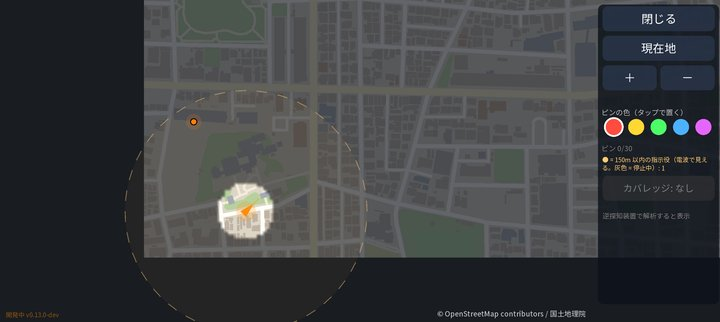 150m 以内の指示役が地図に出る</td>
<td align="center">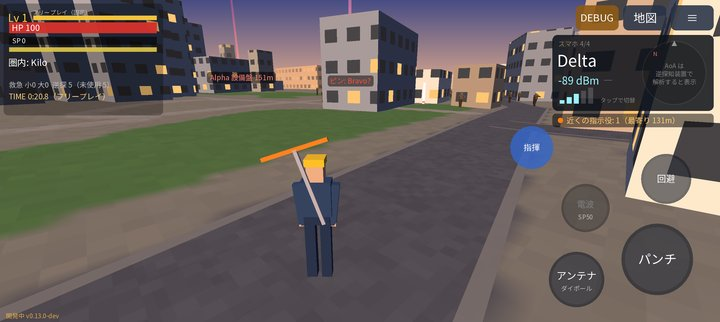 光柱に「Alpha 設備盤」などのラベル</td>
</tr>
<tr>
<td align="center">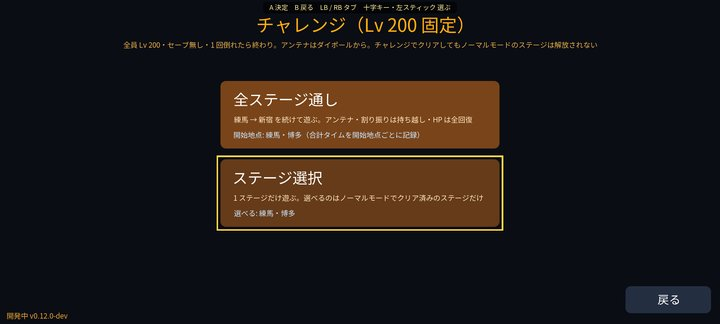 チャレンジ: 全ステージ通し / ステージ選択</td>
<td align="center">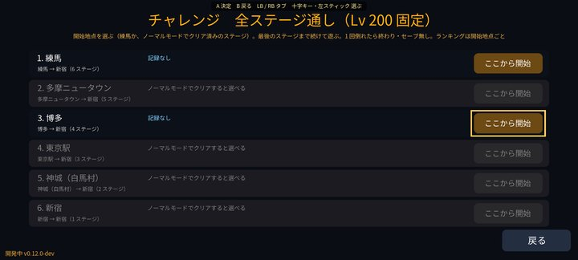 通しの開始地点（ノーマルでクリア済みのステージ）</td>
</tr>
<tr>
<td align="center">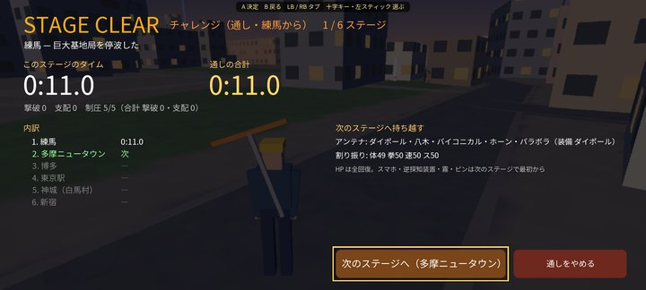 通しの途中のステージクリア</td>
<td align="center">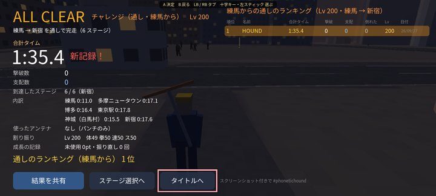 全ステージ通しの完走</td>
</tr>
<tr>
<td align="center">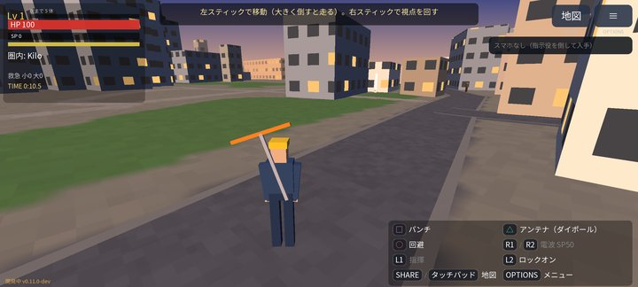 ゲームパッドで遊ぶ（□△○× の操作表示）</td>
<td align="center">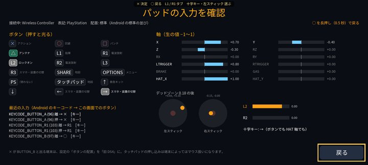 設定の「パッドの入力を確認」</td>
</tr>
<tr>
<td align="center">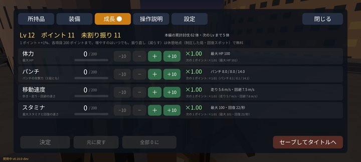 レベルアップしてポイントを割り振る</td>
<td align="center">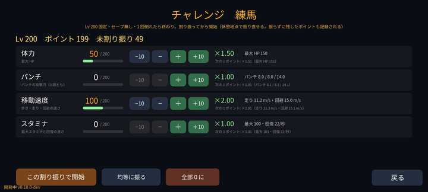 チャレンジ（Lv 200）の割り振り</td>
</tr>
<tr>
<td align="center">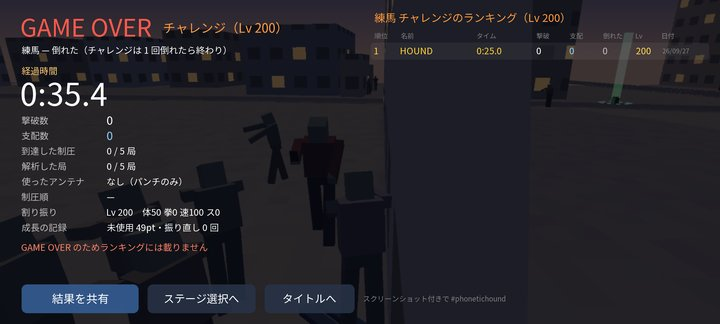 チャレンジは 1 回倒れたら GAME OVER</td>
<td align="center">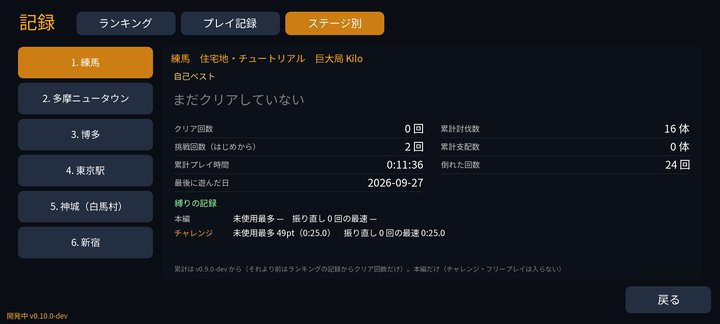 縛りの記録（ステージ別）</td>
</tr>
<tr>
<td align="center">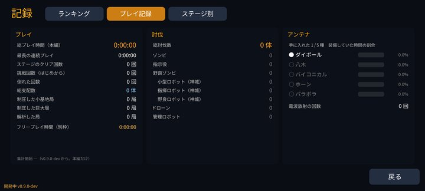 記録画面（プレイ記録）</td>
<td align="center">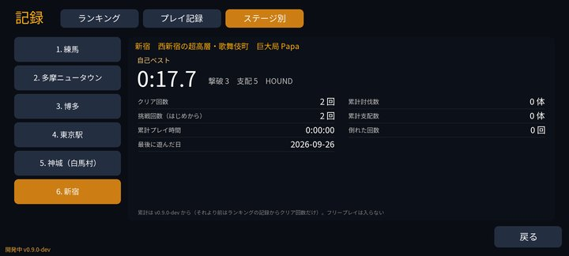 記録画面（ステージ別）</td>
</tr>
<tr>
<td align="center">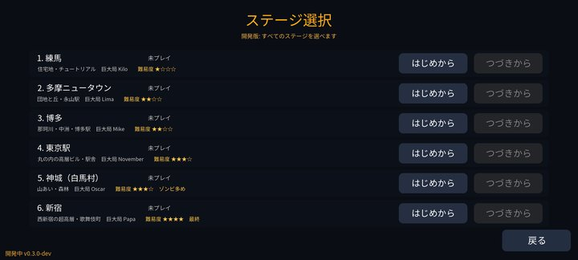 ステージ選択</td>
<td align="center">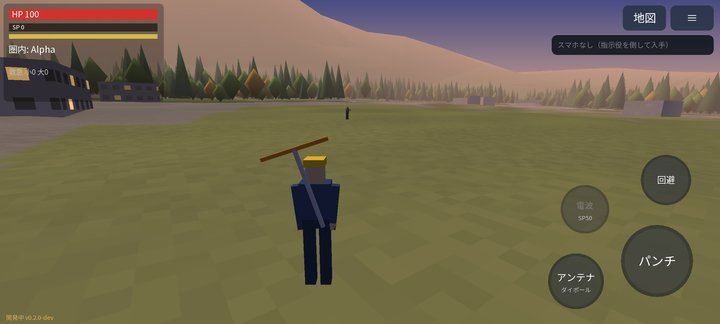 神城（白馬村）の田んぼと森</td>
</tr>
<tr>
<td align="center">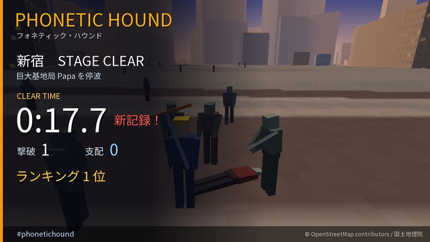 共有される画像（スクリーンショット＋結果）</td>
<td align="center">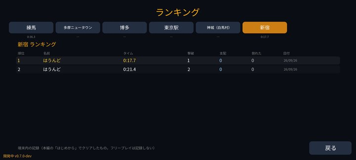 ステージごとのランキング</td>
</tr>
<tr>
<td align="center">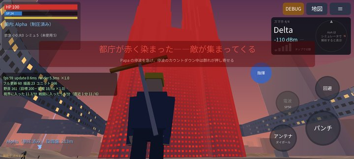 新宿の終盤、都庁が赤く染まる</td>
<td align="center">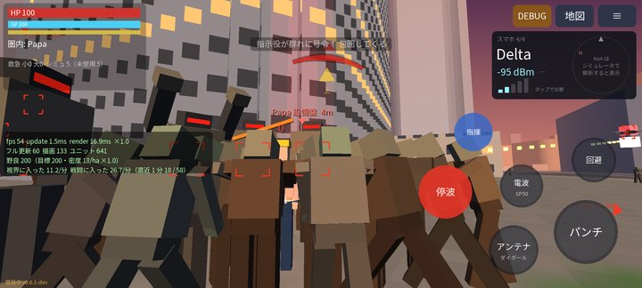 巨大局 Papa の足元に敵が押し寄せる</td>
</tr>
<tr>
<td align="center">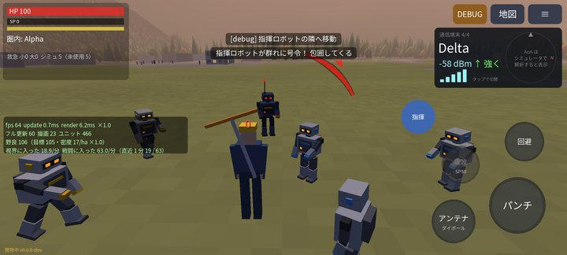 神城の敵はロボット（指揮ロボットと小型ロボット）</td>
<td align="center">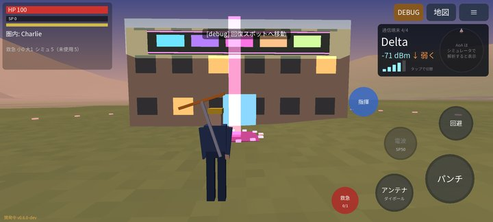 神城の回復スポット（ゲームセンター）</td>
</tr>
<tr>
<td align="center">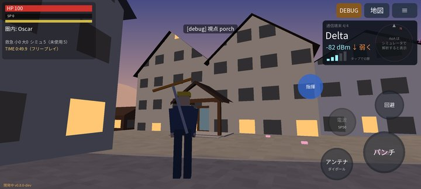 神城・三角屋根の旅館と家並み</td>
<td align="center">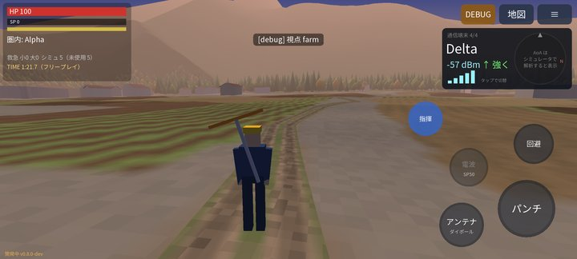 神城・田んぼと農道</td>
</tr>
<tr>
<td align="center">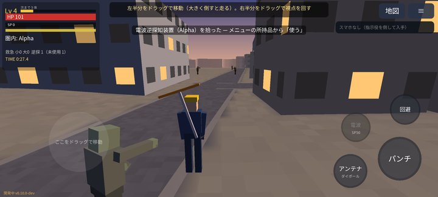 スマホは信号の強さ（↑↓）だけ</td>
<td align="center">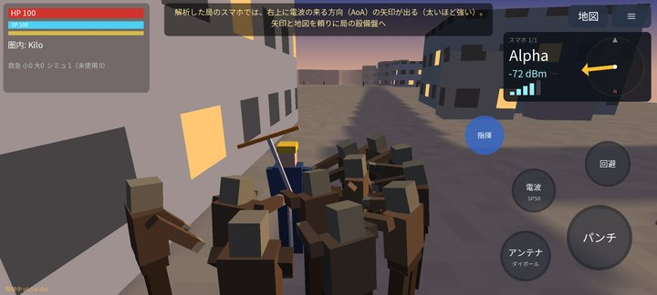 電波逆探知装置で解析した局は到来方向が出る</td>
</tr>
<tr>
<td align="center">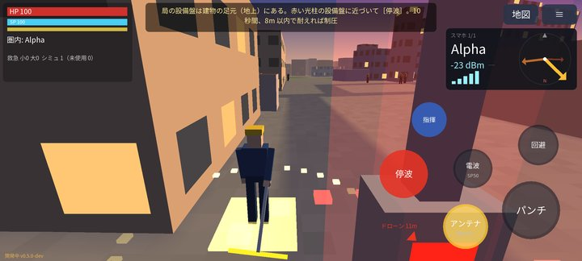 アンテナを溜めて振る</td>
<td align="center">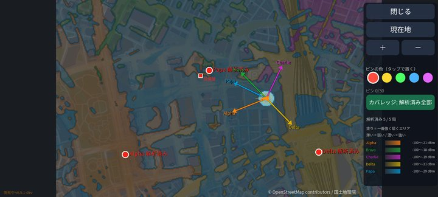 カバレッジマップ（局ごとのエリアを濃淡で表示）</td>
</tr>
<tr>
<td align="center">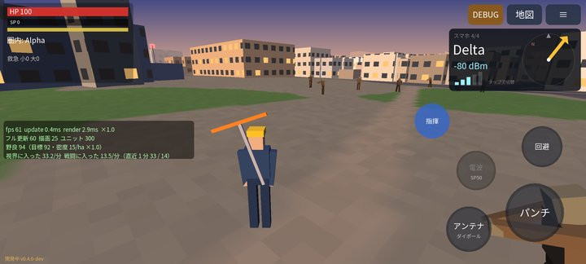 野良ゾンビが街中から寄ってくる</td>
<td align="center">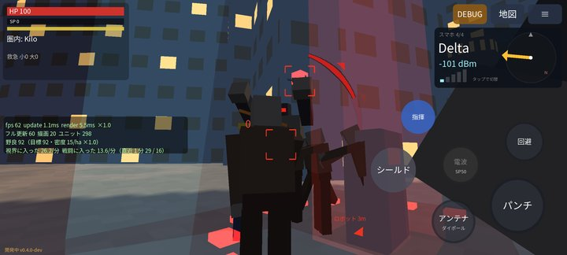 撃たれた方向を赤い弧で表示</td>
</tr>
<tr>
<td align="center">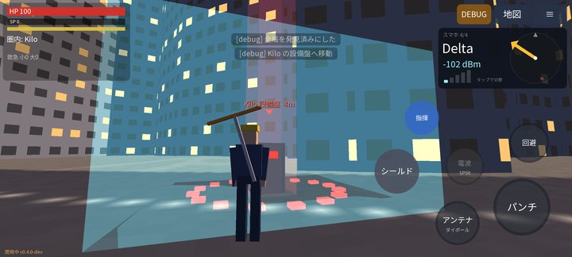 巨大局は足元の設備盤で停波</td>
<td align="center">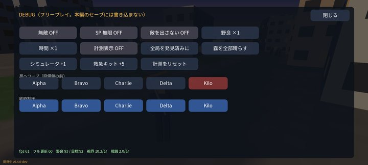 デバッグモードのパネル</td>
</tr>
<tr>
<td align="center">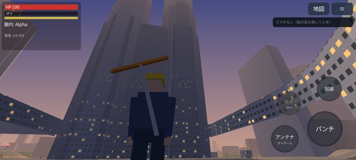 新宿（最終）の超高層街</td>
<td align="center">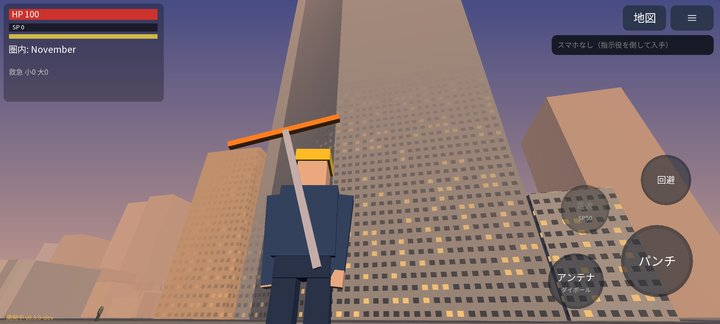 東京駅・丸の内の高層ビル</td>
</tr>
<tr>
<td align="center">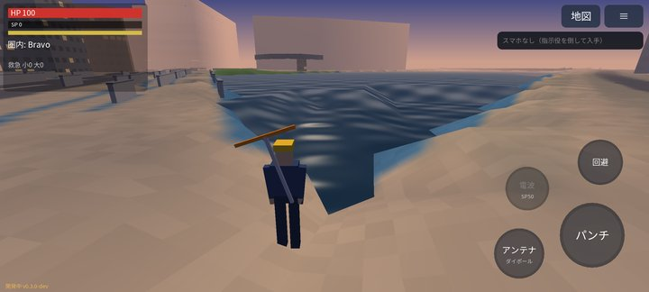 博多・那珂川のほとり</td>
<td align="center">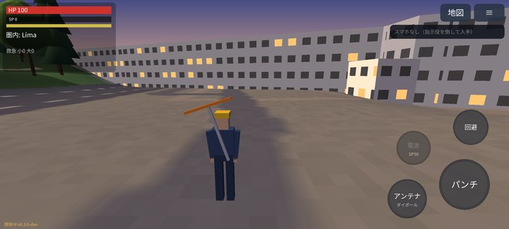 多摩ニュータウンの団地</td>
</tr>
<tr>
<td align="center">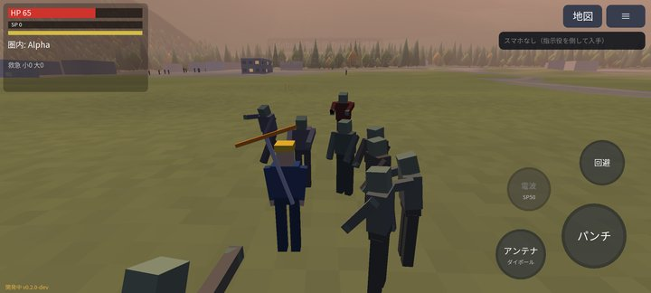 神城はロボット多め</td>
<td align="center">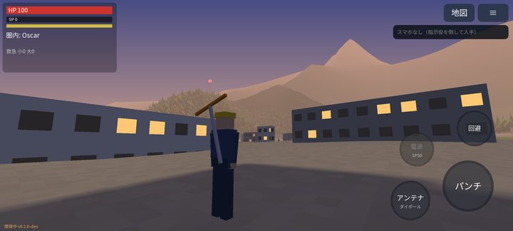 尾根の上に巨大局 Oscar</td>
</tr>
<tr>
<td align="center">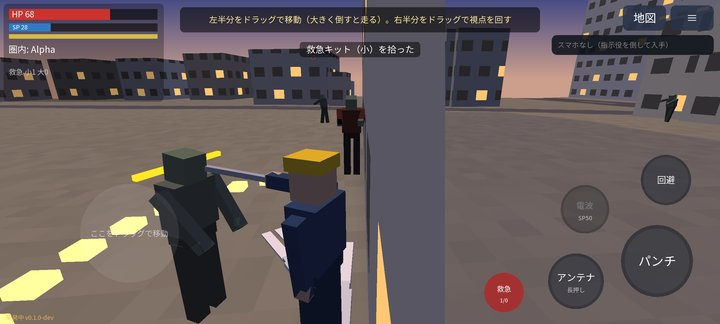 アンテナ 5 種類の性能比較</td>
<td align="center">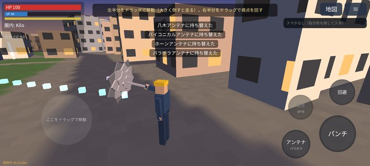 パラボラのビーム</td>
</tr>
<tr>
<td align="center">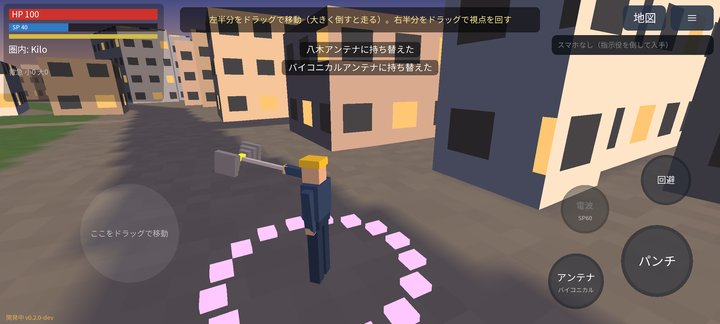 バイコニカルは周り全部に放射</td>
<td align="center">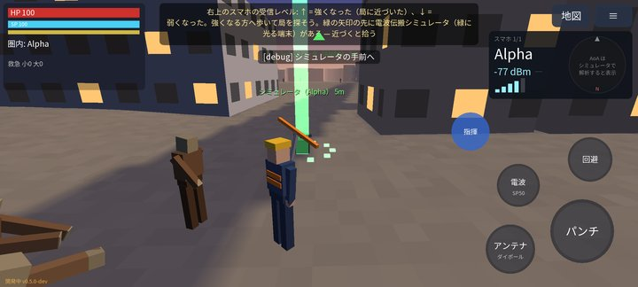 各局のエリアに置いてある電波逆探知装置（緑の光）</td>
</tr>
<tr>
<td align="center">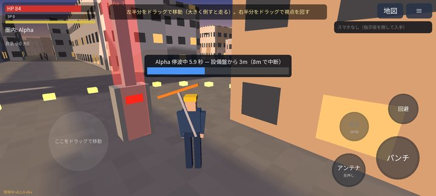 基地局を停波中</td>
<td align="center">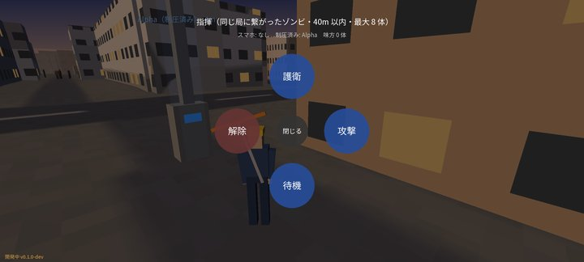 ゾンビを指揮（護衛・攻撃・待機）</td>
</tr>
</table>

## 注意

- 開発中の版です。不具合があれば [Issues](https://github.com/kijitora-no-hito/android-apps/issues) へお知らせください。
- 登場する携帯基地局・事業者は架空のもので、実在の事業者・基地局とは関係ありません。
- ゾンビとの戦闘の表現があります（流血の表現はありません）。

## インストール方法

1. このページをスマホのブラウザで開き、上の「APK をダウンロード」を押します。
2. ダウンロードした APK を開きます。初回は「提供元不明のアプリ」のインストールを許可するよう求められるので、使っているブラウザ（またはファイルアプリ）に許可してください。
3. Google Play プロテクトが警告を出すことがあります。ストアを通さない APK では一般的に出る表示です。心配なときは上の SHA-256 と一致するか確かめてください。

### 更新について

- 自動更新はありません。新しい版が出たら、このページから同じ手順で入れ直してください（上書きインストールになります）。
- このアプリは GitHub でのみ配布しています。

## 出典

- 建物・道路などの地図データ: © [OpenStreetMap](https://www.openstreetmap.org/copyright) contributors（ODbL）
- 地形: [国土地理院（標高タイル）](https://maps.gsi.go.jp/development/ichiran.html)
- 神城の一部の建物の位置・形: [国土地理院（シームレス空中写真）](https://maps.gsi.go.jp/development/ichiran.html)をもとに作成
- BGM の譜面: [The Session](https://thesession.org/)（ODbL 1.0）。アプリに同梱した譜面データ（派生データベース）は
  [music-data](https://github.com/kijitora-no-hito/android-apps/tree/main/phonetic_hound/music-data) で公開しています。
  アプリのクレジット画面からも書き出せます。
- フォント: Noto Sans JP（SIL Open Font License 1.1）
- ゲームエンジン: libGDX（Apache License 2.0）

## プライバシーポリシー

[Phonetic Hound プライバシーポリシー](https://kijitora-no-hito.github.io/android-apps/phonetic_hound/privacy-policy.html)

---

[← アプリ一覧に戻る](../)
