

# Phonetic Hound 遊び方マニュアル

[← Phonetic Hound のページに戻る](https://kijitora-no-hito.github.io/android-apps/phonetic_hound/)

> 開発中の版（v0.13.5-dev）の画面です。見た目や数値は今後変わることがあります。

## もくじ

1. [ゲームの目的](#ゲームの目的)
2. [画面の見方](#画面の見方)
3. [操作](#操作)
4. [基地局を探す](#基地局を探す)
5. [ゾンビを指揮する](#ゾンビを指揮する)
6. [基地局を停波する](#基地局を停波する)
7. [アンテナと成長](#アンテナと成長)
8. [地図](#地図)
9. [リザルトと記録](#リザルトと記録)
10. [チャレンジモード](#チャレンジモード)
11. [ステージ](#ステージ)
12. [設定・ゲームパッド](#設定ゲームパッド)
13. [ヒント](#ヒント)

## ゲームの目的

街の携帯基地局から出る電波が、ゾンビを操っています。基地局には Alpha・Bravo・Charlie… と名前があり、
ゾンビは自分の基地局の電波が届く範囲でしか動けません。

1. スマホを持った**支配者**を倒してスマホを手に入れる
2. スマホの信号の強さや**電波逆探知装置**を頼りに、隠れた**小基地局**を探す
3. 小基地局の足元の**設備盤**で**停波**して制圧する（4 局）
4. 小基地局をすべて制圧すると**巨大局**のシールドが消える。巨大局を停波すればステージクリア

<table>
<tr>
<td align="center">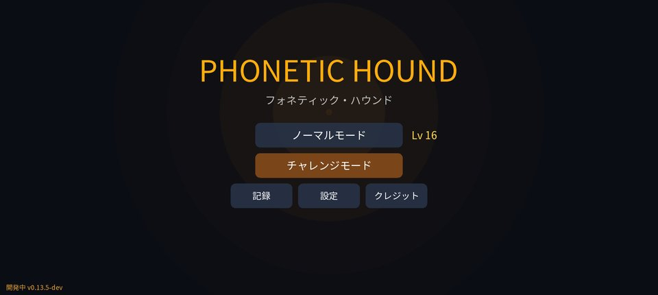 タイトル</td>
<td align="center">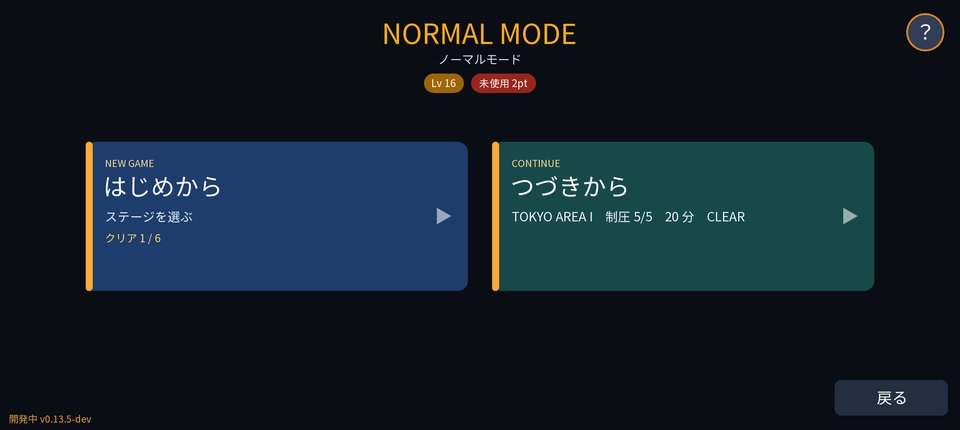 ノーマルモード（つづきから / 最初のステージから）</td>
</tr>
</table>

ノーマルモードは TOKYO AREA I から TOKYO AREA IV まで順に進む 1 本道です。ステージをクリアするとリザルトの［次のステージへ］で次のステージが始まり、［つづきから］は中断したステージか次のステージから始まります。
［最初のステージから］は Lv・割り振り・アンテナを持ち越して TOKYO AREA I からやり直します。Lv・アンテナ・ステージの進行を全部消すときは［ニューゲーム（Lv 1 から）］です（記録・ランキング・設定は残ります）。
最後のステージをクリアするとエンディング（スタッフロール）が流れ、終わったら［ステータスを引き継いで最初から］で次の周を始められます。
ステージが進むほどゾンビの体力が上がり、手ごわくなります。

### チュートリアル

タイトルの［チュートリアル］（はじめての方へ）で、小さな訓練場「TRAINING GROUND」で操作と遊び方を順に練習できます。移動・疾走・回避・パンチ・アンテナ・ロックオン・電波放射、支配者の技のかわし方とブレイク、スマホと電波逆探知装置で基地局を探して停波、休憩・成長・地図とピンまでを 13 の段で案内します。各段は［次へ］で飛ばせて、全部スキップもできます。練習中は倒れません。チュートリアルのプレイはセーブ・記録・ランキング・Lv のどこにも残りません。

## 画面の見方

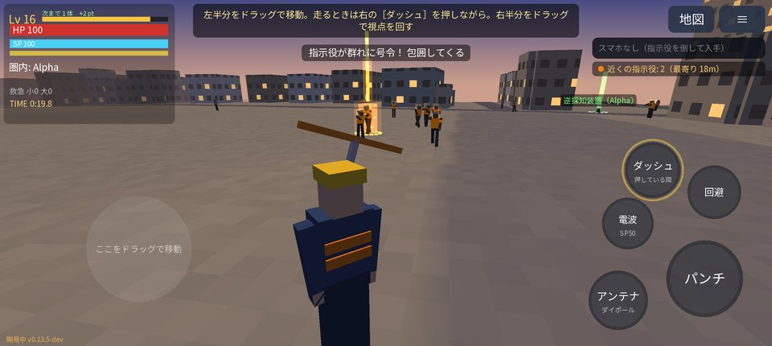

| 場所 | 内容 |
| --- | --- |
| 左上 | Lv と次のレベルまで、HP（赤）、SP（青・電波放射に使う）、スタミナ（黄）、いま居る所の基地局（圏内）、救急キットと電波逆探知装置の数、タイム |
| 右上 | 地図・メニュー。その下にスマホ（基地局の名前・信号の強さ・到来方向）と「近くの支配者」、左隣に周囲 30m の敵のレーダー（技を振りかぶっている敵は赤く点滅） |
| 左下 | 移動のスティック（触った所に出ます） |
| 右下 | 疾走・回避・電波・アンテナ・パンチ・ロックオン（ロック中は解除も）。スマホを持つと指揮、設備盤の前では停波・休憩のボタンも出ます |

最初のステージ（TOKYO AREA I）では、画面上の帯で操作を案内します。

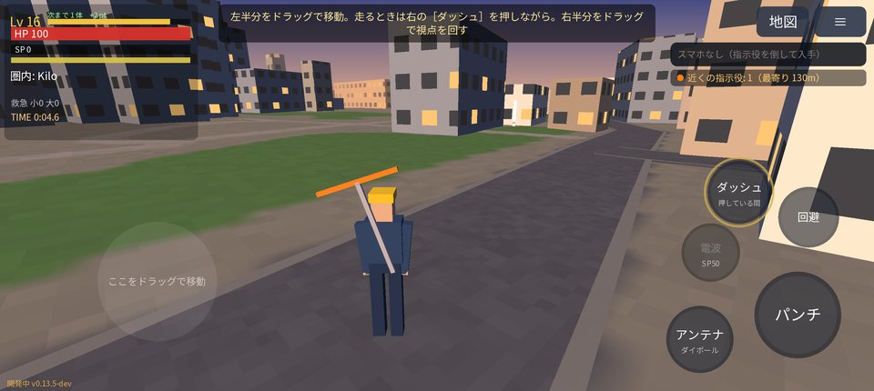

## 操作

| 操作 | タッチ | ゲームパッド（DualShock 4 の表記） |
| --- | --- | --- |
| 移動 | 左半分をドラッグ | 左スティック |
| 視点 | 右半分をドラッグ | 右スティック |
| 疾走（ON / OFF） | ［疾走］ | R2 |
| パンチ | ［パンチ］ | □ |
| アンテナ | ［アンテナ］（長押しで溜め） | △（押している間溜め） |
| 電波放射 | ［電波］ | R1 |
| 回避 | ［回避］ | ○ |
| 停波・休憩・決定 | 出てきたボタン | × |
| 指揮 | ［指揮］ | L1 |
| ロックオン | ［ロックオン］（押すたびに次の敵へ） | L2 |
| ロックオン解除 | ［解除］ | L3（左スティック押し込み） |
| 地図 / メニュー | 右上のボタン | SHARE / OPTIONS |

### 移動と疾走

スティックを倒した量で歩く速さが変わります。［疾走］を押すと ON になり、手を離していても前へ走り続けます
（スティックで向きを変えられます）。疾走中はスタミナを使いませんが、攻撃はできません。もう一度［疾走］を押すと止まります
（倒れる・停波を始める・メニューや地図を開いたときも止まります）。

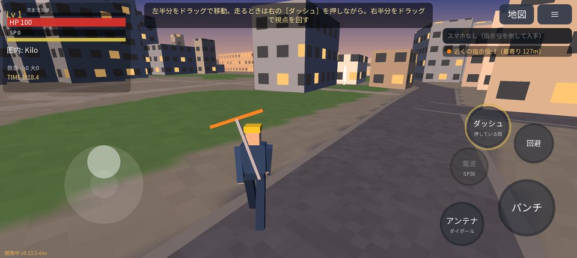

### パンチ

スタミナを使わない基本の攻撃です。続けて押すと 3 段コンボになり、3 段目で敵がよろめきます。
成長でパンチにポイントを振ると、攻撃力に加えてリーチと範囲も広がります。

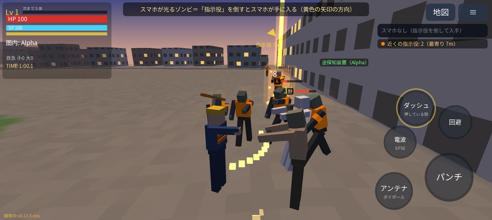

### アンテナ

長押しで溜め、放すと振ります。振ると**アンテナの形どおりの衝撃波**が飛び、範囲内の敵すべてに当たります（建物の向こうには届きません）。
**溜めるほどリーチと威力が伸び**、溜め中は足元に届く範囲の形が表示されます。溜めずに振ると短く弱い攻撃です。振るとスタミナを使い（溜めずに 25〜溜め切って 50）、スタミナで払える所までしか溜まりません。

<table>
<tr>
<td align="center">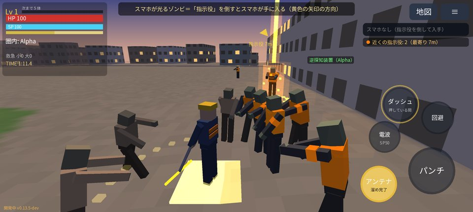 溜め（足元の輪がリーチ）</td>
<td align="center">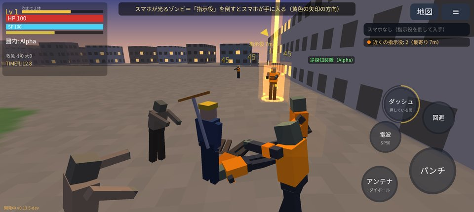 溜めて振る</td>
</tr>
</table>

### 電波放射

SP を使ってアンテナから電波を出します。**支配者のスマホを一時的に止め**（止まっている間、群れは支配が途切れます）、
ドローンを落とし、ロボットを硬直させます。SP は攻撃を当てると溜まります。電波の形はアンテナによって違います。

<table>
<tr>
<td align="center">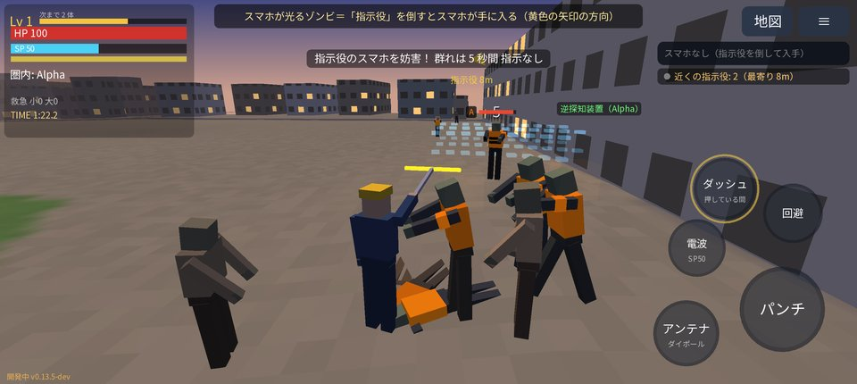 ダイポール（前後 2 方向）</td>
<td align="center">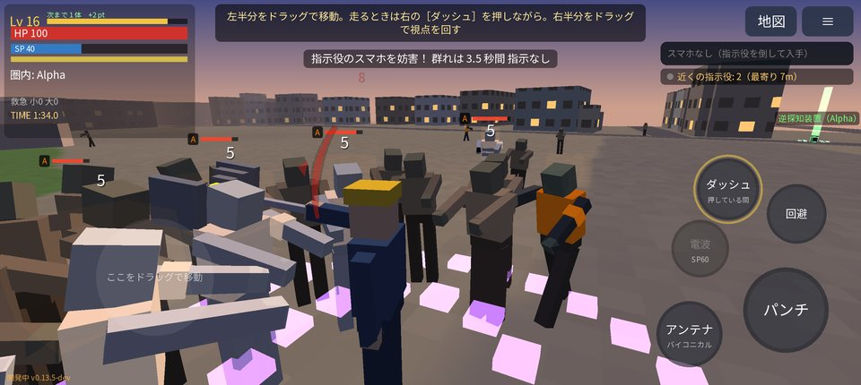 バイコニカル（自分の周り全部）</td>
</tr>
</table>

### 回避

前転して攻撃をかわします（スタミナを使います。回避中は攻撃が当たりません）。ドローンの弾は大きな光の玉で、見てから横へ避けられます。

### ロックオン

［ロックオン］で近くの敵を狙い、カメラがその敵へ向きます。設定の「操作・パッド」で「ロックオン中の移動」を「敵の周りを回る」にすると、ロックオン中はスティックの左右で敵の周りを回り込み、上下で近づく・離れる動きになります（疾走中は通常の動き）。ロック中にもう一度押すと次の敵へ、［解除］で解除します。

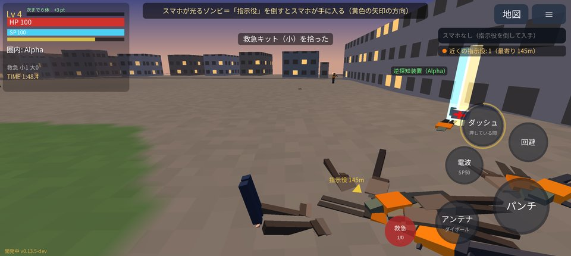

### 支配者の技とブレイク

支配者は大きな体で、振りかぶってから重い技を出します。振りかぶりの間は**地面に当たる範囲が赤く**出て頭上に「！」が出るので、回避か範囲の外へ逃げてください。
ステージが進むほど技の種類と連続攻撃が増えます。離れていても、スマホを投げてきます（落ちる地点が赤い円で出ます）。振りかぶり中に**電波放射**を当てると膝をついて止まり（ブレイク）、そこに**パンチ**を押すと専用の「吹っ飛ばし」になり（出している間は無敵）、周り 3m の敵もまとめて吹っ飛ばせます。

基地局の設備盤を守る**ロボット**も支配者並みの強さです（支配者の 7 割ほどの大きさ・同じ技・離れているとミサイル。ブレイクと吹っ飛ばしも効きます）。
各ステージの一番大きな基地局には、王冠を付けた**ボス**が 2 体います。ボスはそのステージのクリアで手に入るアンテナを背負っていて、1 体を倒すと残りの 1 体が力を解放してパワーアップし、アンテナを振ってきます。振りかぶったら地面に赤く出る範囲から出るか、回避ボタンで避けましょう（回避の無敵で当たりません）。制圧していない局の周りでは、敵が減ると少しずつ湧き直します。

ボスから約 100m 手前には**公衆電話**（ボス戦の復活ポイント。地図にも表示）があります。ボス戦で倒れると「公衆電話から復活する？」と聞かれ、［はい］なら公衆電話の前で復活します（ボスの残り体力・倒したボスはそのまま）。公衆電話の周り 12m には敵が入ってきません。チャレンジモードでは使えません。

## 基地局を探す

### スマホの信号の強さ

支配者を倒すとスマホが手に入ります。スマホには、そのスマホがつながっている基地局の**信号の強さ**が出ます。
「↑ 強く」なら基地局に近づいている、「↓ 弱く」なら遠ざかっています。強くなる方へ歩いて探しましょう。

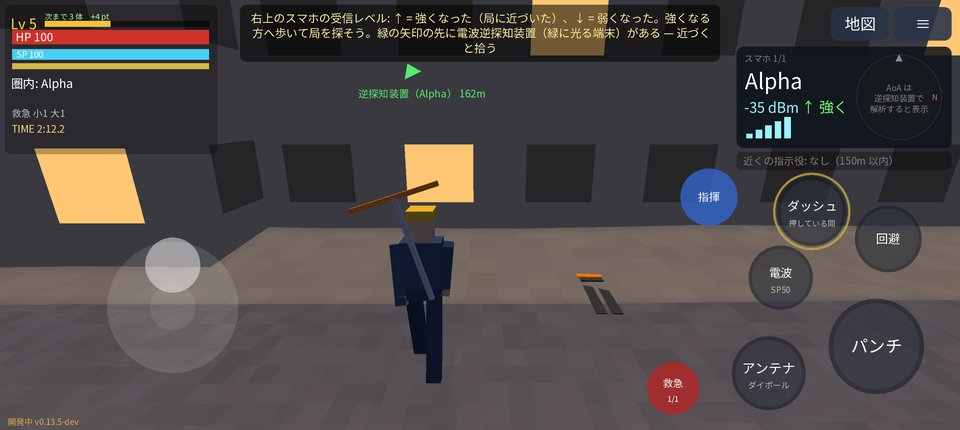

### 支配者を見つける

支配者はスマホで電波を出しているので、**局の色の光（オーラ）**をまとっています。150m 以内の支配者は地図にも点で出ます。
ゾンビの服の色は、つながっている基地局の色です。**色の無い灰色がかった茶色は野良**で、指揮できません（HP バーの左の文字は「野」）。

<table>
<tr>
<td align="center">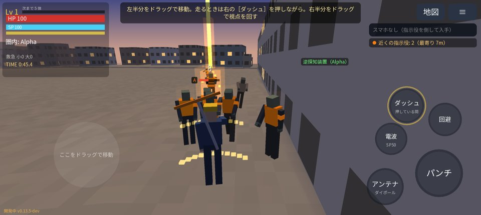 支配者のオーラと局の色の群れ</td>
<td align="center">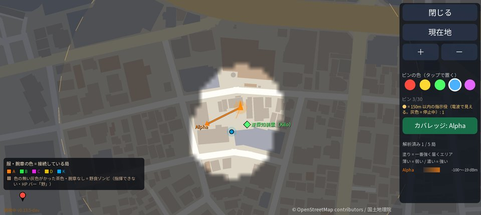 地図の支配者の点（150m の円）</td>
</tr>
</table>

### 電波逆探知装置

各基地局のエリアに 1 台ずつ、緑に光る端末（**電波逆探知装置**）が置いてあります。近づくと拾えます。
メニューの所持品から「使う」と、**その局の位置**と**カバレッジマップ**（その局が一番強く届くエリアを局の色の濃淡で表示）が地図に出て、
その局のスマホに電波の**到来方向（AoA）**の矢印が出るようになります。

ビルの壁で反射した電波は壁の方から届くので、矢印が基地局の方向を指しているとは限りません。場所を変えて確かめましょう。

<table>
<tr>
<td align="center"> 地面の電波逆探知装置</td>
<td align="center">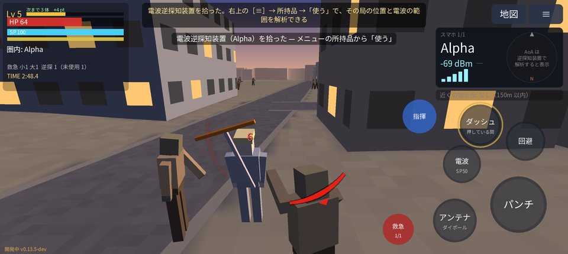 拾う</td>
</tr>
<tr>
<td align="center">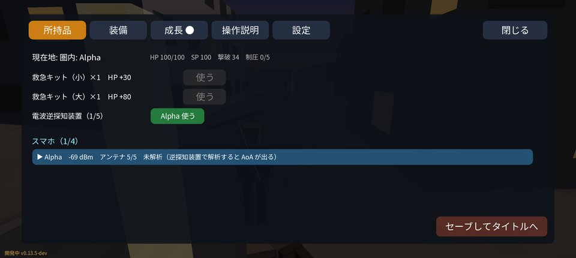 所持品から使う</td>
<td align="center"> 局の位置とカバレッジ</td>
</tr>
<tr>
<td align="center" colspan="2">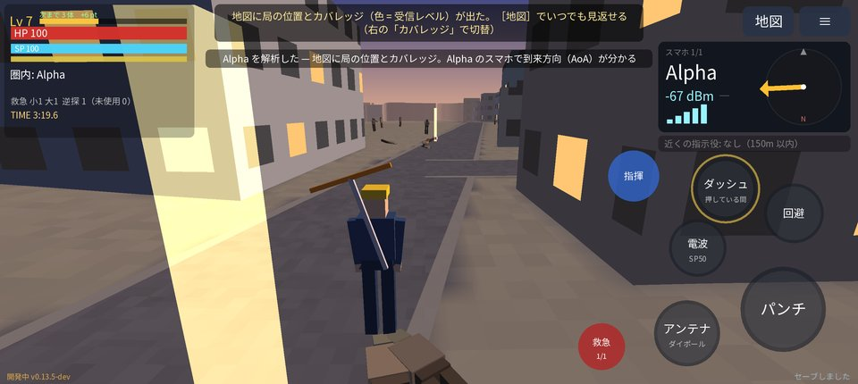 スマホに到来方向の矢印</td>
</tr>
</table>

## ゾンビを指揮する

スマホを持っていると、**そのスマホと同じ基地局につながっているゾンビ**（40m 以内・最大 8 体）を指揮できます。
［指揮］で円形のメニューを開き、護衛・攻撃・待機・解除を選びます。支配者が健在の群れは奪えないので、倒すか電波で止めてからにしましょう。
味方は倒されるまでどこまでも付いてきます（局のエリアの外でも。疾走すると疾走の速さで追ってきます）。「待機」の味方はその場に残ります。

<table>
<tr>
<td align="center">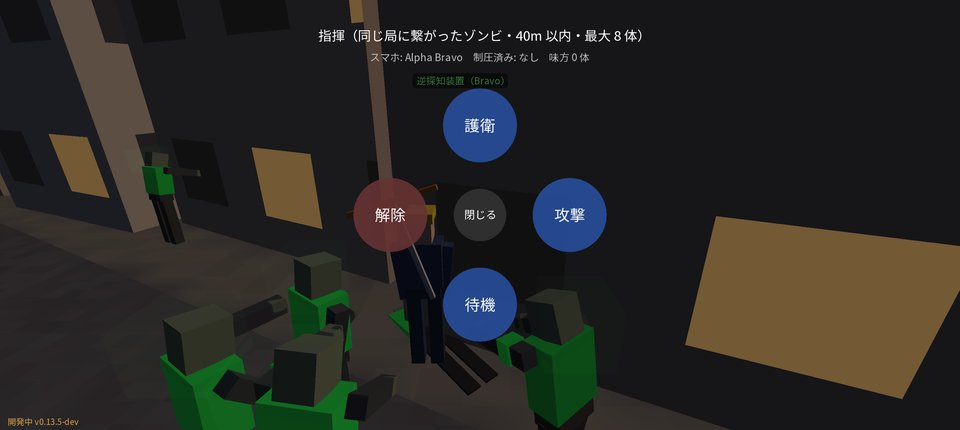 指揮の円形メニュー</td>
<td align="center">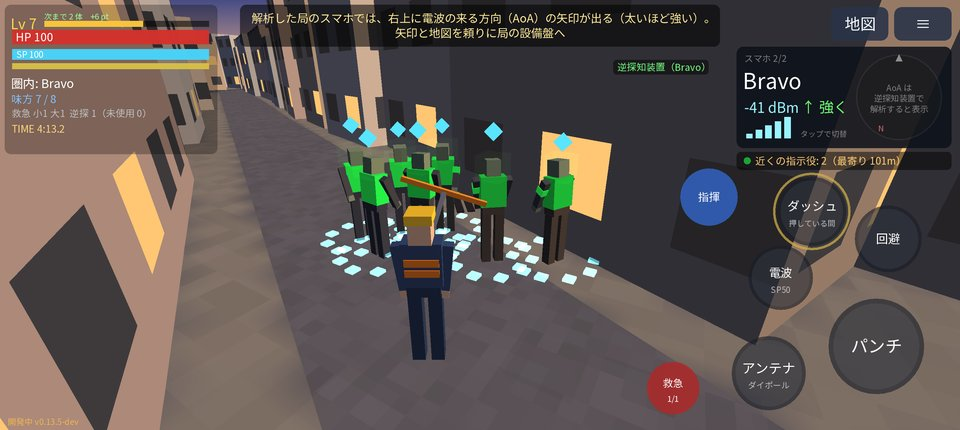 味方（頭上に水色のひし形）</td>
</tr>
</table>

基地局を制圧すると、そのエリアのゾンビは戦わなくなります（中立。頭上に白い「−」）。中立のゾンビもスマホ無しで指揮できます。

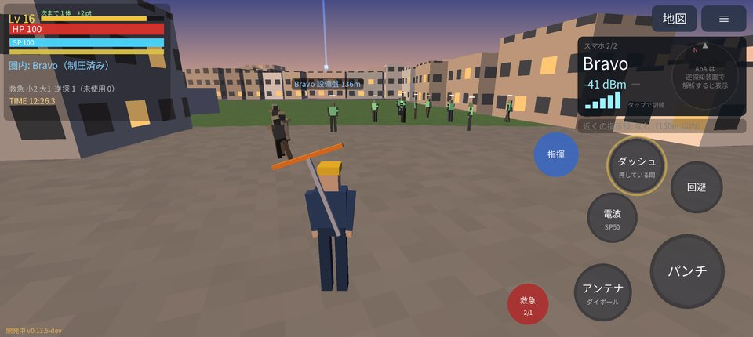

## 基地局を停波する

基地局のアンテナは建物の上にあっても、**停波するのは足元（地上）の設備盤**です。見つけた基地局には光柱が立ち、
「Alpha 設備盤 120m」のように名前と距離が出ます（赤 = 未制圧、青 = 制圧済み）。

設備盤の近く（10m 以内）で［停波］を押すと 30 秒のカウントダウンが始まります。設備盤から 16m 以上離れると中断されるので、群れを防ぎながら耐えましょう。

<table>
<tr>
<td align="center">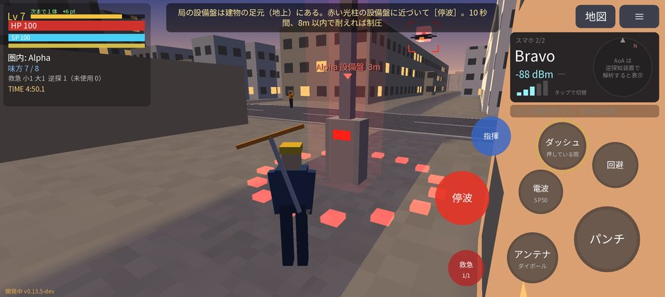 設備盤と［停波］</td>
<td align="center">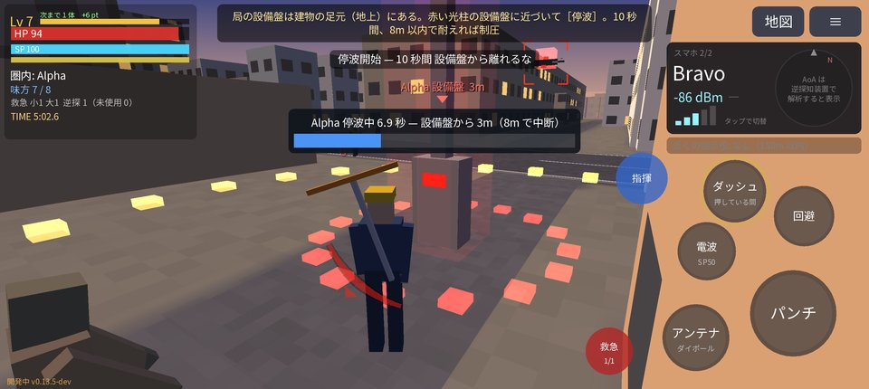 停波のカウントダウン</td>
</tr>
</table>

制圧した基地局は**休憩地点**になります（HP 全回復・セーブ・ファストトラベル・能力の振り直し。倒れたらここから再開）。休憩中は座って休み、周りの敵はその場で止まります。

<table>
<tr>
<td align="center">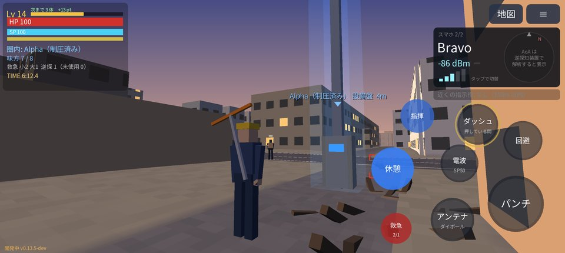 制圧後は青い光柱</td>
<td align="center">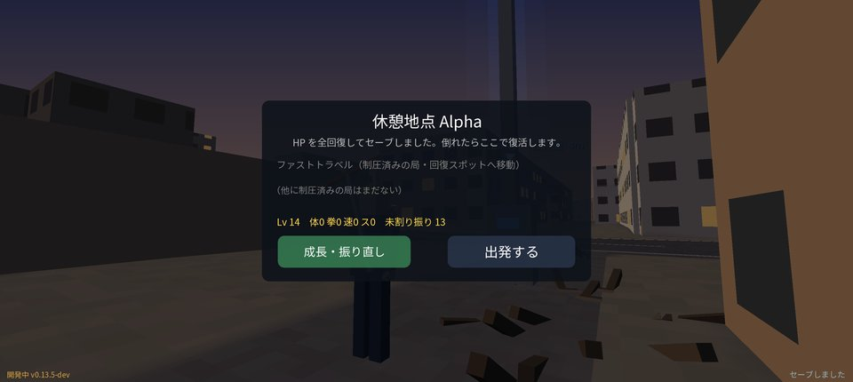 休憩地点のパネル</td>
</tr>
</table>

巨大局はシールドで守られていて、小基地局を 4 局すべて制圧するとシールドが消えます。設備盤の場所は画面で案内されます。

<table>
<tr>
<td align="center"> 巨大局のシールドと守りのロボット</td>
<td align="center">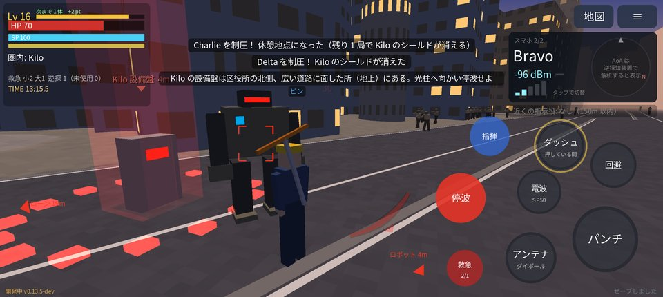 シールドが消えた所</td>
</tr>
</table>

## アンテナと成長

### アンテナ

ステージをクリアするたびに新しいアンテナが 1 本手に入り（TOKYO AREA I で八木、TOKYO AREA II でバイコニカル、KYUSHU でホーン、TOKYO AREA III でパラボラ、NAGANO でフェーズドアレイ、TOKYO AREA IV でディッシュ、最終ステージでフライング）、「NEW ANTENNA」の画面でその場で装備できます。メニューの「装備」でもいつでも持ち替えられます（まだ装備していないアンテナには「NEW」の札）。

| アンテナ | 特徴 |
| --- | --- |
| ダイポール | 最初の装備。前後の 8 の字に 14m。電波も前後 2 方向 |
| 八木 | 前方 ±20° に 24m。電波は細く遠くまで届き、支配者を長く止める |
| バイコニカル | 自分の周り全部（全周 10m）を薙ぎ払う。電波も全周 |
| ホーン | 前方 ±15° に 20m、攻撃力が高い。電波でもダメージを与える |
| パラボラ | 前方 ±6° の細い突きで 30m 先まで、大きく吹き飛ばす。電波は溜めてから撃つ細いビーム（ドローンを確実に落とす） |
| フェーズドアレイ | 前方 ±70°・22m の敵を自動で捕捉し、光のビームを 3〜8 本分散して撃つ。電波は近い敵から最大 6 体へ個別に飛ぶ |
| ディッシュ | 前方 25m の敵の足元に照準を出し、上空から光の柱を 2〜5 発落とす（半径 3m。建物の向こうの敵も狙える）。電波は前方 20m 先の半径 8m を上空からまとめて止める |
| フライング | 肩の左右に浮かぶ 2 台の飛行ユニットが撃つ。短く押すと前方に放射状の弾、溜めると青いレーザー 2 本（28m・貫通）、ロックオン中に溜めると 2 台が相手の真上へ飛んで撃ちおろす（建物の向こうの敵にも当たる）。電波は 2 台が周りを一周して全周 15m をまとめて止める |

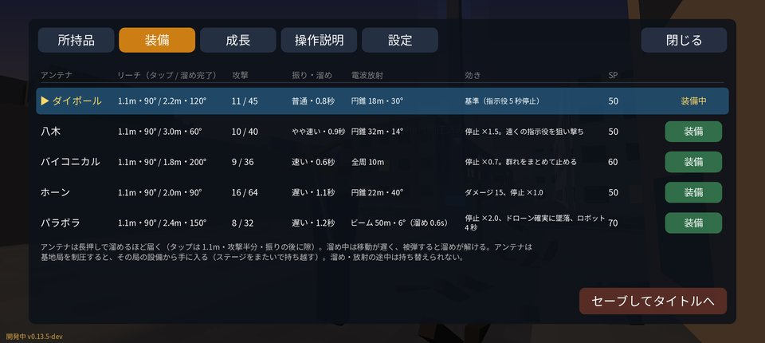

### レベルと成長

ノーマルモードで敵を倒すとレベルが上がり（最大 Lv 999）、1 レベルごとに 1 ポイントもらえます。
メニューの「成長」で**体力・パンチ・移動速度・スタミナ・回収範囲・回避**に振れます（1 ポイント = +1%、各 200 ポイントまで。回収範囲は 200 ポイントでアイテムを拾う距離が 6 倍、回避は 200 ポイントで速さ 2 倍・距離 3 倍）。
減らす（振り直す）のは休憩地点でできます（無料）。

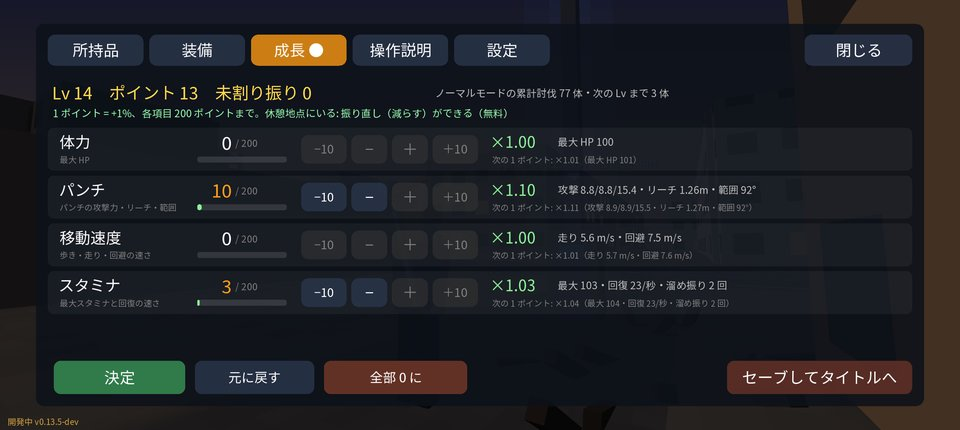

メニューの「操作説明」でも、操作とルールをいつでも確かめられます。

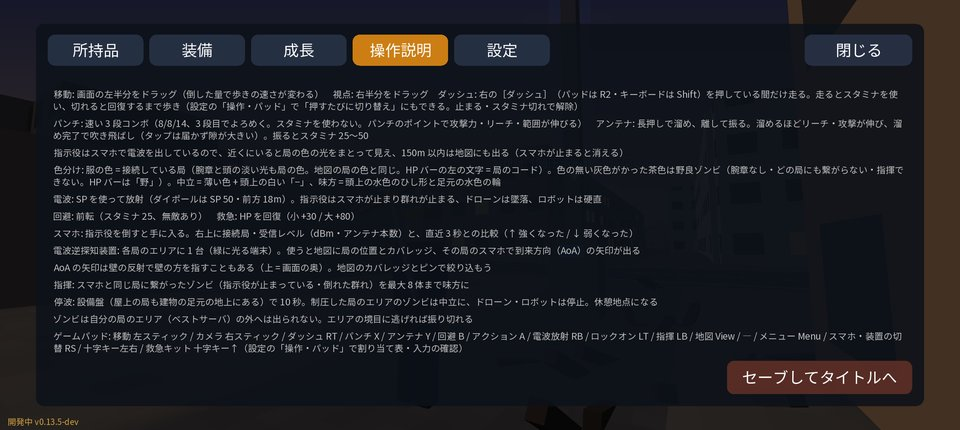

## 地図

地図は歩いた場所だけが見えます（霧）。空いている所をタップするとピンを置けます（5 色・メモ付き）。
ピンはゲーム画面にも光の柱と「◆ 距離」で出て、遠くからでも見えます（画面の外なら縁に矢印。30m 以内はレーダーにも出ます）。電波逆探知装置で解析した局のカバレッジも、ここで表示を切り替えられます。

<table>
<tr>
<td align="center">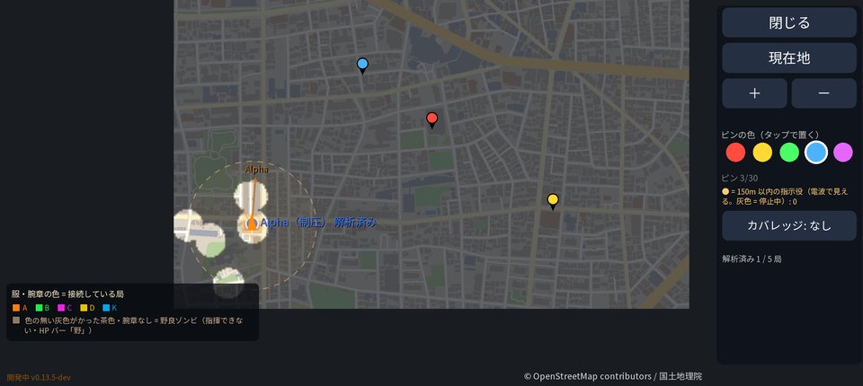 地図（霧・ピン・凡例）</td>
<td align="center"> 光柱のラベル</td>
</tr>
</table>

## リザルトと記録

ノーマルモードでステージを最初から始めてクリアすると、クリアタイム・撃破数・支配数などが記録され、ステージごとのランキング（上位 10 件）に載ります。
「結果を共有」で、スクリーンショット付きの画像と文章を SNS などに送れます（#phonetichound）。

<table>
<tr>
<td align="center">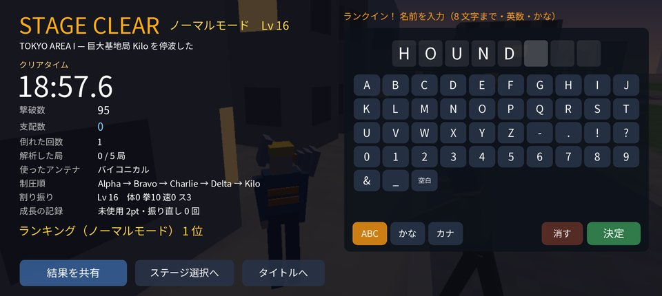 ランクインの名前入力</td>
<td align="center">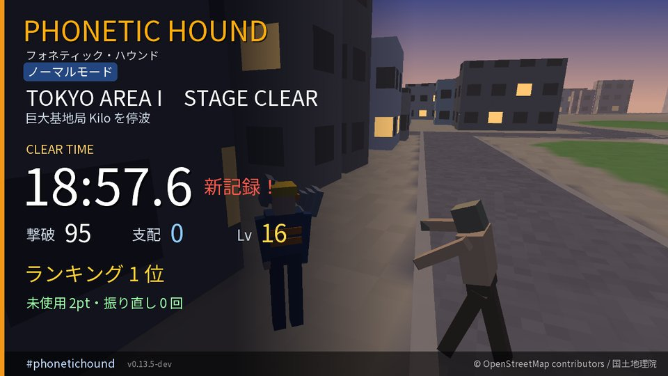 共有される画像</td>
</tr>
</table>

タイトルの「記録」で、ランキング・プレイ記録（総プレイ時間・討伐数の内訳など）・ステージ別の記録を見られます。

<table>
<tr>
<td align="center">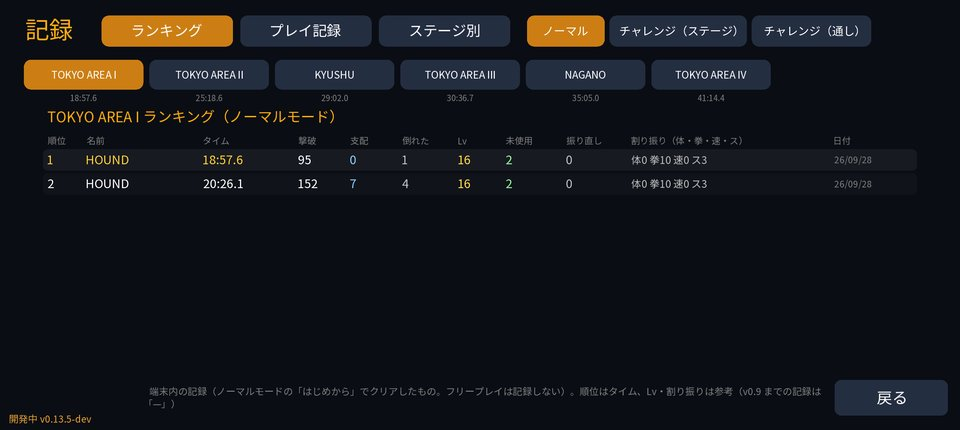 ランキング</td>
<td align="center">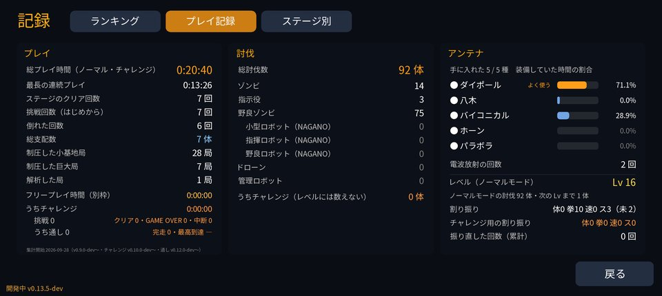 プレイ記録</td>
</tr>
<tr>
<td align="center" colspan="2">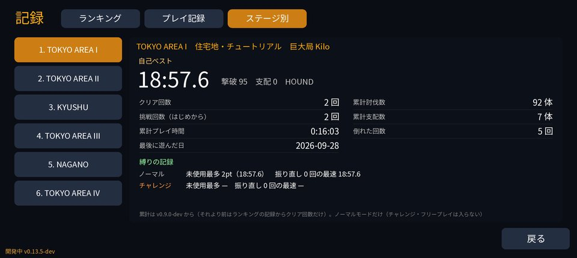 ステージ別（縛りの記録も）</td>
</tr>
</table>

## チャレンジモード

**Lv 200 固定・セーブ無し・1 回倒れたら終わり**の腕試しです。開始前に 199 ポイントを割り振ります。アンテナは、開始ステージより前のステージのクリアで手に入る分を持って始まります（通しではクリアごとに増えます）。
右上の「？」でルールの説明を読めます。

- **全ステージ通し**: 開始ステージから TOKYO AREA IV まで続けて遊び、合計タイムを競います。開始地点は TOKYO AREA I か、ノーマルモードでクリアしたステージ。
- **ステージ選択**: 1 ステージだけ遊びます。選べるのはノーマルモードでクリアしたステージ。

チャレンジでクリアしても、ノーマルモードのステージは解放されません。

<table>
<tr>
<td align="center">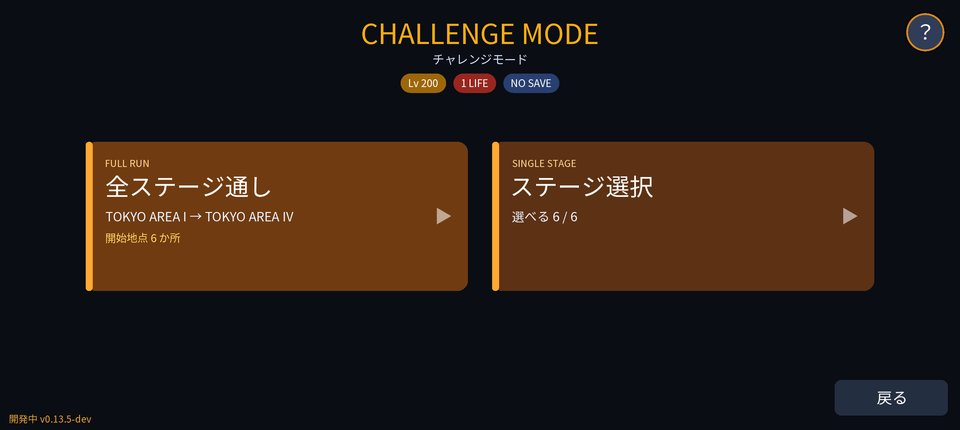 チャレンジモード</td>
<td align="center">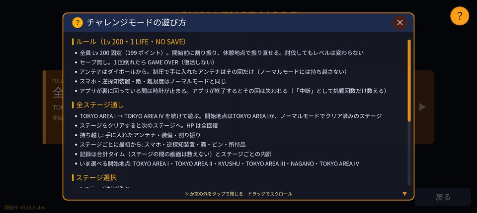 「？」の説明</td>
</tr>
<tr>
<td align="center">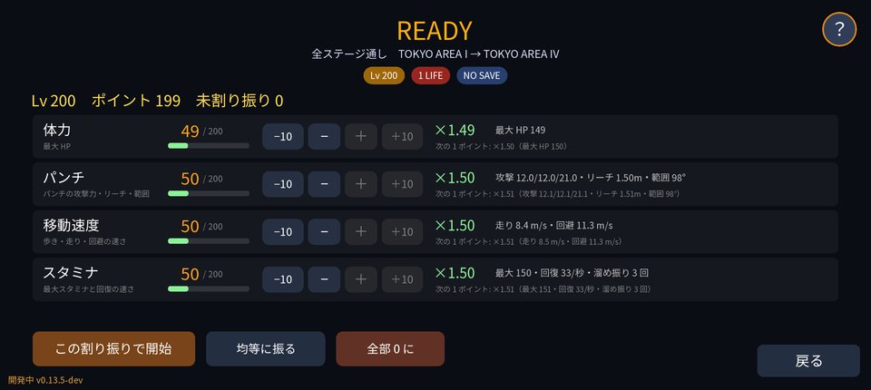 開始前の割り振り</td>
<td align="center">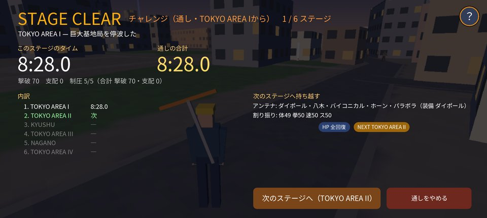 通しの途中のリザルト</td>
</tr>
<tr>
<td align="center" colspan="2">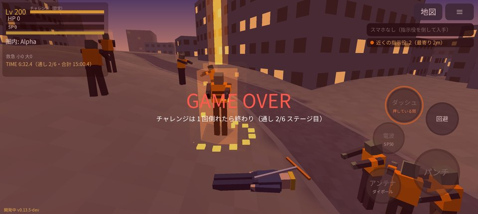 倒れたら GAME OVER</td>
</tr>
</table>

## ステージ

| # | ステージ | 特徴 | 難易度 |
| --- | --- | --- | --- |
| 1 | TOKYO AREA I | 住宅地。チュートリアル | ★ |
| 2 | TOKYO AREA II | 団地と坂 | ★★ |
| 3 | KYUSHU | 川と橋 | ★★ |
| 4 | TOKYO AREA III | 高層ビルの谷。反射波が多い | ★★★ |
| 5 | NAGANO | 山あいの田んぼと森。敵はすべてロボット。回復スポットあり | ★★★ |
| 6 | TOKYO AREA IV | 超高層街（最終ステージ）。終盤に大変なことが… | ★★★★ |

<table>
<tr>
<td align="center">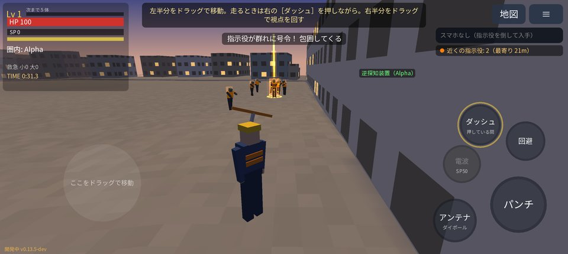 TOKYO AREA I</td>
<td align="center">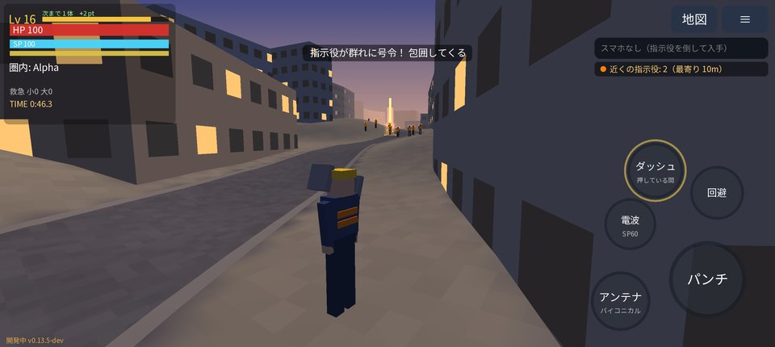 TOKYO AREA II</td>
</tr>
<tr>
<td align="center">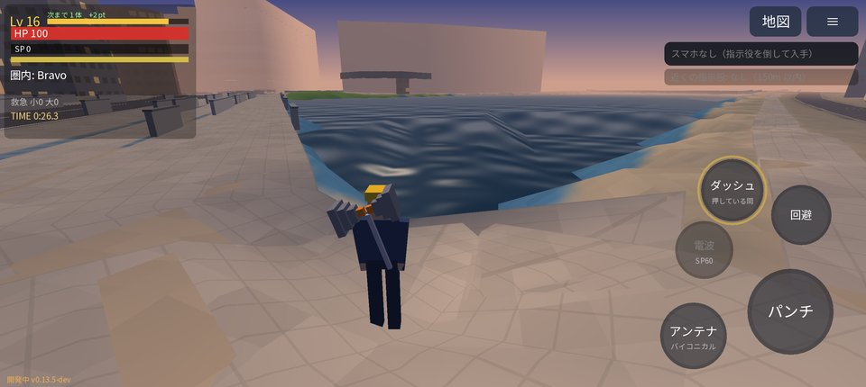 KYUSHU</td>
<td align="center">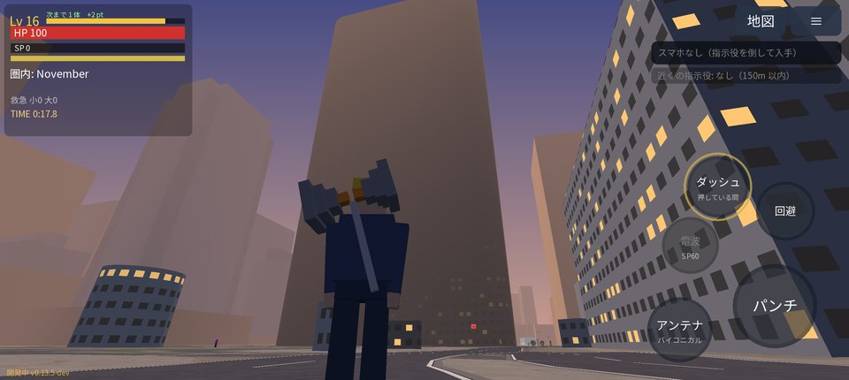 TOKYO AREA III</td>
</tr>
<tr>
<td align="center">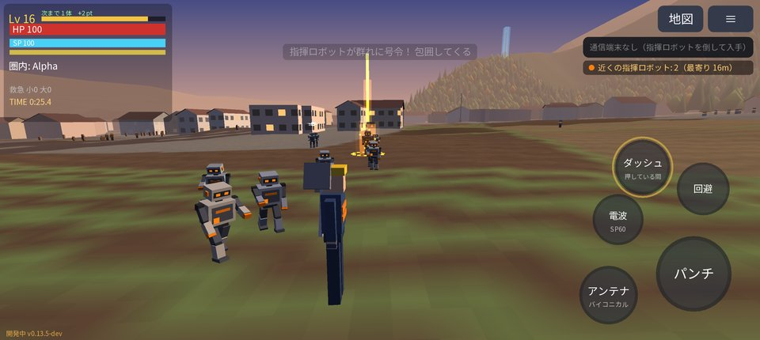 NAGANO（ロボット）</td>
<td align="center"> TOKYO AREA IV</td>
</tr>
</table>

## 設定・ゲームパッド

設定では音量・カメラの感度・カメラの上下反転・ゲームパッドの設定を変えられます。
Bluetooth で接続したゲームパッド（DualShock 4 など）でも遊べます。パッドを使うと画面の操作表示が □△○× に変わり、全画面をパッドだけで操作できます。
ボタンが思ったように反応しないときは、設定の「パッドの入力を確認」で確かめ、「ボタンの配置」を切り替えてください。
ゲーム中の操作のボタンは、設定の「操作・パッド」→［ボタンの割り当て…］で変えられます。

### 難易度

設定の「ゲーム」で **EASY / NORMAL / HARD** を選べます（はじめは NORMAL）。

- **EASY**: 巨大局のボスは 1 体だけ（パワーアップしない）。支配者・ボス・管理ロボット以外の敵の体力が半分。
- **NORMAL**: 標準。
- **HARD**: ボスがパワーアップするときに体力が全回復。手下を倒された支配者・ボス・ロボットは 2 分ごとに「取り巻き」を 20 体呼びます（地面の紫の輪が合図。紫に光る小さな敵で、足が速く殴ってくるが体力 1）。
  支配者以上の敵が新しい技（足元から広がる**衝撃の輪**＝回避の無敵でくぐる、足元に 3 回落ちる**時間差の落雷**）を使います。Lv の上がり方は 2 倍。
- ノーマルモードで難易度を変えると、ステージの進行がリセットされて最初のステージからになります（Lv・割り振り・アンテナ・記録はそのまま）。チャレンジモードのランキングは難易度ごとです。

<table>
<tr>
<td align="center">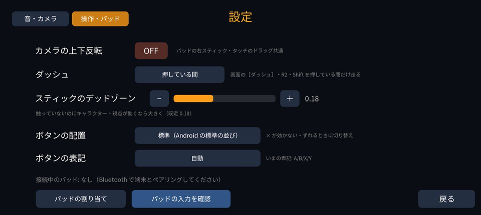 設定（操作・パッド）</td>
<td align="center">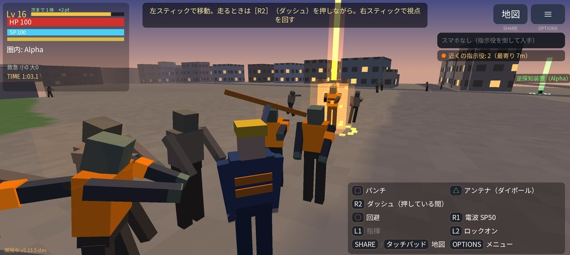 ゲームパッドで遊ぶ</td>
</tr>
</table>

## ヒント

- スタミナはアンテナ・回避で使います（疾走中は減りません）。群れに囲まれる前にパンチで崩し、溜めたアンテナで吹き飛ばしましょう。
- 電波放射で支配者のスマホを止めると、群れの支配が途切れます。その間に支配者を倒すか、群れを奪いましょう。
- ゾンビは自分の基地局の電波が届く範囲の近くまでしか追って来られません。灰色になって頭上に砂嵐が出たゾンビは、電波が届かず下がっていきます。
- 制圧した基地局のエリアは安全地帯です。野良ゾンビも入ってきません。
- 迷ったら地図を開きましょう。解析した局のカバレッジと、近くの支配者が分かります。

---

[← Phonetic Hound のページに戻る](https://kijitora-no-hito.github.io/android-apps/phonetic_hound/)
