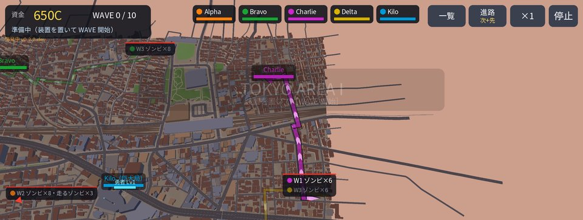
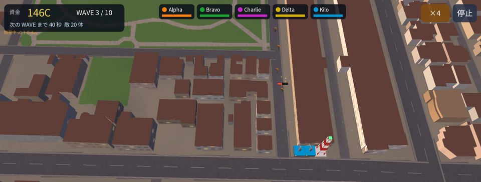
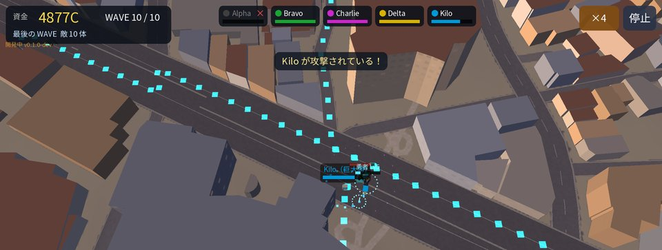

# Phonetic Hound Defence（開発中）

> **⚠ 開発中です。まだダウンロードできません。** 公開の準備ができたら、このページからダウンロードできるようにします。
> 内容・画面は今後大きく変わります。

[Phonetic Hound](https://kijitora-no-hito.github.io/android-apps/phonetic_hound/) の街とキャラクターで遊ぶ、横画面のタワーディフェンスです。

## どんなゲーム？

電波で操られたゾンビの街から、人類はついに基地局を取り戻した。
けれど街に残ったゾンビの群れは、基地局を奪い返そうと押し寄せてくる——。

- 街の外れから道路に沿って攻めてくる **wave** を、防衛装置と**勇者**で食い止め、基地局を守り抜く
- 防衛装置はアンテナを砲台にしたもの。資金の範囲で置き、強化・売却しながら守りを組み立てる
- 勇者は Phonetic Hound の主人公。自動で戦い、地図をタップした所へ駆けつけ、必殺技の衝撃波で群れを吹き飛ばす
- 次の wave の**進路を先に地図で確かめて**から配置できる（その先の wave も薄く表示）
- 基地局の**電波が届く範囲**にだけ装置を置ける。周波数帯を選ぶと、届く範囲と置ける数が変わる。中継器で範囲を広げることも（開発中）
- 街並みは Phonetic Hound と同じく、実在の地形と建物のデータから作っています

<table>
<tr>
<td align="center"> 次の wave の進路を確かめてから守りを組む</td>
<td align="center"> 道路を進む群れを砲台で迎え撃つ</td>
</tr>
<tr>
<td align="center"> 最後の wave。勇者が巨大局の前で踏みとどまる</td>
<td></td>
</tr>
</table>

## 開発の状況

- ステージ 1（TOKYO AREA I）を最初から最後まで遊べる試作ができています（10 wave・最後に大型の敵）。
- いま作っているもの: 周波数帯とカバレッジによる配置の制限、中継器、設定画面。
- これから: バランスの調整、ステージの追加。

## 予定

- 配布は Phonetic Hound と同じく GitHub のみの予定です。
- 動作は Android 7.0 以上（横画面）の予定です。

## 出典

- 建物・道路などの地図データ: © [OpenStreetMap](https://www.openstreetmap.org/copyright) contributors（ODbL）
- 地形: [国土地理院（標高タイル）](https://maps.gsi.go.jp/development/ichiran.html)
- BGM の譜面: [The Session](https://thesession.org/)（ODbL 1.0）。Phonetic Hound と同じ譜面データを使っています
  （[music-data](https://github.com/kijitora-no-hito/android-apps/tree/main/phonetic_hound/music-data)）。
- フォント: Noto Sans JP（SIL Open Font License 1.1）
- ゲームエンジン: libGDX（Apache License 2.0）

ご意見・ご要望は [Issues](https://github.com/kijitora-no-hito/android-apps/issues) へどうぞ。

 このページの QR コード

