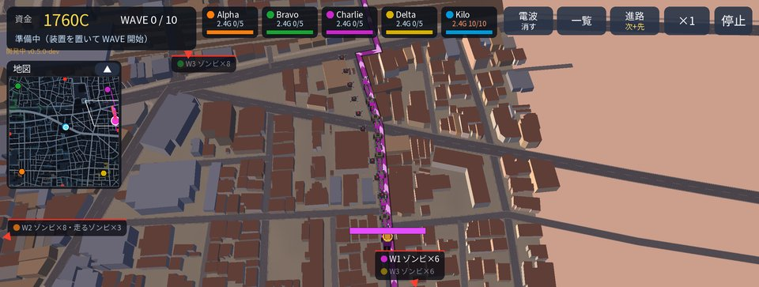
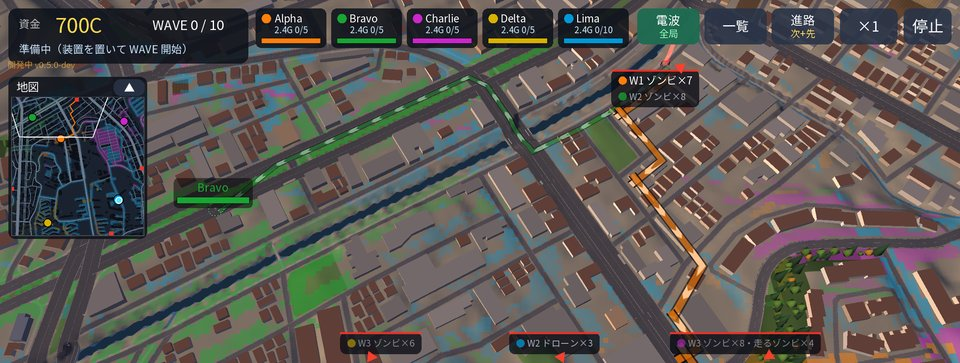
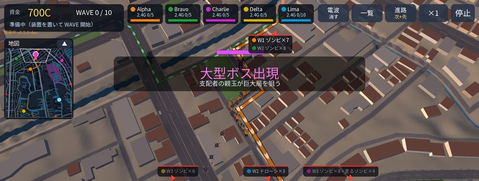
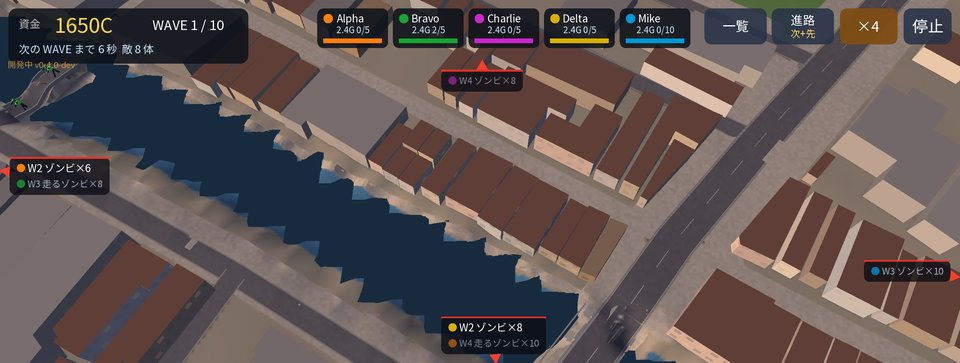
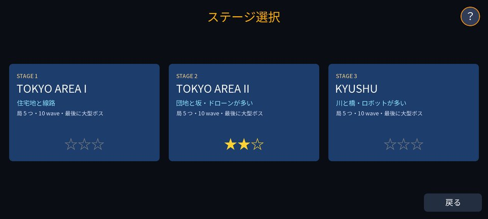

# Phonetic Hound Defence（開発中）

> **⚠ 開発中の版です。** 遊べるのはステージ 3 までで、内容・バランス・画面は今後大きく変わります。
> セーブデータは今後の版で引き継げなくなることがあります。

[Phonetic Hound](https://kijitora-no-hito.github.io/android-apps/phonetic_hound/) の街とキャラクターで遊ぶ、横画面のタワーディフェンスです。

## どんなゲーム？

電波で操られたゾンビの街から、人類はついに基地局を取り戻した。
けれど街に残ったゾンビの群れは、基地局を奪い返そうと押し寄せてくる——。

- 街の外れから道路に沿って攻めてくる **wave** を、防衛装置と**勇者**で食い止め、基地局を守り抜く
- 防衛装置はアンテナを砲台にしたもの。資金の範囲で置き、強化・売却しながら守りを組み立てる
- 勇者は Phonetic Hound の主人公。自動で戦い、地図をタップした所へ駆けつけ、必殺技の衝撃波で群れを吹き飛ばす
- 次の wave の**進路を先に地図で確かめて**から配置できる（その先の wave も薄く表示）
- 装置を置けるのは基地局の**電波が届く範囲**だけ。局ごとに**周波数帯**を選ぶと、届く範囲と置ける台数が変わる（高い帯ほど狭いが、たくさん置ける）。**中継器**で範囲を広げられる
- 街並みは Phonetic Hound と同じく、実在の地形と建物のデータから作り、電波は建物での回折まで計算

<table>
<tr>
<td align="center"> 道路を進む群れと次の wave の進路。左上のミニマップで全体の侵攻が分かる</td>
<td align="center"> ［電波］で各局のカバレッジを確認。装置は電波が届く所にだけ置ける</td>
</tr>
<tr>
<td align="center"> 最後の wave には大型の敵が巨大局を狙ってくる</td>
<td align="center"> KYUSHU: 川と橋で進路が絞られる。建物に囲まれて電波が届きにくい局も</td>
</tr>
<tr>
<td align="center"> 局ごとに周波数帯を選ぶ。高い帯ほど範囲は狭いが、たくさん置ける</td>
<td align="center"> ステージは 3 つ。クリアすると次が解放</td>
</tr>
<tr>
<td align="center"> タイトル</td>
<td align="center"> 守り切った局の耐久で ★1〜3</td>
</tr>
</table>

### [📖 遊び方マニュアル（画面の見方・装置・周波数帯・勇者・攻略のヒント）](https://kijitora-no-hito.github.io/android-apps/phonetic_hound_defence/manual.html)

## ダウンロード

### [APK をダウンロード（v0.5.2-dev・開発中・9.4 MB）](https://github.com/kijitora-no-hito/android-apps/releases/download/phonetichounddefence-v0.5.2-dev/phonetichounddefence-0.5.2-dev-release.apk)

 PC で見ている方へ: スマホでこの QR を読み取ると、このページが開きます。

## インストール方法

1. このページをスマホのブラウザで開き、上の「APK をダウンロード」を押します。
2. ダウンロードした APK を開きます。初回は「提供元不明のアプリ」のインストールを許可するよう求められるので、使っているブラウザ（またはファイルアプリ）に許可してください。
3. Google Play プロテクトが警告を出すことがあります。ストアを通さない APK では一般的に出る表示です。心配なときは下の SHA-256 と一致するか確かめてください。

- 自動更新はありません。新しい版は、このページから同じ手順で入れ直してください（上書きインストールになります）。
- Phonetic Hound とは別のアプリです。両方入れても、互いのセーブには影響しません。
- このアプリは GitHub でのみ配布しています。

## この版でできること（0.5.2-dev）

- ステージ 3 つ（前のステージをクリアすると次が選べる）。それぞれ 10 wave、最後に大型の敵。局を守り切った残りの耐久で ★1〜3。

  | # | ステージ | 特徴 |
  | --- | --- | --- |
  | 1 | TOKYO AREA I | 住宅地。四方から道路沿いに攻めてくる |
  | 2 | TOKYO AREA II | 団地と坂。空から来る敵が多い |
  | 3 | KYUSHU | 川と橋。橋で進路が絞られる。電波の届きにくい局がある |

- 防衛装置 6 種類（3 段階の強化・売却）、勇者 1 人（タップで移動・必殺技）、中継器。
- 進路の予告（次の wave ははっきり、その先は薄く）と、これからの wave の一覧。
- 周波数帯（900MHz / 2.4GHz / 6GHz / 14GHz / 28GHz）を局ごとに選ぶと、置ける範囲と台数が変わる。
- 右上の［電波］で全局のカバレッジをすぐ確認（局の札の長押しでその局だけ）。左上のミニマップで敵の侵攻を一目で（畳める）。
- 設定: 音・中継器の置き方（自由に置く／決まった地点から選ぶ。端末の速さで初期値が決まる）。

これから: バランスの調整、ステージの追加。

## 注意

- 開発中の版です。不具合があれば [Issues](https://github.com/kijitora-no-hito/android-apps/issues) へお知らせください。
- 登場する携帯基地局・事業者は架空のもので、実在の事業者・基地局とは関係ありません。
- ゾンビとの戦闘の表現があります（流血の表現はありません）。

## 出典

- 建物・道路などの地図データ: © [OpenStreetMap](https://www.openstreetmap.org/copyright) contributors（ODbL）
- 地形: [国土地理院（標高タイル）](https://maps.gsi.go.jp/development/ichiran.html)
- 電波の計算: ITU-R P.526（回折）・3GPP TR 36.814（アンテナのパターン）をもとに自作
- BGM の譜面: [The Session](https://thesession.org/)（ODbL 1.0）。Phonetic Hound と同じ譜面データを使っています
  （[music-data](https://github.com/kijitora-no-hito/android-apps/tree/main/phonetic_hound/music-data)）。
- フォント: Noto Sans JP（SIL Open Font License 1.1）
- ゲームエンジン: libGDX（Apache License 2.0）

## プライバシーポリシー

[Phonetic Hound Defence プライバシーポリシー](https://kijitora-no-hito.github.io/android-apps/phonetic_hound_defence/privacy-policy.html)

## 更新履歴

<b>0.5.2-dev</b>（2026-10-05）

- **不具合の修正**: 周波数帯の窓と装置の窓で、［×］・帯の切り替え・強化・売却のボタンが押せなかったのを直しました。

<b>0.5.1-dev</b>（2026-10-05）

- **エリアの外の見た目を整理**: 遊ぶ範囲の外へ長く延びていた道路を短く切り落とし、範囲の外の地面・建物・木は暗がりへ自然に消えるようにしました（肌色の平面も無くなりました）。

<b>0.5.0-dev</b>（2026-10-05）

- **カバレッジのささっと確認**: 右上の［電波］で全局のカバレッジを表示（もう一度押すと消える。wave 中も使える）。局の札を長押しすると、その局だけを表示。
- **キャラクターと装置を大きく**: 敵・勇者・装置を大きく描き、カメラを引いても小さくなりすぎないように。HP バーと名札も大きく。
- **ミニマップ**: 左上に全体の地図（局・敵・次の wave の進路・装置・勇者・見ている範囲）。タップ・ドラッグでその場所へ移動、［▲］で畳める。

<b>0.4.0-dev</b>（2026-10-05）

- **ステージ 2（TOKYO AREA II）とステージ 3（KYUSHU）を追加**: 前のステージをクリアすると次が選べます。
  - TOKYO AREA II: 団地と坂。空から来る敵が多く、丘の上の巨大局を狙う群れが坂を登ってくる。
  - KYUSHU: 川と橋。橋で進路が絞られ、硬い敵と足の速い敵が多い。建物に囲まれて電波が届きにくい局は中継器で守る。

<b>0.3.0-dev</b>（2026-10-05）

- 最初の公開（開発中）。ステージ 1、防衛装置・勇者・中継器、進路の予告、周波数帯とカバレッジ、設定。

---

| 項目 | 内容 |
| --- | --- |
| バージョン | 0.5.2-dev（2026-10-05・開発中） |
| ファイル | `phonetichounddefence-0.5.2-dev-release.apk`（9,840,763 バイト） |
| SHA-256 | `CBF7E958B45E02EBB50244B5B2AD09D7A615944F336D2D412913870823194728` |
| 対応 Android | 7.0 以上（横画面） |
| 価格 | 無料・広告なし・アプリ内課金なし・アカウント登録なし |

使う権限はありません（インターネットにも接続しません）。
