
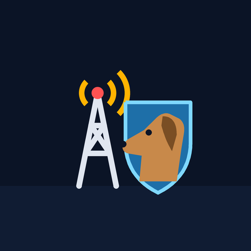

# Phonetic Hound Defence 遊び方マニュアル

[← Phonetic Hound Defence のページに戻る](https://kijitora-no-hito.github.io/android-apps/phonetic_hound_defence/)

> 開発中の版（v0.5.0-dev）の画面と数値です。今後の版で見た目や数値が変わることがあります。

## もくじ

1. [ゲームの目的](#ゲームの目的)
2. [画面の見方](#画面の見方)
3. [進め方](#進め方)
4. [進路の予告と wave の一覧](#進路の予告と-wave-の一覧)
5. [装置を置く](#装置を置く)
6. [防衛装置の種類](#防衛装置の種類)
7. [周波数帯とカバレッジ](#周波数帯とカバレッジ)
8. [中継器](#中継器)
9. [勇者](#勇者)
10. [敵の種類](#敵の種類)
11. [ステージ](#ステージ)
12. [設定](#設定)
13. [ヒント](#ヒント)

## ゲームの目的

人類が取り戻した街の基地局を、電波ゾンビの群れから守り抜くタワーディフェンスです。
各ステージには小基地局 4 つ（Alpha・Bravo・Charlie・Delta）と巨大局 1 つがあり、群れは街の外れの 4 か所の出現点から道路に沿って局を狙ってきます。

- **勝ち**: 全 10 wave を出し切り、敵を全滅させる（最後の wave には大型ボス）。
- **負け**: 巨大局の耐久が 0 になる、または小基地局がすべて落ちる。
- **★**: クリアしたときの局の耐久で決まります。局を 1 つも落とさず耐久の合計 80% 以上で ★3、45% 以上で ★2、それ以外は ★1。

<table>
<tr>
<td align="center">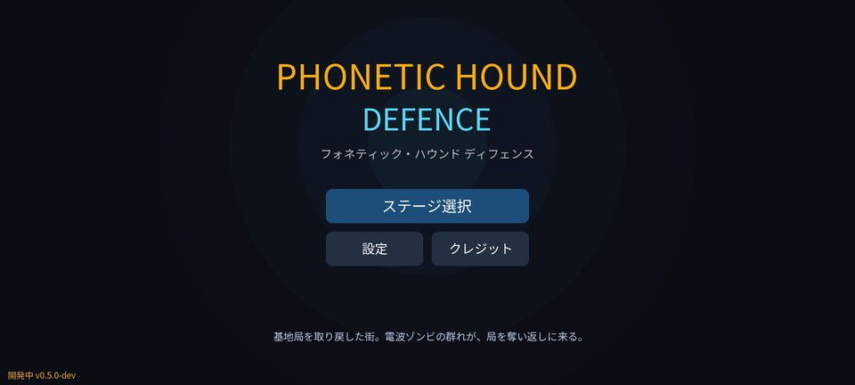 タイトル（ステージ選択・設定・クレジット）</td>
<td align="center"> ステージ選択。右上の「？」で遊び方</td>
</tr>
</table>

## 画面の見方

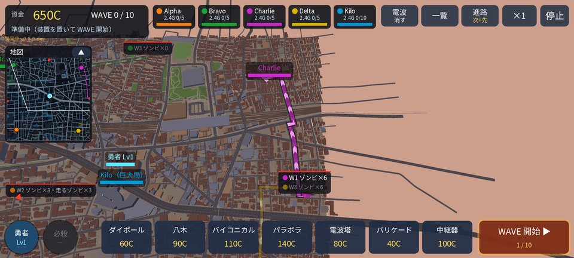

| 場所 | 内容 |
| --- | --- |
| 左上 | 資金（C）・いまの wave・状態（準備中 / 出現中 / 次の WAVE まで何秒・敵の数） |
| 上の中央 | 局の札。局の色・耐久のバー・周波数帯と「つないでいる装置の数 / 上限」（例「2.4G 0/5」）。攻撃されると点滅、落ちると ×。タップでその局へ寄って帯の窓、長押しでその局の範囲 |
| 右上 | ［電波］カバレッジの表示・［一覧］これからの wave・［進路］進路の予告の切り替え・速さ（×1 / ×2）・［停止］一時停止 |
| 左上の窓の下 | ミニマップ（［▲］で畳む） |
| 下 | 装置の列（名前と費用）。右端は［WAVE 開始］／［次の WAVE］ |
| 左下 | 勇者のボタン（Lv）と必殺技のボタン |

画面の動かし方: 1 本指のドラッグで地図を動かし、2 本指のつまみで拡大・縮小します。地図の端の赤い光の柱が敵の出現点です。

### ミニマップ

左上にステージ全体の地図が出ます。敵（赤い点。支配者は紫、ボスは大きなマゼンタ、ドローンは三角）・局・装置・勇者（水色）・次の wave の進路と、いま見ている範囲（白い枠）が分かります。
ミニマップをタップ・ドラッグすると、その場所へ画面が動きます。［▲］で畳むと［地図 ▼］のボタンだけになります（次に遊ぶときも同じ状態）。

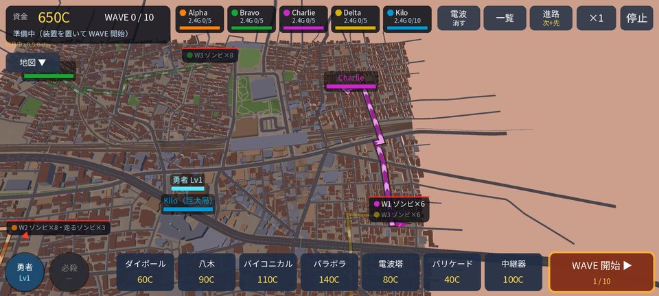 ミニマップを畳んだところ

### 一時停止

右上の［停止］で一時停止します。一時停止の窓から、つづける・遊び方・設定・最初からやり直す・ステージ選択へ を選べます。端末の戻るボタンは、置くのをやめる → 選択を外す → 一時停止 の順に働きます。

## 進め方

1. **準備**: ステージが始まると準備中です。進路の予告を見て、装置を置きます。資金はステージ 1 が 650C、ステージ 2 が 700C、ステージ 3 が 800C から。
2. **wave 開始**: 右下の［WAVE 開始］で最初の wave が始まります。
3. **次の wave**: 出現を出し切ると 40 秒の待ちの後、自動で次の wave が始まります。待ちの間に［次の WAVE］を押すと早く始まり、**残り秒 × 2 の資金**（早めのボーナス）がもらえます。
4. **資金**: 敵を倒すと賞金、wave を凌ぐ（出し切って全滅させる）と +60C。

右上の速さのボタンで ×1 と ×2 を切り替えられます。装置の配置・強化・売却は **wave の途中でもできます**。

<table>
<tr>
<td align="center"> クリア（★・撃破数・局の耐久・時間）</td>
<td align="center">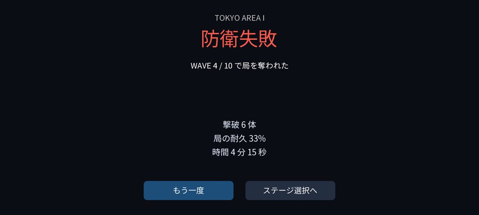 防衛失敗（何 wave 目で奪われたか）</td>
</tr>
</table>

## 進路の予告と wave の一覧

地図の上の線が敵の通り道です。装置を置く場所を、wave の前に決められます。

- **太く矢羽根が流れる線** = 次の wave（wave の途中は今の wave）。**細く薄い線** = その先の 2 wave 分。
- 線の色は**狙われる局の色**。点線はドローン（空を一直線に飛んでくる）です。
- 出現点の札に、wave の番号と出てくる敵の種類・数が出ます（例「W1 ゾンビ×6」）。画面の外の出現点は、画面の縁に向きの三角つきで出ます。
- 右上の［進路］で表示を切り替えます（次 + 先 → 次だけ → 消す）。wave の途中は今の wave だけ、装置を選んでいる間はいつも出ます。
- 狙われる局が落ちていれば、その群れは巨大局（それも落ちていれば一番近い残りの局）へ向かう線で出ます。

右上の［一覧］で「これからの WAVE」の窓が開きます（W 番号・出現点 → 局・敵の種類と数）。行をタップすると**その wave の進路だけ**を出して、全体が見えるようにカメラを寄せます。もう一度タップで元に戻ります。

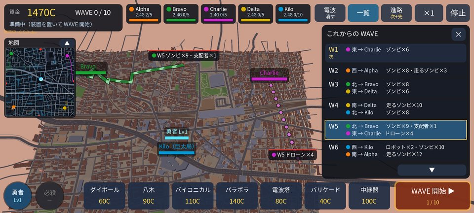 一覧で W5 を選んだところ（北から Bravo へゾンビと支配者、東から Charlie へドローン）

## 装置を置く

1. 下の列から装置を選ぶと、置ける場所が塗られます。
   - 砲台・電波塔・中継器: **局の電波が届く範囲**の格子が、つながる局の色で塗られます（濃いほど電波が強い）。赤い格子は圏外か、もう置いてある所。上限に達した局の範囲は斜線で薄くなります。
   - バリケード: 道路の上に**緑の格子**（置けない所は赤）。
2. 格子をタップすると、案内に「電波塔（80C）→ Alpha（2.4GHz 2/5 台目）」のように、費用と**つながる局**が出ます。細い線もその局へ伸びます。
3. ［設置］で置きます（同じ格子をもう一度タップしても置けます）。［やめる］で取りやめ。

砲台・電波塔は道路の脇の空き地（道路から 16 m 以内）、バリケードは道路の上にだけ置けます。局の設備盤のすぐそばと、出現点の近くには置けません。

<table>
<tr>
<td align="center">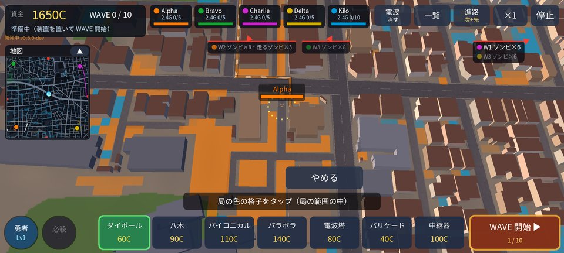 装置を選ぶと、置ける範囲が局の色で塗られる</td>
<td align="center">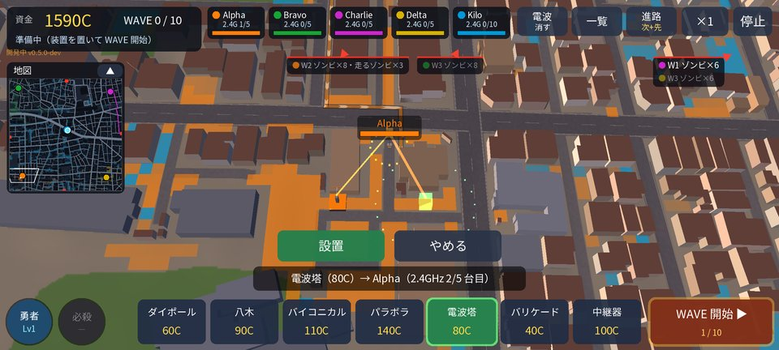 格子を選ぶと、つながる局と台数の案内</td>
</tr>
<tr>
<td align="center">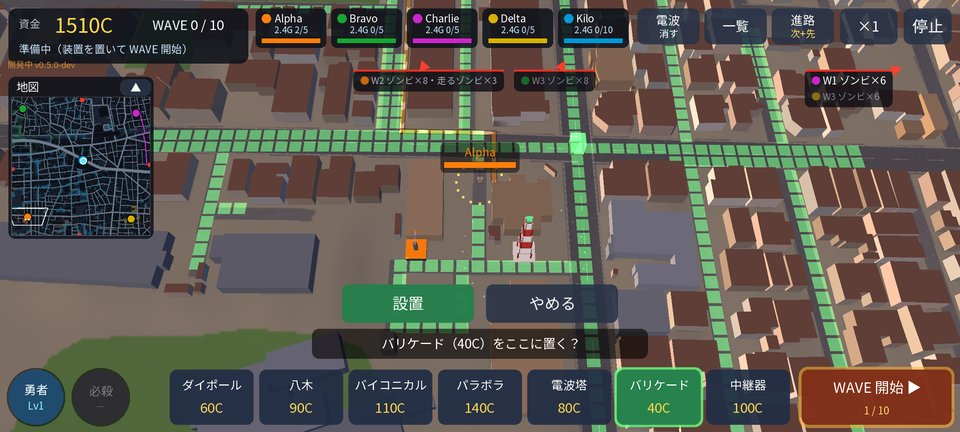 バリケードは道路の上（緑の格子）</td>
<td align="center">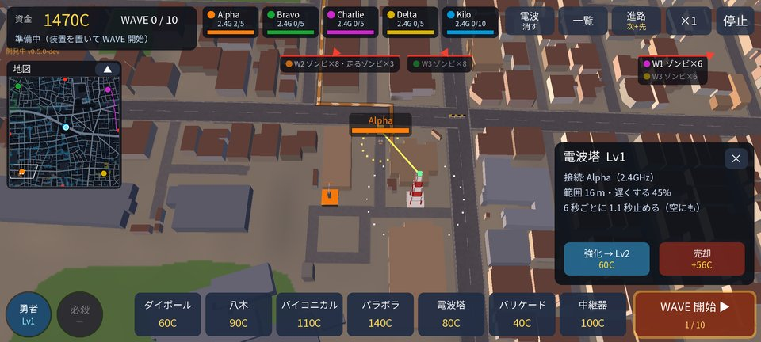 置いた装置をタップ → 強化・売却</td>
</tr>
</table>

### 強化・売却

置いた装置をタップすると右に窓が開き、性能・つながっている局（「接続: Alpha（2.4GHz）」）・強化・売却が出ます。

- **強化**は 3 段階（Lv1 → Lv2 → Lv3）。費用は基本の費用 × 0.75（Lv2 へ）・× 1.1（Lv3 へ）。威力 1.55 倍 → 2.3 倍、射程 1.1 倍 → 1.2 倍、撃つ間隔 0.9 倍 → 0.8 倍。電波塔は遅くする割合と止める秒数が、バリケードは耐久が伸びます（強化で全快）。
- **売却**はいつでも、使った額（強化の分も含む）の 70% が戻ります。

## 防衛装置の種類

| 装置 | 費用 | 射程 | 威力 / 間隔 | 当たる敵 | 特徴 |
| --- | --- | --- | --- | --- | --- |
| ダイポール砲台 | 60C | 20 m | 16 / 0.9 秒 | 地上 | 安い。狙った敵の向きの前後 2 方向をまとめて撃つ |
| 八木砲台 | 90C | 36 m | 42 / 1.2 秒 | 地上 | 射程の長い単体攻撃 |
| バイコニカル砲台 | 110C | 15 m | 22 / 1.5 秒 | 地上・空 | 周りの敵全部（ドローンも）にまとめて当たる |
| パラボラ砲台 | 140C | 62 m | 95 / 2.8 秒 | 地上・空 | とても遠くまで届く狙撃。ドローンに 2 倍、空の敵を優先 |
| 電波塔 | 80C | 16 m | 4 / 6 秒 | 地上・空 | 範囲の敵を 45% 遅くし、6 秒ごとに 1.1 秒止める |
| バリケード | 40C | ― | 耐久 240 | ― | 道路の上に置き、地上の敵を足止め（壊されるまで）。電波は要らない |
| 電波デコイ | 50C | 20 m | 耐久 80 | ― | 小さな基地局。半径 20 m に入った敵（ドローン・支配者・ロボットも。大型ボスは除く）を引き寄せ、自分を攻撃させる。攻撃はせず、すぐ壊される。強化で半径 24 → 28 m・耐久 120 → 180 |
| 中継器 | 100C | ― | ― | ― | 局の範囲を広げる（[中継器](#中継器)）。攻撃しない・強化なし・壊されない |

砲台は射程の中で**局に一番近い敵**（経路の残りが一番短い敵）を狙います。

## 周波数帯とカバレッジ

砲台・電波塔・電波デコイ・中継器は電子機器なので、**基地局の電波が届く範囲（カバレッジ）**の中にしか置けません。バリケードと勇者は電波に関係なく、どこでも大丈夫です。
電波は建物での回折まで計算しているので、建物の陰には届きにくく、見通しの良い道に沿って伸びます。

### 周波数帯を選ぶ

局ごとに周波数帯を選べます（最初は全局 2.4GHz）。**高い帯ほど届く範囲が狭く、そのかわり多くの装置をつなげます。**

| 帯 | 上限（小基地局 / 巨大局） | 届く範囲 |
| --- | --- | --- |
| 900MHz | 3 台 / 6 台 | いちばん広い。建物の陰にも回り込む |
| 2.4GHz | 5 台 / 10 台 | 広め（最初の帯） |
| 6GHz | 7 台 / 14 台 | 局のまわりと見通しの道 |
| 14GHz | 10 台 / 20 台 | 狭い |
| 28GHz | 14 台 / 28 台 | ほぼ見通しの道だけ |

巨大局は 3 セクターなので上限が小基地局の 2 倍です。ただし高い所から見下ろすので、**巨大局の真下（足元）は高い帯ほど届きにくく**なります。

上の局の札（か地図の局）をタップすると**帯の窓**が開きます。5 つの帯それぞれの範囲の広さ（地図の置ける所の何 %）・上限と、変えたら止まる装置の数が出ます。
**帯を変えられるのは、準備中と wave の間（出現が終わってから次の wave まで）だけ**です。出現中は変えられません。

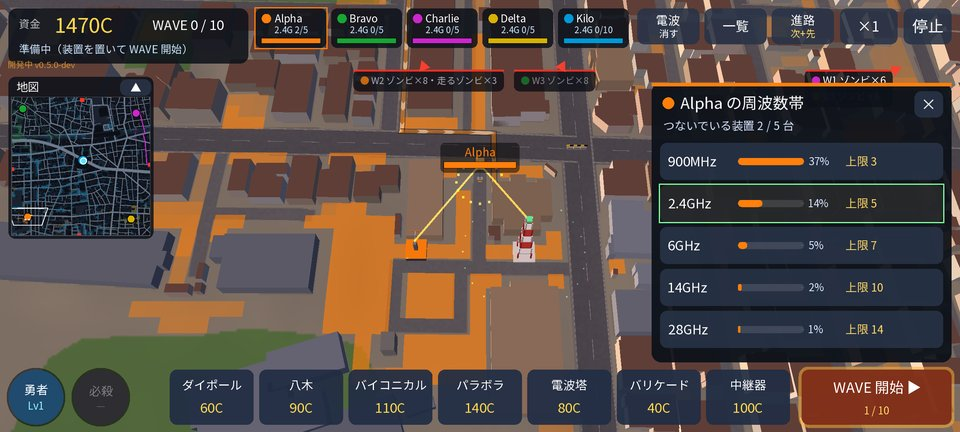 帯の窓（Alpha）。窓を開いている間は、その局の範囲が塗られる

### カバレッジをすぐ確認する

- 右上の **［電波］**: 装置を選んでいないとき（wave の途中も）に、全部の局の範囲を局の色で塗ります（重なる所は電波の強い局の色。中継器の範囲は白っぽく）。もう一度押すと消えます。
- **局の札を長押し**: その局（とその局の中継器）の範囲だけを塗ります。もう一度長押しか［電波］で消えます。

<table>
<tr>
<td align="center">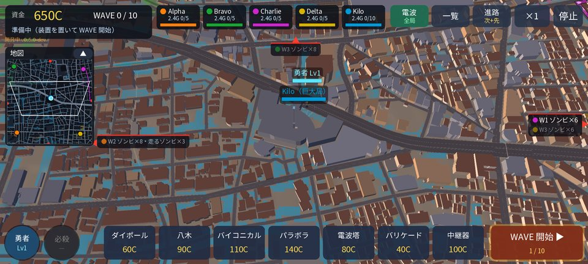 ［電波］で全局のカバレッジ</td>
<td align="center">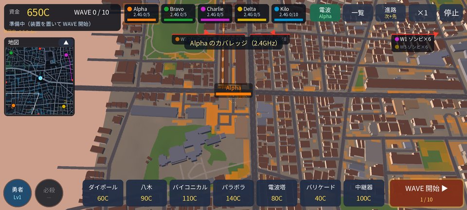 札の長押しで Alpha だけ</td>
</tr>
</table>

### つながり方と圏外

置いた装置は、空きのある局のうち電波の一番強い局（小基地局は少し優先）につながります。どの局につながるかは、置くときの案内と細い線で分かります。

局が落ちると、その局の範囲（とその局の中継器の範囲）が消え、つながっていた装置は**圏外**になって止まります（灰色になり、頭上に赤い「圏外」）。ほかの局の範囲に空きがあれば自動でつなぎ直します。
帯を変えて範囲・上限から外れた装置も止まります。帯を戻す・局に空きができれば自動でつながります。止まった装置もいつでも売却できます。

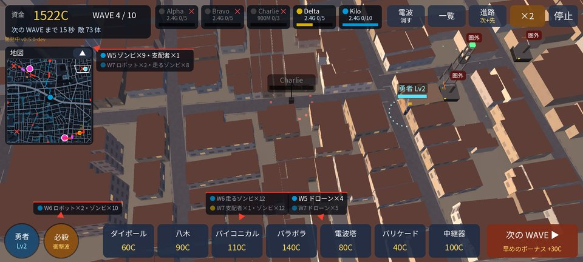 Charlie が落ちて圏外で止まった装置

## 中継器

**中継器**（100C）は局の範囲の中に置くと、その地点から親の局と同じ帯で新しい範囲を作ります（高さ 8 m・出力は局より小さい）。

- 中継器の範囲に置いた装置は、親の局の上限を使います（中継器そのものは数えません）。
- 中継器の範囲の中に中継器は置けません（中継は 1 段まで）。
- 親の局の帯を変えると、中継器の範囲もその帯になります。親が落ちたら、ほかの局の範囲の中ならその局へつなぎ直します。
- 建物の陰や遠くの道を守りたいとき、巨大局の真下を守りたいときに使います。攻撃はせず、壊されません。

置き方は設定で 2 つから選べます。決まり（範囲・上限・つながり方）はどちらも同じです。

- **自由**: 置ける格子ならどこにでも。格子を選ぶとその地点の範囲を計算して重ねて見せます。置いた中継器は計算が終わるまで「計算中」と出て、その間は装置がつながりません（ゲームは止まりません）。
- **簡易**: 決まった候補の地点（地図の ◇。ステージごとに 24 か所の交差点の脇）にだけ置けます。範囲は前もって計算してあるので、すぐに使えます。

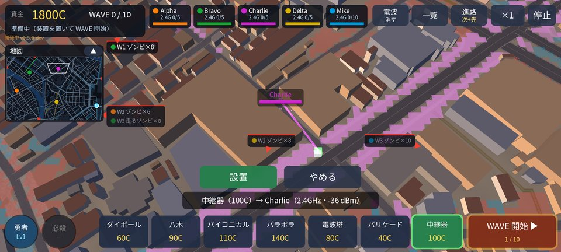 建物に囲まれた Charlie（KYUSHU）のそばに中継器を置くところ。白っぽい色がその中継器の範囲

## 勇者

Phonetic Hound の主人公が**勇者**として 1 人で戦います。電波に関係なく、どこへでも行けます。

- **移動**: 左下の勇者のボタン（または勇者をタップ）→ 地図をタップで、そこへ向かいます。着いたらそこで待ち構えます（移動中は戦いません）。
- **戦い**: 待ち構えた場所の近くの地上の敵と自動で戦います（パンチ、近くに敵が 2 体以上いればアンテナを振って扇形の衝撃波）。組み合った敵はその場で止まります。
- **必殺技**: 左下の［必殺］で、周り 17 m の敵（ドローンも）に衝撃波（140 ダメージ + 1.6 秒止める）。使うと 28 秒使えません。wave が始まるまでは使えません。
- **復活**: 倒れても 15 秒で巨大局の前に戻ってきます。戦っていない間は少しずつ回復します。
- **Lv**: 敵を倒すとステージの中でレベルが上がります（Lv 5 まで。Lv ごとに HP と攻撃 +15%）。自分で倒した敵の賞金がそのまま経験になり、ほかの撃破も少し入ります。

<table>
<tr>
<td align="center">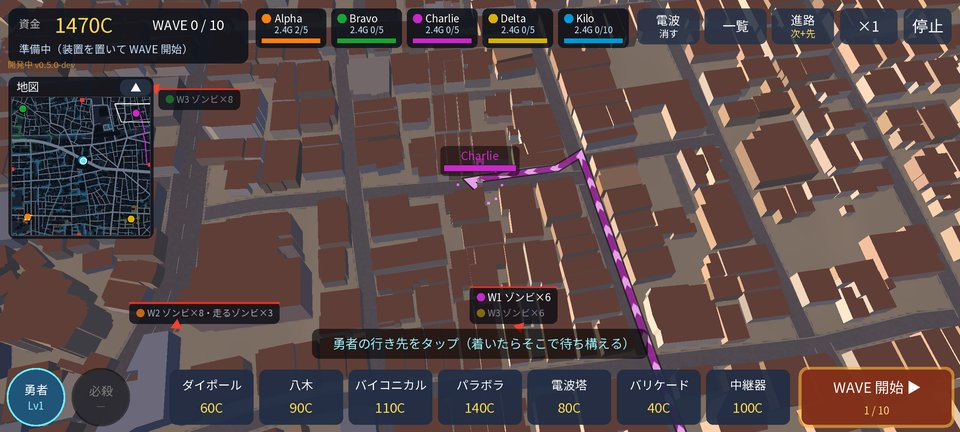 勇者のボタン → 行き先をタップ</td>
<td align="center">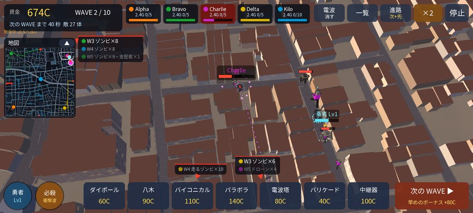 進路の途中で群れを待ち構える</td>
</tr>
</table>

## 敵の種類

| 敵 | HP | 速さ | 賞金 | 特徴 |
| --- | --- | --- | --- | --- |
| ゾンビ | 70 | ふつう | 12C | 基本の敵 |
| 走るゾンビ | 40 | 速い | 10C | 体力は少ないが足が速い |
| 支配者 | 420 | 遅い | 80C | 大きく硬い。周り 12 m の敵が 1.3 倍速になる |
| ドローン | 90 | ふつう | 25C | 空を飛び、道路を無視して局へ一直線。地上専用の砲台（ダイポール・八木）と勇者の通常攻撃は当たらない |
| ロボット | 300 | 遅い | 50C | 硬い（受けるダメージ 0.55 倍） |
| 大型ボス | 5200 | とても遅い | 600C | 最終 wave に出る。とても大きく硬い。周りの敵を速くする |

- 後の wave ほど敵の HP が増えます（wave 1 つごとに +7%）。後のステージはさらに HP が多め。
- 局に着いた敵は設備盤を攻撃して耐久を削ります。狙いの局が落ちると、巨大局（それも落ちていれば一番近い残りの局）へ向かい直します。

## ステージ

前のステージをクリアすると次のステージが遊べます。どのステージも局 5 つ・10 wave・最後に大型ボスです。

| # | ステージ | 特徴 |
| --- | --- | --- |
| 1 | TOKYO AREA I | 住宅地と線路。四方から道路沿いに攻めてくる。Charlie は建物の多い所にあり、電波の届く範囲が狭い |
| 2 | TOKYO AREA II | 団地と坂。丘の上の局へは道が少なく、地上の群れは決まった坂道に集まる。そのぶんドローンが多い。見通しが良いので高い帯を使いやすい |
| 3 | KYUSHU | 川と橋。川は橋でしか渡れず、橋で進路が絞られる（橋の上はバリケードの置き場）。ロボットと走るゾンビが多い。ビル街で小基地局の範囲が狭く、建物に囲まれた Charlie は中継器で守る |
| 4 | TOKYO AREA III | 高層ビルの谷。高いビルで電波が遮られる。支配者が多い |
| 5 | NAGANO | 山あいと森。森の木と急斜面は通れない。敵はすべてロボット（小型・高速・指揮・管理ロボット）。山の上の巨大局へは山道を登ってくる。ドローンは尾根を越えて来る |
| 6 | TOKYO AREA IV | 超高層街。ドローンが多い |
| 7 | ??? | 最終ステージ。STAGE 6 をクリアするまで名前は「？？？」。中身は遊んでのお楽しみ |

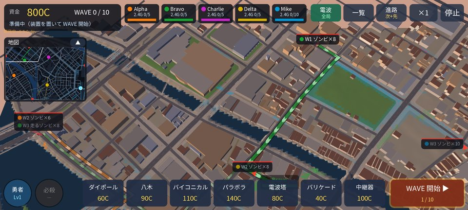 KYUSHU（［電波］で全局のカバレッジを表示）

## 設定

タイトルの［設定］と、一時停止の窓の［設定］で同じ画面が開きます。右上の「？」で説明が見られます。

- **BGM・効果音**: ON / OFF と音量（−・＋で 10 ずつ）。
- **中継器の置き方**: ［自由］［簡易］（[中継器](#中継器)）。初めて起動したときにこの端末で中継器 1 台分の計算の時間を 1 回だけ測り、0.5 秒以内なら「自由」、超えたら「簡易」を最初の設定にしています。［測り直す］で測り直せます（自分で選んだ置き方は変わりません）。ゲームの途中で変えても、置いてある中継器はそのまま。次に置くときから新しい方式になります。

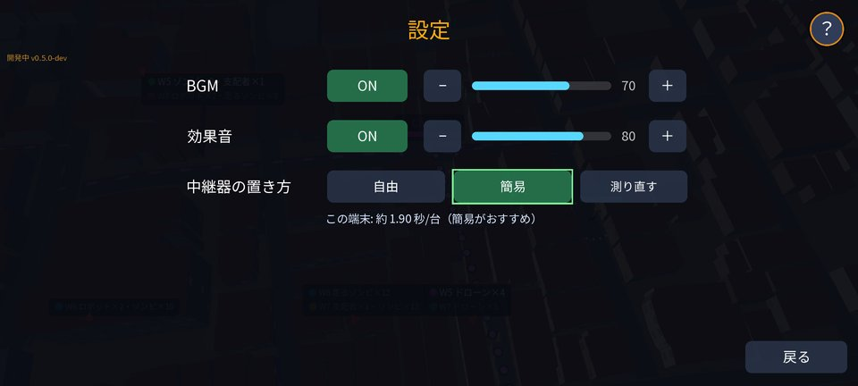

## ヒント

- **進路を見てから置く**: 準備中・wave の間に進路の予告と［一覧］で次に狙われる局を確かめ、その局の手前の道に装置を集めましょう。
- **早めのボーナス**: 守りに余裕があれば［次の WAVE］で早く始めると資金が増えます。
- **ドローンに備える**: ドローンは道路を無視して一直線に来ます。点線の先の局には、パラボラ砲台・バイコニカル砲台・電波塔を。
- **上限が足りなくなったら帯を上げる**: 局の札の「3/5」がいっぱいになったら、wave の間に帯を 1 段上げると多くつなげます。ただし範囲が狭くなり、外れた装置は止まるので、帯の窓の「止まる装置の数」を見てから。
- **範囲の狭い局は中継器で**: 建物に囲まれて電波が届かない局や、巨大局の足元は、中継器で範囲を作ります。
- **バリケードと電波塔で足止め**: 道路の上のバリケードと電波塔で群れを止め、その間に砲台で削ります。支配者のまわりの敵は速いので、早めに倒しましょう。
- **勇者は進路の途中に**: 勇者を群れの通り道に置き、まとまった所で必殺技を使うと効果的です。
