

# 電測記録

電波の測定をプランと実測で記録。地図・写真・携帯網の RSRP をまとめ、PDF / CSV / KML で出力します。

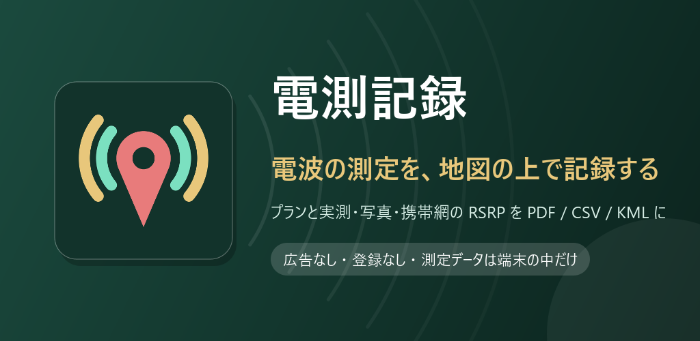

## ダウンロード

### [APK をダウンロード（v1.1.1・2.2 MB）](https://github.com/kijitora-no-hito/android-apps/releases/download/radiosurvey-v1.1.1/radiosurvey-1.1.1-release.apk)

| 項目 | 内容 |
| --- | --- |
| バージョン | 1.1.1（2026-09-25） |
| ファイル | `radiosurvey-1.1.1-release.apk`（2,262,203 バイト） |
| SHA-256 | `61ECB0CFC467D84C280077C73FE330E053C56146497797C3A17C970AD56B9C51` |
| 対応 Android | 8.0 以上 |
| 価格 | 無料・広告なし・アプリ内課金なし・アカウント登録なし |

| 権限 | 使いみち |
| --- | --- |
| 位置情報（詳細・おおよそ） | 測定点の座標を GPS で取る、地図に現在地を出す、携帯網のセル情報を読む（Android ではセル情報の取得に位置情報の許可が必要です）。使うときに許可を求めます。バックグラウンドでは使いません |
| インターネット / ネットワーク状態の確認 | 地図、建物データの取得、PDF の配置図の地図、カバレッジマップ（推定）の標高データの取得（どちらも許可ダイアログは出ません） |

カメラ・写真・ストレージの権限は使いません（撮影は端末のカメラアプリに任せ、レポートは保存先を選んで書き出します）。

 PC で見ている方へ: スマホでこの QR を読み取ると、このページが開きます。

## どんなアプリ？

無線の電界強度測定（電測）の記録アプリです。
実験ごとに送信局と測定点をまとめ、現地に行く前の**プラン**から、現地での**実測**、報告用の**レポート**づくりまでを 1 台のスマホで扱えます。

### 実験・送信局・プラン

- 実験を作り、送信局（位置・周波数・地表高・アンテナ方位角）を登録します。
- 測定点は「プラン」として、予定の日時・位置・アンテナ方位角・周波数・想定電界強度を先に入れておけます。
- 位置は地図を動かして中央の十字に合わせるだけ。標準地図と衛星写真を切り替えられ、GPS で現在地にも飛べます。

### 実測・写真

- 現地では「実測を記録」から、GPS で位置を取り、実測の日時・方位角・周波数・電界強度・メモを入れます。
- 写真は端末のカメラアプリで撮って、その測定に添付します。
- **プランの値は別に残る**ので、予定と実測の差（レベル差）をあとから確かめられます。
- プランにない地点は「追加測定」で現地からそのまま登録できます。

### 携帯網の RSRP を記録

- スマホ自身が接続している携帯網（LTE / 5G NR）の **RSRP・RSRQ・SINR** と、方式・事業者・バンド・ARFCN・PCI・セル ID をその場で取り込み、位置と一緒に測定として保存します。
- 測定器が無くても、エリアの感触をつかむ記録に使えます。

### 地図

- 実験のマップタブに、送信局と測定点（プラン / 実測）がアンテナ方位の矢印つきで並びます。
- **カバレッジマップ（実測）**: 実測済みの点から電界強度（または RSRP）の面を補間し、色分けで地図に重ねます。
- **建物データ**: 表示している範囲の建物の輪郭を OpenStreetMap から取り込み、高さで色分けした線で重ねます。取り込んだデータは保存され、次回もすぐ表示できます。
- **カバレッジマップ（推定）**: 送信局の設定（位置・高さ・周波数・送信電力・アンテナ利得と向き）と地形・建物データから、エリアの電界強度と各測定点の推定値を計算します。推定値はプランの想定電界強度に取り込んだり、実測との差を確かめたりでき、レポートにも載ります。

### レポート

実験ごとに 3 種類で書き出せます。保存先は端末のフォルダのほか、Google ドライブも選べます。

- **PDF**: まとめページ（送信局・配置図・測定結果一覧）と、測定ごとのページ（プラン / 実測の対比・配置図・写真・メモ）。配置図の背景は地理院地図です。
- **CSV**: 送信局と測定の数値データ（Excel でそのまま開けます）。
- **KML**: 送信局と測定点のピン（Google Earth やマイマップで確認できます）。

### データについて

- 実験・測定・写真・携帯網の記録は端末の中だけに保存されます（サーバに預かりません）。

## スクリーンショット

画面はデモ用のダミーデータです（大阪城公園周辺・架空の送信局と測定値）。

<table>
<tr>
<td align="center">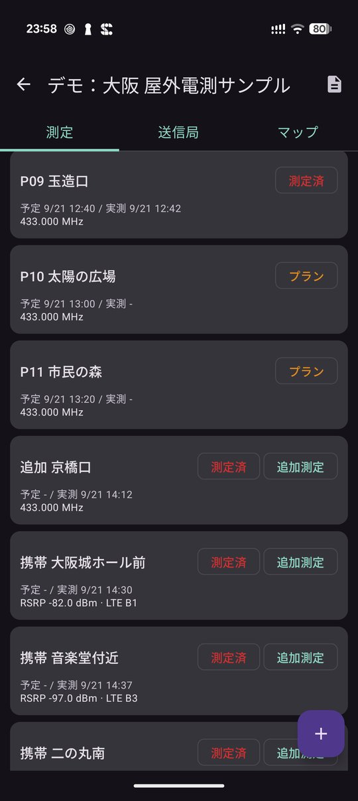 測定の一覧（プラン / 測定済 / 携帯網）</td>
<td align="center">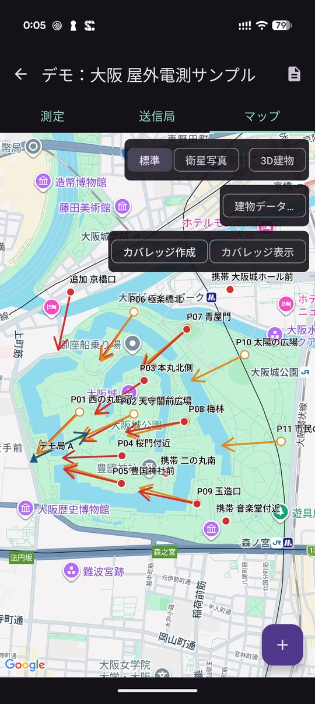 マップ（送信局・測定点・アンテナ方位）</td>
</tr>
<tr>
<td align="center">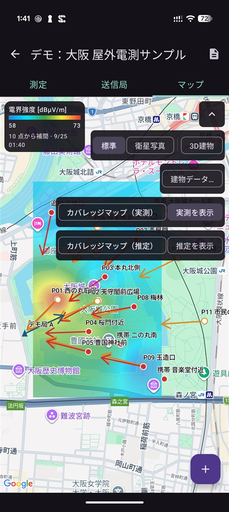 カバレッジマップ（実測）</td>
<td align="center">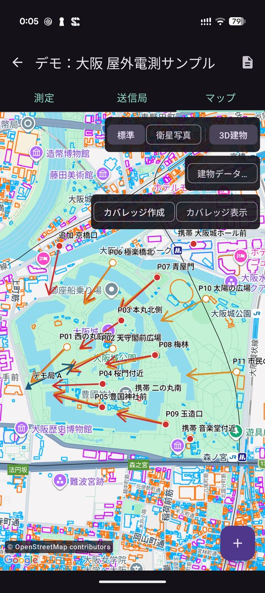 建物データ（OpenStreetMap）</td>
</tr>
<tr>
<td align="center">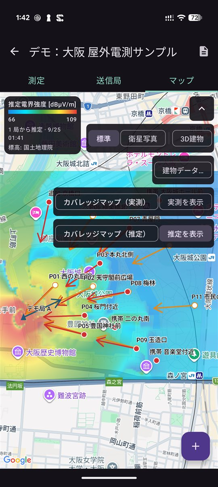 カバレッジマップ（推定）</td>
<td align="center">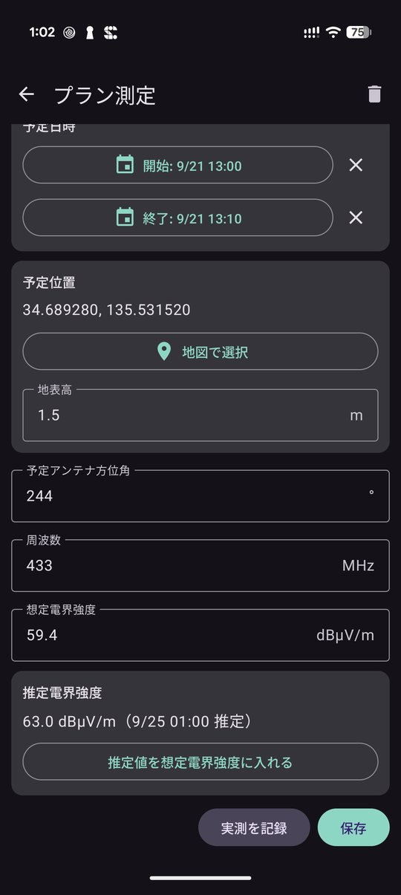 プランに推定電界強度を表示</td>
</tr>
<tr>
<td align="center">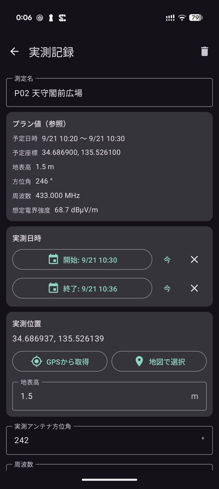 実測の記録（プラン値を参照）</td>
<td align="center">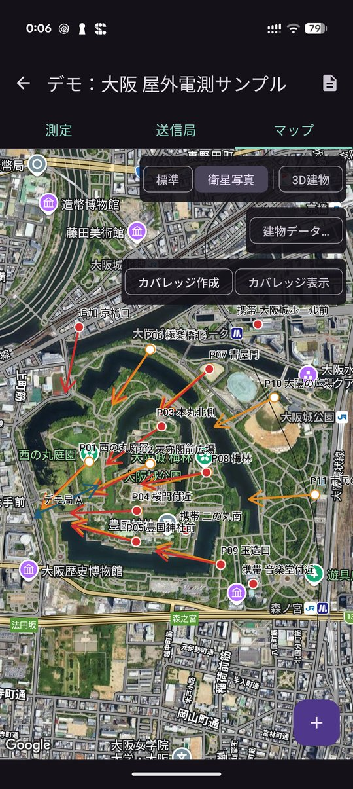 衛星写真に切り替え</td>
</tr>
<tr>
<td align="center">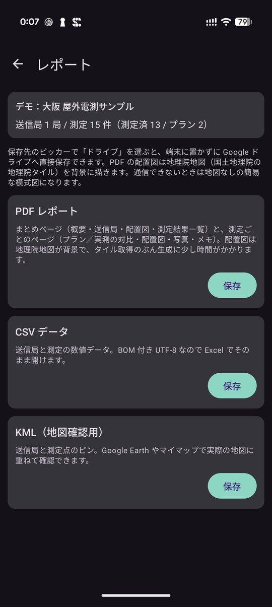 レポート（PDF / CSV / KML）</td>
<td align="center">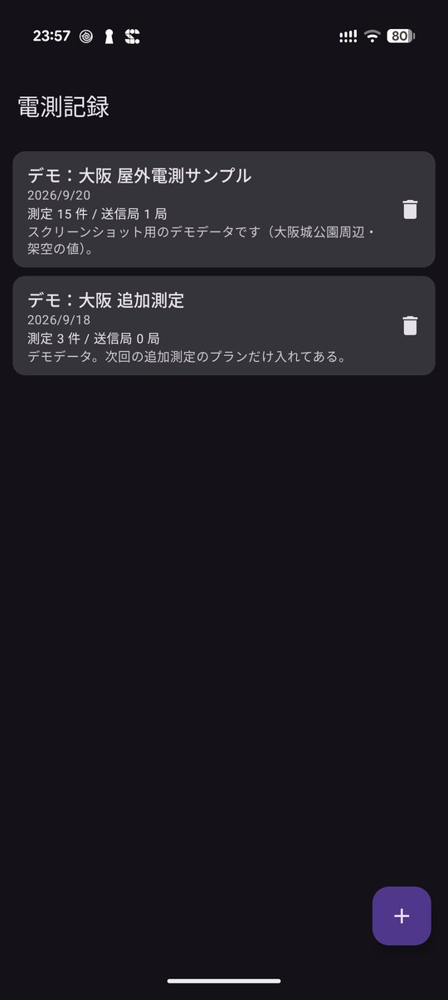 実験の一覧</td>
</tr>
</table>

## 注意

- 地図・建物データ・PDF の配置図・カバレッジマップ（推定）の標高データにはインターネット接続が必要です。機内モードでは地図が出ません（PDF は通信できないと配置図が簡易図に、カバレッジマップ（推定）は平らな地面として計算します）。
- カバレッジマップ（推定）の値は計算による目安です。実際の電界強度は測って確かめてください。範囲は送信局と測定点を含めて約 10 km 四方までです。
- 地図の表示には Google Play 開発者サービスが必要です（入っていない一部の端末では地図が出ません）。
- 携帯網の記録には SIM と位置情報の許可が必要です。圏外や SIM 無しでは取れず、端末によって取れる項目が違います。
- 表示・記録される値は端末で得た目安です。**校正された測定器の代わりにはなりません。**
- 建物データは一度に約 2 km 四方までです。広すぎるときは地図を拡大してから取得してください。

## インストール方法

1. このページをスマホのブラウザで開き、上の「APK をダウンロード」を押します。
2. ダウンロードした APK を開きます。初回は「提供元不明のアプリ」のインストールを許可するよう求められるので、使っているブラウザ（またはファイルアプリ）に許可してください。
3. Google Play プロテクトが警告を出すことがあります。ストアを通さない APK では一般的に出る表示です。心配なときは上の SHA-256 と一致するか確かめてください。
4. **アンインストールすると、端末内の実験・測定・写真は消えます。** 残したい実験は先にレポート（PDF / CSV / KML）を書き出しておいてください。

### 更新について

- 自動更新はありません。新しい版が出たら、このページから同じ手順で入れ直してください（上書きインストールになり、データは残ります）。
- このアプリは GitHub でのみ配布しています。

## 出典

- 地図: Google マップ（Google のロゴと出典は地図上に表示されます）
- 建物データ: © [OpenStreetMap](https://www.openstreetmap.org/copyright) contributors（ODbL）。[Overpass API](https://overpass-api.de/) で取得
- PDF の配置図: [国土地理院（地理院タイル）](https://maps.gsi.go.jp/development/ichiran.html)
- カバレッジマップ（推定）の標高: [国土地理院（標高タイル）](https://maps.gsi.go.jp/development/ichiran.html)

## プライバシーポリシー

[電測記録 プライバシーポリシー](https://kijitora-no-hito.github.io/android-apps/radio_survey/privacy-policy.html)

---

[← アプリ一覧に戻る](../)
