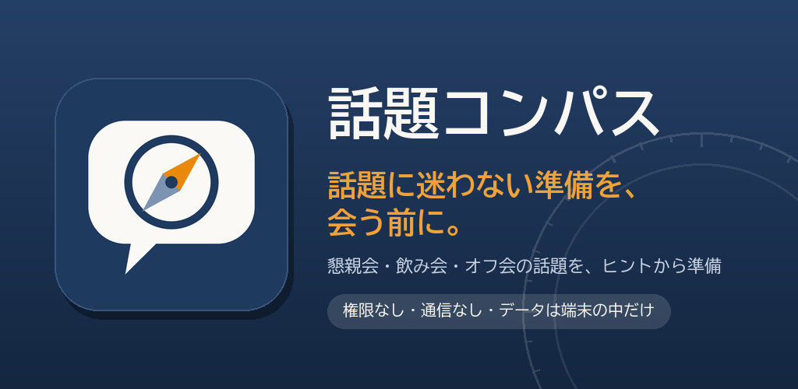
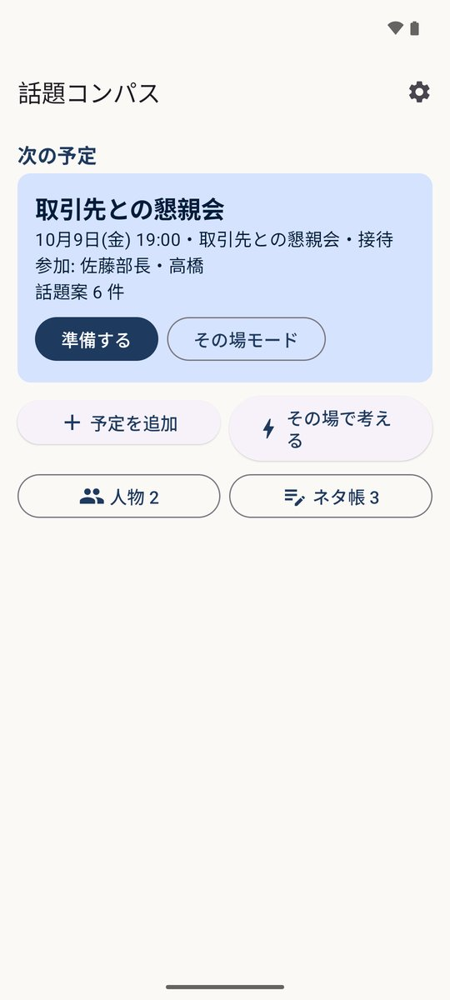
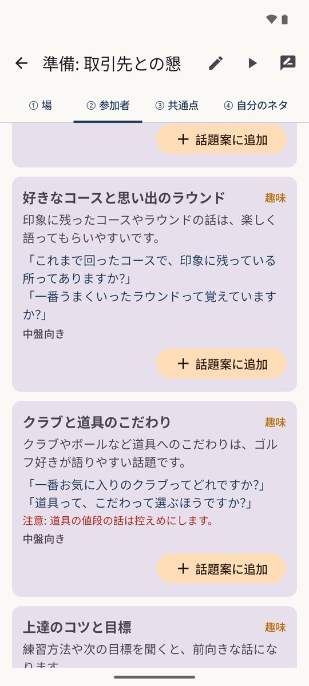
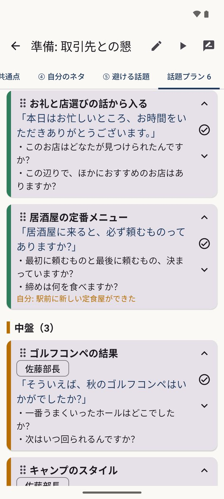
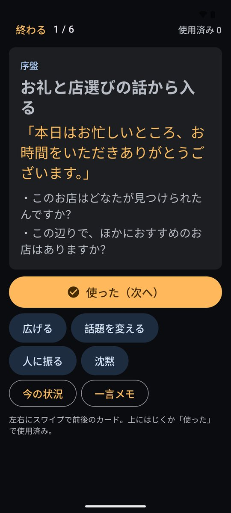
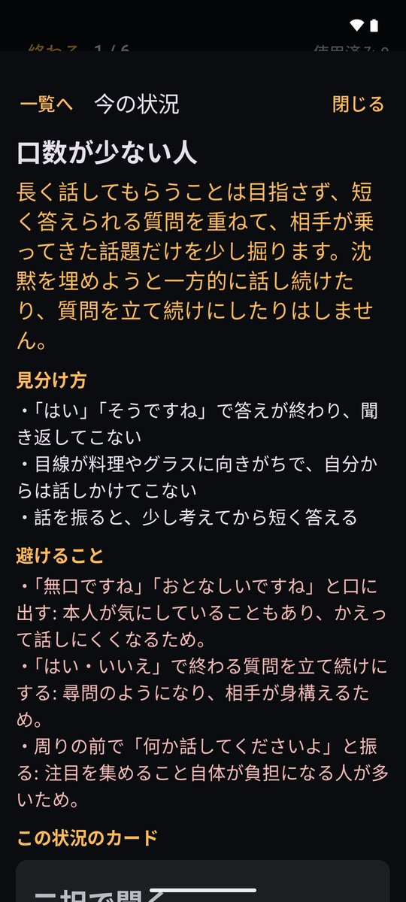
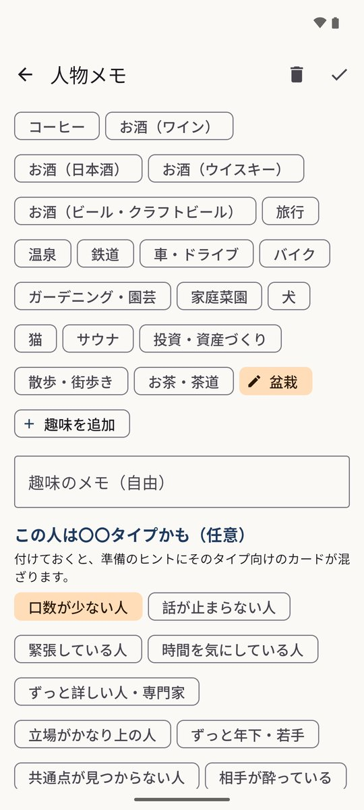

# 話題コンパス

懇親会・飲み会・オフ会の前に、同梱のヒントから話題を考えて並べておくアプリ。当日は話題を 1 枚ずつ出して使えます。権限なし・通信なし。

## ダウンロード

### [APK をダウンロード（v0.2.0・11.4 MB）](https://github.com/kijitora-no-hito/android-apps/releases/download/talkcompass-v0.2.0/talkcompass-0.2.0-release.apk)

| 項目 | 内容 |
| --- | --- |
| バージョン | 0.2.0（2026-10-06） |
| ファイル | `talkcompass-0.2.0-release.apk`（11,980,402 バイト） |
| SHA-256 | `71C5A4805FC7F1B764962964A2929BE1C9FA8B665D516529ABFA2DD4E4BF1197` |
| 対応 Android | 7.0 以上（縦画面） |
| 権限 | なし（インターネットにもつながりません） |
| 価格 | 無料・広告なし・アプリ内課金なし・アカウント登録なし |

 PC で見ている方へ: スマホでこの QR を読み取ると、このページが開きます。

## どんなアプリ？

取引先との懇親会、知人との飲み会、趣味のオフ会。「何を話そう」と困らないように、会う前に話題の案を考えてまとめておくためのアプリです。

ランダムに話題を出すのではなく、話題を考えるための**ヒント**を出します。ヒントはアプリに同梱した文章（26 の場面・約 1,700 枚のカード）から、予定の場面・相手との関係・相手の業界や出身や趣味に合うものを選んで並べます。

### 準備（中心の機能）

予定（日時・場面・お店・料理・参加者）を入れると、5 つのステップでヒントが出ます。

- **① 場** — 季節の話題・料理の話題・その場面の心得
- **② 参加者** — 人ごとの接し方、業界・出身・趣味の話題、前に話したことのメモ
- **③ 共通点** — 参加者どうし・自分との共通の業界・出身・趣味
- **④ 自分のネタ** — ネタ帳から、その場に合うもの
- **⑤ 避ける話題** — 場面・関係・業界ごとの注意

気に入ったヒントは［話題案に追加］で、切り出しの一言・広げる質問・自分の返しのネタをまとめた「話題案」にできます。

### 話題プラン

- 話題案をカードで一覧にします。序盤・中盤・締めに分けて、長押しのドラッグや ↑↓ で並べ替えられます。
- 人ごとの表示にも切り替えられます。使った話題は横にスワイプで「使用済み」に。

### その場モード

- 当日は暗い画面で、話題案を 1 枚ずつ大きく表示します（画面が消えにくくなります）。
- ［広げる］［話題を変える］［人に振る］［沈黙］で、会話の技術のヒントを出せます。
- ［今の状況］では、「口数が少ない人」「沈黙が続く」「話が重くなった」など、今の状況に合わせた構え方・見分け方・避けることが出ます。
- 予定が無いときも、ホームの「その場で考える」で場面と関係を選ぶだけでヒントが出ます。

### 振り返り

- 使った話題に「盛り上がった」「いまいち」を付けると、次からのヒントの並び順に反映されます。
- 当日の一言メモは、その人の人物メモへ移せます。

### 人物メモ・ネタ帳

- 相手の関係・業界・出身・趣味・タイプと、日付つきのメモ（前回話したこと・聞きたいこと・家族や予定）を残せます。
- 趣味は一覧（約 60 種）に無いものも自分で追加できます。追加した趣味にも共通のヒントが出ます。
- ネタ帳には、最近の出来事・発見・聞かれたら話せることを、向いている場面とあわせて書いておけます。

### データについて

- **権限を 1 つも使いません。インターネットにもつながりません。**
- **生成 AI は使っていません。** ヒントはアプリに同梱した文章で、アプリは条件に合うものを選んで並べるだけです。
- 入力した内容は端末の中だけに保存されます。Google アカウントへの自動バックアップの対象にもしていません。
- 機種変更のときは「データと設定」の［書き出す］でファイルに保存し、新しい端末で［読み込む］してください（保存先は自分で選びます）。

## スクリーンショット

画面に出ている人物・会社・お店はすべて架空のサンプルデータです。

<table>
<tr>
<td align="center"> ホーム</td>
<td align="center"> 準備（参加者のヒント）</td>
<td align="center"> 話題プラン</td>
</tr>
<tr>
<td align="center"> その場モード</td>
<td align="center"> 今の状況</td>
<td align="center"> 人物メモ（趣味の追加）</td>
</tr>
</table>

## 注意

- 人物メモには他の人の情報が入ります。書き出したファイルを共有・保存するときは、その扱いにご注意ください。
- ヒントは会話のきっかけの例です。相手や場の様子に合わせてお使いください。

## インストール方法

1. このページをスマホのブラウザで開き、上の「APK をダウンロード」を押します。
2. ダウンロードした APK を開きます。初回は「提供元不明のアプリ」のインストールを許可するよう求められるので、使っているブラウザ（またはファイルアプリ）に許可してください。
3. Google Play プロテクトが警告を出すことがあります。ストアを通さない APK では一般的に出る表示です。心配なときは上の SHA-256 と一致するか確かめてください。
4. **アンインストールすると、端末内のデータ（人物メモ・予定・ネタ帳など）は消えます。** 先に「データと設定 → 書き出す」で書き出しておいてください。

詳しい手順は[トップページ](../)の「インストール方法（共通）」にもあります。

### 更新について

- 自動更新はありません。新しい版が出たら、このページから同じ手順で入れ直してください（上書きインストールになり、データは残ります）。
- このアプリは GitHub でのみ配布しています。

## プライバシーポリシー

[話題コンパス プライバシーポリシー](https://kijitora-no-hito.github.io/android-apps/talk_compass/privacy-policy.html)

---

[← アプリ一覧に戻る](../)
