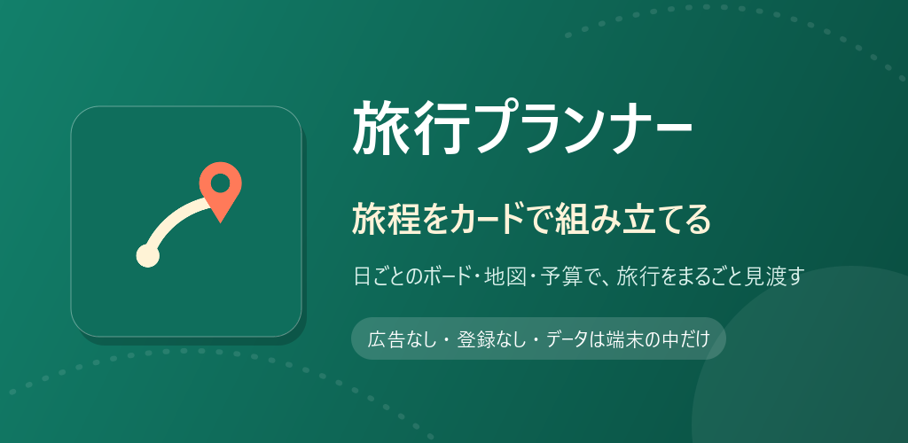
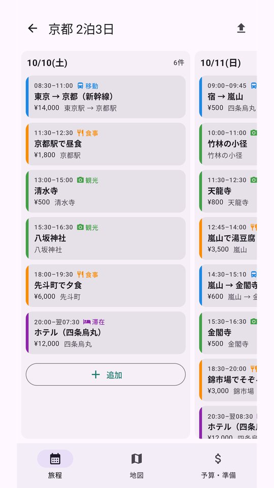
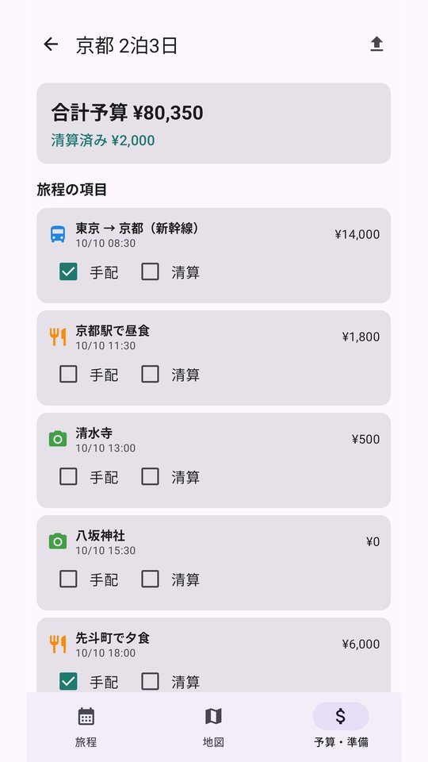
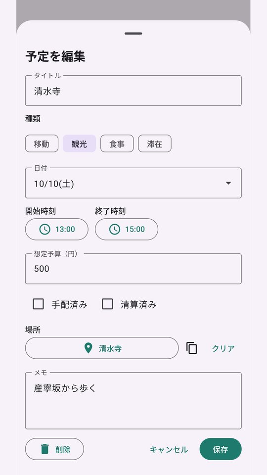
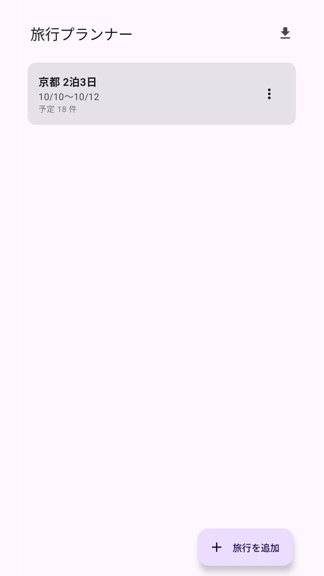

# 旅行プランナー

予定カードを日ごとのボードに並べ、地図と予算で旅程を俯瞰。JSON で仲間に丸ごと渡せます。

## ダウンロード

### [APK をダウンロード（v1.6・11.7 MB）](https://github.com/kijitora-no-hito/android-apps/releases/download/tripplanner-v1.6/tripplanner-1.6-release.apk)

| 項目 | 内容 |
| --- | --- |
| バージョン | 1.6（2026-09-24） |
| ファイル | `tripplanner-1.6-release.apk`（12,248,613 バイト） |
| SHA-256 | `A95D7D70F9310DBB637850C7D7BA7051417BA421A60CE2248C2DDE30CD1916E2` |
| 対応 Android | 7.0 以上 |
| 権限 | インターネット / ネットワーク状態の確認（地図と場所名検索のため。どちらも許可ダイアログは出ません） |
| 価格 | 無料・広告なし・アプリ内課金なし・アカウント登録なし |

 PC で見ている方へ: スマホでこの QR を読み取ると、このページが開きます。

## どんなアプリ？

旅行の予定を 1 枚ずつのカードにして、日付ごとの列に並べていくプランナーです。
旅程・地図・予算の 3 つの画面で、同じ旅行を別の角度から見られます。

### 旅程ボード

- 日付ごとの列を横に並べたボードに、予定をカードとして置いていきます。
- カードには開始時刻・終了時刻・種類（移動 / 観光 / 食事 / 滞在）・予算・場所を入れられます。
- 長押しでカードをつかんで、別の日や別の順番へドラッグ&ドロップ。**移した先で時刻は自動で計算し直される**ので、
  「この観光を前の日に回したら何時発になるか」をその場で確かめられます。
- 所要時間は終了時刻から自動で求められ、深夜フェリーのように日をまたぐ予定や、宿泊（泊数・チェックアウト）にも対応します。
- 場所は地図をタップするか、名前で検索して選ぶだけ。「前のカードの場所をコピー」や、同じ旅行で一度入れた場所の一覧からも選べます。
- カードには**画像**（1 枚のカードに 10 枚まで）・**リンク（URL）**・メモを付けられます。予約確認の画面、お店のページ、乗り換えのメモなどをカードにまとめておけます。
  画像は端末の写真選択画面から選ぶので、写真へのアクセス権限は要りません。

### 地図

- 旅程を地図の上に描きます。移動のカードは始点から終点へ弧を描き、進行方向に矢印が付くので、どこからどこへ動く日なのかがひと目で分かります。
- 時間帯のスライダーと種類フィルタで表示を絞り込めます。
- 日付のチップを押すとその日ぜんぶを表示。見やすい位置と縮尺を「その日の既定範囲」として覚えさせておけます。
- 地図は Google マップなので、海外の旅程も描けます。利用者が API キーなどを用意する必要はありません。

### 予算・準備

- 旅程のカードと、手で足した準備項目（チケット手配・持ち物など）をまとめて一覧にし、それぞれに予算・「手配済み」「清算済み」のチェックを付けられます。
- 合計予算と清算済みの金額が常に出るので、精算のとりまとめに使えます。

### 受け渡し

- 旅行 1 つが 1 つの JSON ファイルです。「共有」から Quick Share・メール・チャットなどで送れ、受け取った側はファイルを開いて「取り込む」を押すだけ。
- 同じ Wi-Fi にいる同行者には「Wi-Fi で送る」で直接渡すこともできます（相手の画面に出る 4 桁のコードを入れて送ります。サーバは経由しません）。
- 同じ旅行なら上書きされるので、更新版を送り直すこともできます。地図の既定範囲やカードの画像も一緒に付いていきます
  （画像を受け取るには相手も 1.6 以降が必要です）。

### データについて

- 旅行のデータは端末の中だけに保存されます（サーバに預かりません）。

## スクリーンショット

<table>
<tr>
<td align="center"> 旅程ボード</td>
<td align="center"> 予算・準備</td>
</tr>
<tr>
<td align="center"> カードの編集</td>
<td align="center"> 旅行の一覧</td>
</tr>
</table>

## 注意

- 地図と場所名検索にはインターネット接続が必要です。機内モードでは地図が出ません。
- 地図の表示には Google Play 開発者サービスが必要です（入っていない一部の端末では地図が出ません）。
- 「Wi-Fi で送る」は、端末どうしの通信が制限されたネットワーク（一部の公衆 Wi-Fi など）では相手が見つからないことがあります。そのときは「共有」を使ってください。
  また、この通信は暗号化されないので、信頼できないネットワークでは使わないことをおすすめします。

## インストール方法

1. このページをスマホのブラウザで開き、上の「APK をダウンロード」を押します。
2. ダウンロードした APK を開きます。初回は「提供元不明のアプリ」のインストールを許可するよう求められるので、使っているブラウザ（またはファイルアプリ）に許可してください。
3. Google Play プロテクトが警告を出すことがあります。ストアを通さない APK では一般的に出る表示です。心配なときは上の SHA-256 と一致するか確かめてください。
4. **アンインストールすると、端末内の旅行データは消えます。** 残したい旅行は先に書き出して（共有・エクスポート）おいてください。

### 更新について

- 自動更新はありません。新しい版が出たら、このページから同じ手順で入れ直してください（上書きインストールになり、旅行データは残ります）。
- Google Play でも公開する予定です。ここで配っている APK は tsukutta.app 版・Google Play 版と同じ署名鍵で署名しているので、どちらから入れた版にも上書きで入れ替えられます。

## 出典

- 地図: Google マップ（Google のロゴと出典は地図上に表示されます）
- 場所名検索: [Nominatim](https://nominatim.org/) / © [OpenStreetMap](https://www.openstreetmap.org/copyright) contributors（ODbL）

## プライバシーポリシー

[旅行プランナー プライバシーポリシー](https://kijitora-no-hito.github.io/android-apps/trip_planner/privacy-policy.html)

---

[← アプリ一覧に戻る](../)
