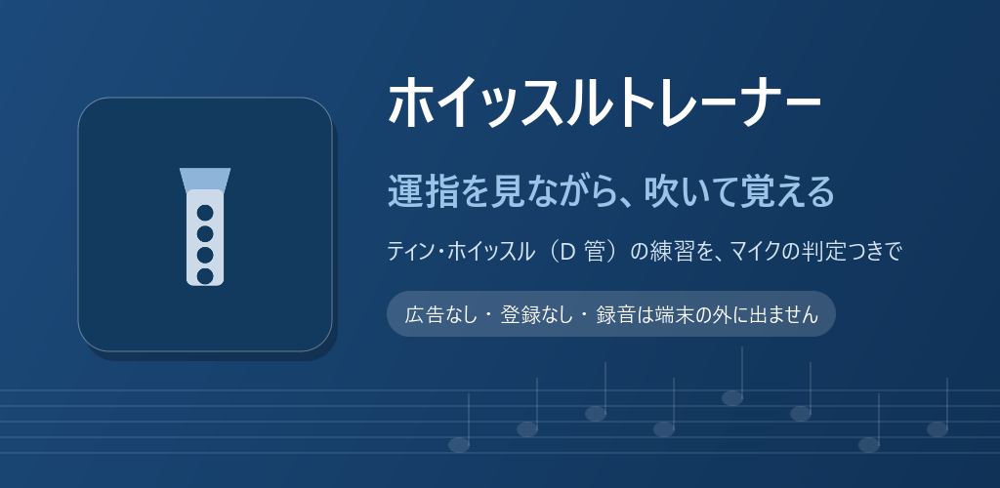
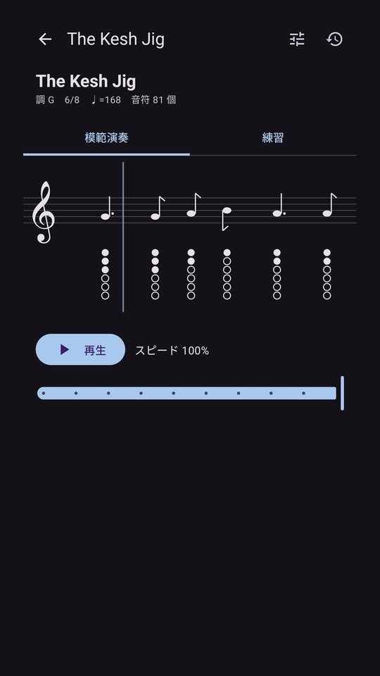
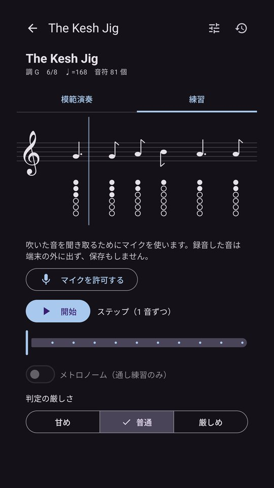
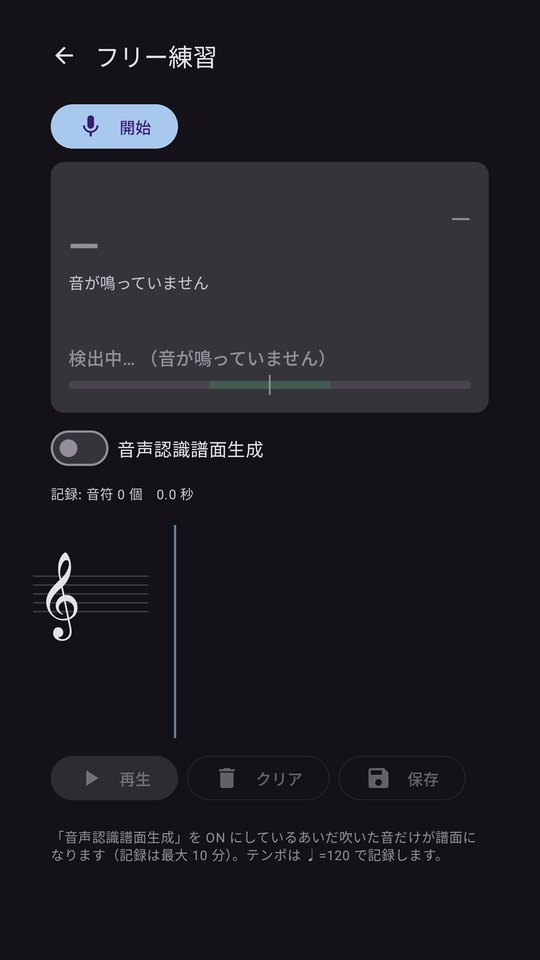
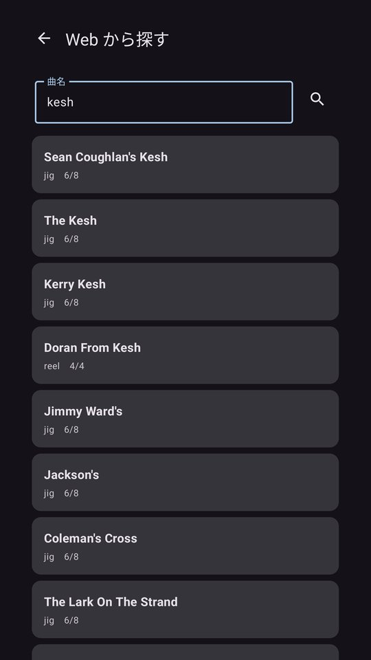
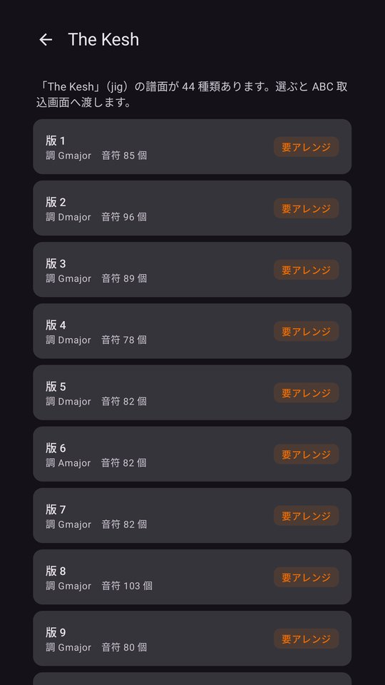
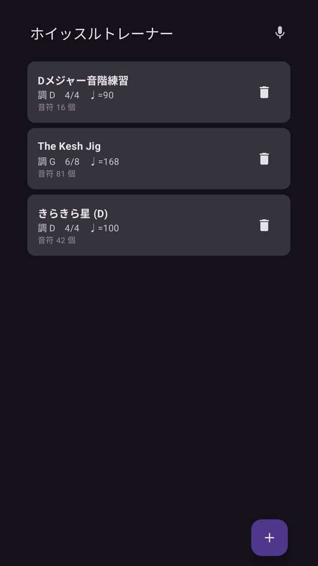
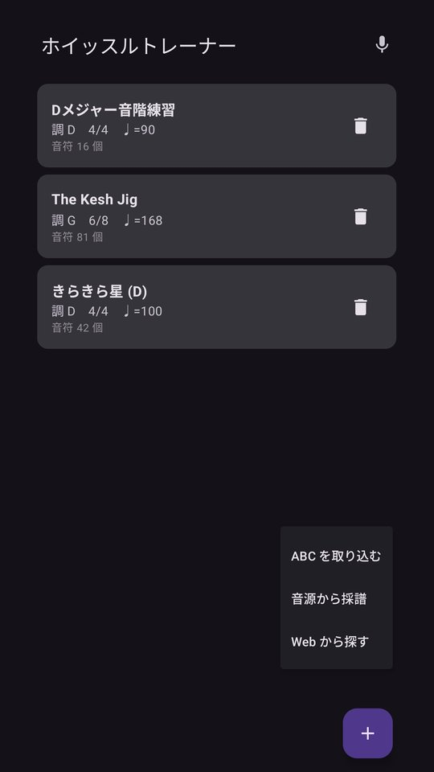

# ホイッスルトレーナー

ティン・ホイッスル（D 管）の練習アプリ。譜面と運指を見ながら吹き、マイクで正誤を判定します。

## ダウンロード

### [APK をダウンロード（v1.1・83.0 MB）](https://github.com/kijitora-no-hito/android-apps/releases/download/whistletrainer-v1.1/whistletrainer-1.1-release.apk)

| 項目 | 内容 |
| --- | --- |
| バージョン | 1.1（2026-09-24） |
| ファイル | `whistletrainer-1.1-release.apk`（86,996,891 バイト） |
| SHA-256 | `810B15A67F4499823D5982409742C53D85B111591469D59DC895EFE4432B2F44` |
| 対応 Android | 7.0 以上 |
| 権限 | マイク（練習・キャリブレーション・採譜のときに許可を求めます）/ インターネット（「Web から探す」のときだけ） |
| 価格 | 無料・広告なし・アプリ内課金なし・アカウント登録なし |

**ファイルが大きい（約 83MB）ので、Wi-Fi でのダウンロードをおすすめします。** AI 採譜のモデルと推論エンジンを同梱しているためです。

 PC で見ている方へ: スマホでこの QR を読み取ると、このページが開きます。

## どんなアプリ？

ティン・ホイッスル（D 管）を練習するためのアプリです。譜面と 6 孔の運指図を並べて表示し、模範演奏に合わせて吹き、マイクで拾った音が合っているかをその場で判定します。

### 譜面と運指

- 音符の一つひとつの下に、6 つの孔をどう塞ぐか（閉 / 開 / 半塞ぎ）を図で出します。
- 第 2 オクターブには印が付き、D 管で出せない音は「?」になるのでひと目で分かります。

### 模範演奏

- 電子音で曲を鳴らします。速さは 10〜100% の間で変えられるので、まずゆっくり聴いて覚え、だんだん上げていけます。
- 譜面は演奏に合わせてなめらかにスクロールし、いま鳴っている音が光ります。

### マイクで判定する練習

- **ステップ練習** — 1 音ずつ止まって待ちます。正しい音を安定して出せたら次へ。外したときは「検出: レ#（目標: レ、+70 セント）」のように、何がどうずれていたかを言葉で出します。オクターブ違い（息の強さ）も見分けます。
- **通し練習** — テンポに合わせて最後まで通し、音ごとに ○ / ✗ を付けていきます。メトロノームも出せます。
- 判定の厳しさは「甘め / 普通 / 厳しめ」から選べます。
- 低いレを 1 音まっすぐ吹くだけで、その笛が平均律よりどれだけ高い（低い）かを測って補正できます。実物の笛は個体差や息圧で数十セントずれるので、この補正で「正しく吹いているのに ✗」が減ります。

### 曲を増やす

- **ABC を貼り付ける** — ABC 記譜のテキストを貼るだけで取り込めます。D 管でそのまま吹けない曲は「D 管に合わせる」で自動で移調・オクターブ調整され、何をしたかも表示されます。
- **Web から探す** — アイルランド音楽のデータベース [The Session](https://thesession.org/) から曲名（英語）で検索して取り込めます。版ごとに「D管OK / 要アレンジ」のバッジが出るので、吹ける版を選べます。
- **音源から採譜する** — 手持ちの音源ファイルや、その場で録った音から譜面を起こせます。伴奏の入った音源に対応した AI 採譜（Spotify の Basic Pitch モデル）と、単旋律向けの軽いシンプル採譜を選べます。

### フリー練習と記録

- 曲を選ばずに吹いて、いま出ている音の音名・運指・チューナーを見られます。吹いたものをそのまま譜面に起こして、再生したり曲として保存したりもできます。
- 1 回ごとの正答率と、「苦手な音」（音ごとの通算正答率が低い順）を残します。

### データについて

- 録音した音は保存も送信もしません。判定・採譜はすべて端末の中で行います。
- ネットワークを使うのは「Web から探す」だけ。それ以外はすべてオフラインで動きます。

## スクリーンショット

<table>
<tr>
<td align="center"> 譜面と運指（模範演奏）</td>
<td align="center"> マイクで判定する練習</td>
<td align="center"> フリー練習</td>
</tr>
<tr>
<td align="center"> Web から探す</td>
<td align="center"> 版ごとの D 管適合バッジ</td>
<td align="center"> 曲一覧</td>
</tr>
<tr>
<td align="center"> 曲の増やし方は 3 通り</td>
<td></td>
<td></td>
</tr>
</table>

## 注意

- D 管（キー D）のティン・ホイッスル専用です。運指表も判定も D 管を前提にしています。
- 繰り返し記号は区切りとしてしか扱わないので、リピートは譜面どおり 1 回だけ再生されます。

## インストール方法

1. このページをスマホのブラウザで開き、上の「APK をダウンロード」を押します。
2. ダウンロードした APK を開きます。初回は「提供元不明のアプリ」のインストールを許可するよう求められるので、使っているブラウザ（またはファイルアプリ）に許可してください。
3. Google Play プロテクトが警告を出すことがあります。ストアを通さない APK では一般的に出る表示です。心配なときは上の SHA-256 と一致するか確かめてください。
4. **アンインストールすると、取り込んだ曲と練習の記録は消えます。**

### 更新について

- 自動更新はありません。新しい版が出たら、このページから同じ手順で入れ直してください（上書きインストールになり、曲と記録は残ります）。
- Google Play でも公開する予定です。ここで配っている APK は tsukutta.app 版・Google Play 版と同じ署名鍵で署名しているので、どちらから入れた版にも上書きで入れ替えられます。

## 第三者のソフトウェア・データ

- 自動採譜のモデル: [Spotify Basic Pitch](https://github.com/spotify/basic-pitch)（Apache License 2.0, (c) Spotify AB）
- 推論エンジン: [ONNX Runtime](https://github.com/microsoft/onnxruntime)（MIT License, (c) Microsoft Corporation）
- AndroidX / Jetpack Compose / Kotlin（Apache License 2.0）
- 「Web から探す」で取り込む譜面の出典: [The Session](https://thesession.org/)（ODC Open Database License (ODbL) に基づくデータベースに由来）
- 同梱のサンプル曲は伝統曲・古典曲で、曲そのものはパブリックドメインです。

ライセンス全文と著作権表示: [NOTICE.txt](licenses/NOTICE.txt) / [Apache-2.0.txt](licenses/Apache-2.0.txt)（APK にも同梱しています）

## プライバシーポリシー

[ホイッスルトレーナー プライバシーポリシー](https://kijitora-no-hito.github.io/android-apps/whistle_trainer/privacy-policy.html)

---

[← アプリ一覧に戻る](../)
